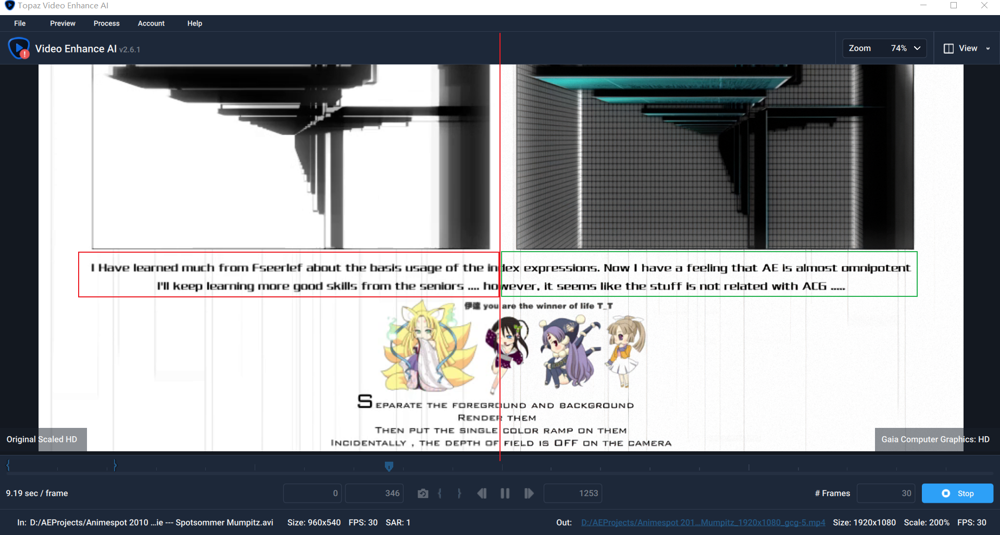

# 预准备

> 工欲善其事，必先利其器。

在开始动手模仿之前，需要做一些前期准备工作。

## 下载原作视频并超分辨率

> 如果能寻找到分辨率足够清晰的原作视频，可以跳过或者泛读这部分。

使用该软件将原作视频加载。视频类型选择CG，选择 Gaia Computer Graphics 算法模型。

> Gaia Computer Graphics 模型，简称GCG，是该软件中对CGI（computer graphics image）处理比较优秀的一个算法模型。

然后点击预览，将右上角视图切换为：Split-View。即分割对比视图。从对比图中可以看出超分后的文字（右侧绿色方框）变得更为清晰。这对于模仿时观察文案是有较大帮助的。

这步的结果可以产生一个较高分辨率的原作超分视频。

> 注意：如果自身的电脑配置较弱，计算时间会很长导致无法忍受。建议跳过该流程。因为这步不是必须的。

## 将视频BGM单独提取

使用小丸工具箱将原作视频加载。

点击压制之后，就可以得到背景音乐BGM的mp3格式。

### 关于原作的BGM制作流程

该作品的BGM全名为：Nostalgia（instrumental），时长为 5:45 。而该MAD时长为1:47，显然对BGM进行了适当裁剪。这里不打算深究音频的处理，所以到此为止。

## 对超分视频进行格式转换（按需）

无论是直接获取的原作超分视频，还是通过超分软件进行处理获得的原作视频。此时的视频格式可能并不能直接导入AE，例如AE 2020不支持AVI格式的导入，此时可以通过小丸工具箱或者格式工厂之类的格式转化工具将其转化为泛用视频格式，例如mp4或者flv。

此时，假设**你已经获得了合适格式的原作超分视频和单独的BGM音频文件**。

## 在AE中标记每个主分镜的时间点

新建AE空白工程，将视频和音频文件导入。

### 方法论: 两层标记+一层复制

首先，任何一个分镜合成必然存在一个起始时间点（start-point）和结束时间点（end-point）。

基于这个客观事实，复制2个视频图层副本。

- 一个视频图层A作为每个分镜的起始时间点标记，
- 一个视频图层B作为每个分镜的结束时间点标记。

然后手动分别标记每一个分镜的起始时间点和结束时间点。如下面图示：

全局：

标记完成后，对BGM音频层和标记的两个视频图层直接加锁，防止误点。

红色的第3个视频图层的作用：作为裁剪层，在之后的制作中，可以分别预合成为对应的主分镜合成。下面以合成P2举例说明。

首先复制一层红色的视频层。选中上面的副本视频图层（index 22），使用键盘的【和】将时间轴裁剪到合成2应该对应的时间点。

此时对副本视频图层（index 22）进行预合成。注意此时的预合成选项。

必须勾选：**Adjust composition duration to the time span of the selected layers**。

作用是：调整合成的长度到所选图层的时间范围。由于上面已经裁剪到合适范围。因此此时P2的时间长度就是完美正确的。

预合成后：

P2直接放于正确的时间位置上。我们点进去查看一下P2。

此时P2内部的起始时间是26帧。个人习惯是将该合成起始时间一律归0。这样在内部制作时容易把握时间持续时间。但是，这个做法是opinioned的，带有强烈的个人色彩，所以，这里的选择取决于个人的习惯。

如果选择归0，那么做法是，在该P2的内部编辑界面中，CTRL+K打开P2设置。

将上面红色框的时间改为0，确定。结果为：

---

在该教程的讲解过程中，如果没有特殊说明，一律默认采用了这种归0处理。

### 这个分割方法的可行性

回到这个方法论本身，这个标记法，它是普遍适用于MAD的模仿的。结合上面的裁剪合成的方式，渐进式分解模仿的工作量到单独的合成中。整体上看，个人认为具有技术上的可行性。

通过这种规范的方式，可以很轻松地创建起应该存在的空合成序列。

> 请忽略下图中关于过渡效果图层的细微处理。红线框中就是合成序列示意图。

好了，~~空文件夹已经建好了，稳了稳了，进度0%~~。空合成已经建好了。下面就是逐个大合成的内部切分和实现。

这里大合成分为了19个，从P1-P19。main合成大小为1280x720。帧率30。

现在，让我们开始吧。
