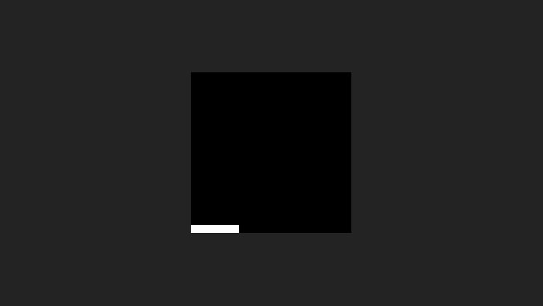
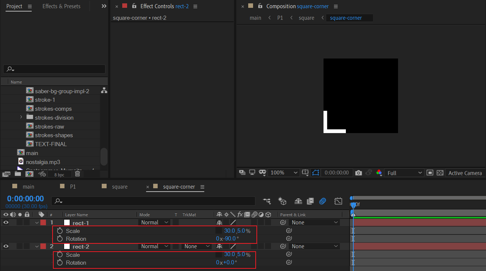
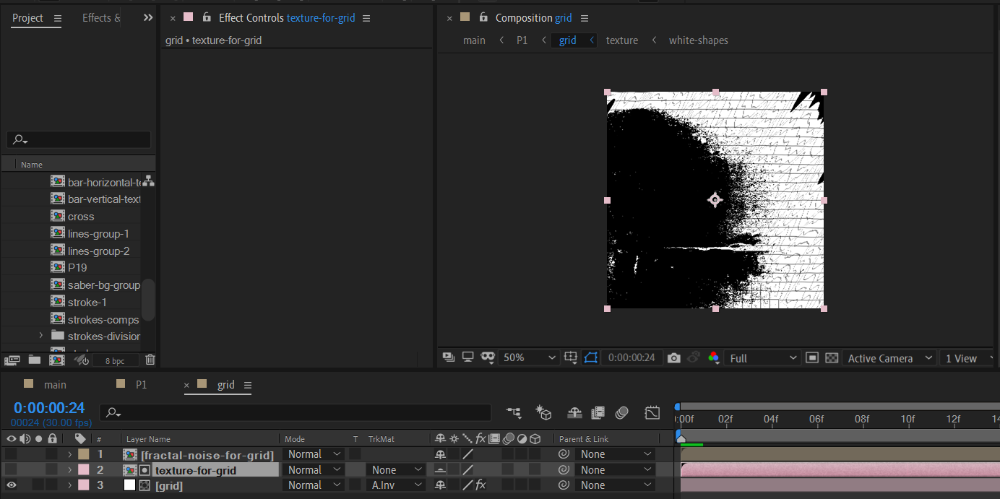

# 01 飞旋与音乐频谱

新建一个黑色纯色层作为背景。

## square

### square-corner 合成

新建一个只有1帧长度，200x200的合成。新建1个白色纯色层，将锚点定于左侧，通过调节scale百分比使得形状为小的长方形。将位置摆放于合成的左下角。

然后复制一层，调节旋转角度为-90。得到下面的图形。

### square 合成

- 将上面的square-corner预合成。将锚点定于画布中心。
- 将square-corner复制为一共4个副本。通过调节旋转角度使得刚好形成四个边角。

### square 合成的动画

回到P1中，首先使用图层冻结将该square合成冻结在第一帧。

然后选取一个合适的结束时间点，对scale，rotation，opacity先记录目前的关键帧。然后挑选合适的起始时间，设置参数使得动画为：缩小，顺时针旋转，淡出。

> 这里教程中将弱化具体参数的说明，而是强调目标的效果，因为参数只是目标效果的实现。对于具体的参数值，可以参考工程文件，自己调节预览体会。

## grid

首先创建一个形状为正方形，时间长度足够的合成，命名grid。这里合成大小为600x600。

这个合成的目标就是制作正方形背景。

### 网格背景

新建一个白色纯色层。添加网格效果，调节参数使得网格比较细，网格是小正方形。

然后我们需要对该图层添加置换map效果。但是问题在于，目前我们还没有一个事先准备好的贴图纹理。于是，我们需要先创建一个给grid纯色层的纹理。

### 制作分形杂色纹理

我们依旧准备一个正方形的合成作为纹理的制作。

创建一个布满合成大小的白色纯色层，然后通过适当的修改transform参数和绘制mask使得出现下面这样一个半遮盖的显示效果。

下面给该纯色层添加fractal noise。这里有2个关键的参数需要说明：

首先取消Uniform scaling，也就是不需要统一缩放。现在我们需要的是宽高呈现极大的差异。于是将Width设置得非常高，图中是5000。保持Height不变。因此出现了类似木板的纹理效果。

### 给grid应用分型杂色纹理

回到grid纯色层。添加置换map效果。

置换map一共有2个关键参数：

- 设置置换的图层，这里选择的是之前制作的分型杂色纹理：fractal-noise-for-grid图层。
- 加大水平置换的值。实际上，加大垂直置换的值也是可行的。效果差别不大。

现在，我们得到了上面的这种背景。有点单调，于是考虑添加磨砂颗粒感效果。

此时，我们又需要制作一个磨砂颗粒纹理的合成。

### 制作磨砂颗粒纹理

新建一个600x600的合成，命名texture。

在texture中，依旧创建600x600的合成，命名white-shapes。在white-shapes新建两个纯色层。分别绘制mask，使得一个是圆形，一个是不规则多边形。

然后给mask 扩展值k帧，得到图形变大的效果。

---

在texture中导入墙图片，作为素材。

- 使用Hue/saturation改为黑白：将饱和度压到最低-100；
- 使用曲线，将暗部压暗，亮部提亮，为S型曲线。
- 然后取消墙图片的显示。

---

接着，我们故技重施来制作纹理。对white-shapes合成添加置换map效果。

- 置换图层选择上面制作的wall图层。然后重点调节最大水平/最大垂直的置换值，使得边缘有种沙子的颗粒感。

### 给grid应用磨砂颗粒纹理

回到gird合成中，给grid纯色层应用alpha翻转遮罩。

此时背景的感觉已经很丰富了。

### grid合成的动画

- 给该合成绘制一个mask，形状为不规则多边形就行。添加轻度羽化值避免边缘过于生硬。
- 给transform k帧：缩小，逆时针旋转，淡出。这里注意必须是逆时针旋转，因为square是顺时针旋转。此外，淡出结束值不能为0。

## audio spectrum line

### 频谱线的制作
现在，开始制作音乐频谱线。

新建一个纯色层。添加 Audio Spectrum效果。

关键步骤为：

- 将Audio layer设置为自身，也就是纯色层。于是频谱是不会运动的。

- 将star point和end point设置到合适位置。
- 设置Frequency bands和maximum Height 使得频谱变得：**非常密集，而且频谱直方条最大高度很低。** 频段影响点之间的疏密程度。
- 颜色改为全白。

添加 Glow 效果使得频谱稍微变亮。

### 频谱线的运动

这里频谱线一直是逆时针旋转。但是标记【2】处注意是绝对水平横线位置。

- 左侧关键帧先快后慢，运动角度很大。
- 右侧关键帧缓动，运动幅度很小，参考值3-5度。

此时频谱线的出场没有特殊效果。为了实现该频谱横线的出场有一个从画面中心径向扩散淡入的效果。需要创建一个纯色层来绘制mask实现。

创建一个纯色层：white-x-expand-matte。然后绘制一个mask，刚开始mask是中间一根细线。

- 加大羽化值，参考值500。
- 对mask expansion k帧，参考值从20到1000。实现目标是从中间细线向两侧水平扩散开，直到画面全白。

此时效果预览一下。

下面开始制作Audio lens。也就是音乐透镜，类似于2个圆环描边。

## Audio lens

创建一个纯色层,添加Audio Spectrum效果。复制main合成的音频图层到这个合成，放于底部，取消显示。因为这里只是需要它作为音乐源来使得频谱可以跳动。

对于纯色层 audio lens inner，设置关键参数：

- 将Audio layer设置为导入的音频图层。
- 设置star point和end point为画面左右侧。**注意这里必须手动输入Y的值，严格为720/2=360，保持绝对水平。否则圆环不会对称。**
- 合适增大maximum Height的值，使得富有动感。

然后添加Glow，发光效果。

最后添加CC lens效果。这个效果设置后，圆环的效果瞬间就出现了。对CC lens的size k一个放大的关键帧即可实现圆环扩散。

实现了内环之后，只需要将该图层复制为audio lens outer。将outer关键帧设置整体往左移动一帧。这样，outer运动就比inner快，自然就实现了外环比较大的效果。

### lens 跟随 audio spectrum line

首先打开这两个图层的rotation属性。可以看到它们相差240。这个240取决于自身的设置。

为了完美使得audio lens 保持和audio spectrum line 水平。那么需要将audio lens设置为-120。

因为一个圆等于360度。240-360=-120。此时，它们rotation相差360度，也就是重合。

此时，将时间轴拉到最左侧。保持audio spectrum line的rotation为240度。设置父子链接如下：

此时将时间轴移动到合适位置观察。的确达到了预想的效果。

## 左右侧文字

- opacity淡入
- 相反方向的X轴位置移动。

此时这两个文字旋转角度和背景格格不入。于是创建一个空对象来统一设置这两个文本的角度旋转。

创建空对象text-rotation-control之后，将audio spectrum line的旋转关键帧复制过来，对齐时间。这里都是240 ->0。

**然后将时间轴定于旋转角度为0的位置。此时选中两个文本层，父子链接。**

> 切记不要将时间轴停留于其他位置时进行父子链接。否则角度不一致。推荐读者自行尝试踩坑，印象更深。

此时，效果如下。

很好，就差标题了。

## 标题

创建一个文本层，打上合适的文字。这里选择了一种比较圆润的细线体：Noteworthy。

选中该文本层。将文本层转化为形状层。

---

### 标题动画

内容：添加摆动变换。

- wiggle/second设置为0，这是为了降低摆动速度。

- Random Seed，设置一个合理值 24。这个值比较随意，每个随机值对应不同的摆动效果。

变换：

- 位置k帧 （-60,115） -> （ -24,0）。这里只要趋势是X变大，Y变大，就能创造文字聚合效果。

- opacity 淡入。

## P1预览

## 小结

- 多个图形，使用交错旋转方向进场的方式比较普遍。
- 在协调多个图层的统一旋转运动时，一般选取一个图层的旋转关键帧作为参考，其余图层无论是复制关键帧还是父子链接，都是可行的方法。此外，AE表达式链接也是不错的思路。
- 分型杂色+置换图可以制作复杂纹理，素材+置换图也可以制作复杂纹理。
- 音乐频谱+CC lens 可以制作出类似涟漪散开的波纹效果。
- 文字层的wiggle transform可以制作文字汇聚出场效果。

