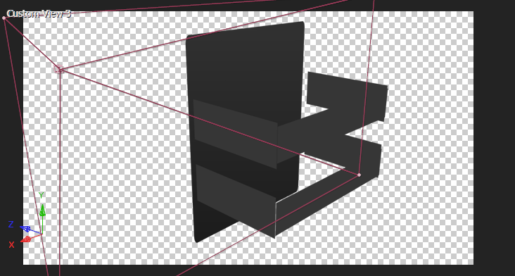

# 02 LOGO面板

## 原作

三个部分：LOGO面板，背景形状层图形，右下角文本。

## BG-ramp

纯色层+梯度渐变。

- 将渐变类型改为径向渐变，起始为白色，终点为灰色。
- 起始点在画布中心，终点在画面右下角外侧。

## viewport

在开始制作背景元素之前，先解决视口问题很有必要。

> 我们来演算如果先制作和摆放背景元素，然后再创建视口矩形会发生什么事情？
>
> - 由于在摆放背景元素时，没有一个绝对的视口参考，因此后续加上视口后，很可能观察位置达不到理想的状态。

下面这张图是我刻意制作的一个不正确的视口状态。

图中，文本位置被视口截断了一部分。因为刚开始摆放右下角文本时没有一个明确的参考。

---

回到视口的制作。

- 创建一个纯色层，初始化填满画布，也就是1280x720。

- 然后保持X比例不变。只对Y scale k帧：0% -> 75%。这样就产生了视口从中间细线往Y轴两个方向扩展开的效果。

  

- 将这个图层的模式改为Stencil Alpha。也就是模板Alpha。观察上面的截图和这个截图，发现模板alpha就是让白色矩形区域穿透成了下面图层的区域。
这一点，类似于Alpha轨道遮罩的作用。

  

## BG-shape

现在，我们先来制作背景形状层的组合图案。

我们可以将这个图案拆分为7个独立的形状层。

- 青色标记: 三角形。
- 橙色标记：两个矩形，大部分区域重合。横向摆放。
- 红色标记：两个矩形，大部分区域重合。竖向摆放。
- 蓝色标记：类似于两个梯形组合90度。直接使用钢笔工具绘制路径。
- 紫色标记：类似于一个梯形+一个矩形。直接使用钢笔工具绘制路径。

将这个制作好的BG-shape复制一份。通过适当的角度旋转和scale摆放到图中位置。

## bottom-right text

> There is no original content. It’s just an imitation for learning mad production. 没有原创内容。这只是学习MAD制作的模仿。
>
> We pay homage to the man who paved the way. 我们向开拓道路的人致敬。

注意这里字体右对齐。

## panel

在合成中，新建一个摄像机，不K帧，仅用于观察。

### 7 rects

首先我们需要创建面板

- 面板由1个大的矩形+6个小的矩形组成，一共7个矩形。都是由形状层实现。填充黑，描边无，轻度圆角。
- 主面板背景使用黑色影调的梯度渐变。

**这里本质是AE使用基础形状层/纯色层搭建标准立方体的问题。因为已经默认读者具有这种操作能力，因此不会赘述。**

### 外围文本

然后，我们创建3个外围文本。分别是：

- 2020 autumn （正面）
- opening（右侧），以自身左侧为锚点，往上倾斜一定角度。
- music（左侧），以自身左侧为锚点，往上倾斜一定角度。

这三个外围文字使用的字体是：

Orbitron字体是一种富有科技感的英文系字体，字体风格比较圆润，字体家族很多。

对于长文本的显示，Orbitron字体能提供很好的可读性。另外，它与原作在这里使用的字体风格比较类似。

---

### 正面文本

我们将观察视角改回正面：

- 这里正面文本 Anime Spot单独拆分了文本图层，一共是2个文本层。使用Orbitron字体。
- 中间的竖线使用了形状层绘制。
- 3个层都应用Glow效果来制作发光。

---

### 背面文本

我们将观察视角改到背面：

- 创建两个文本层，目标是贴在两个背面矩形上面。于是需要参考两个矩形的Z轴位置。
- 图层back-face的Z位置都是298，那么文本层对应只要稍微大于298即可。图中设置文本层Z轴300.4。
- 文字这里采用Adobe Heiti Std字体。

### 内部opacity动画

我们先考察图中红线框的四个图层，这四个图层的关键帧都是：淡出-淡入。例如opacity：100-30-70。对应合成预览窗口的1,2,3,4位置的矩形。

解决掉这个4个图层的opacity动画后，背面back-face 1和背面back-face 2，以及两个文本层的动画关键帧位置可以自由发挥，不偏离太多即可。

## panel 入场和投影

### 投影

给panel合成添加RG shadow效果。主要调节图中四个参数：

- 基线起始点
- 基线结束点
- 高度和倾斜点
- 线框颜色。也就是投影颜色。

### 入场

关键就两点：

- 位置移动：从左侧到定版位置。注意Z轴变化趋势是稍微推近的。例如Z从120到0。
- Y轴旋转：确定定版Y轴的旋转角度后，回到关键帧初始位置k帧，变化量大约1圈左右。是逆时针旋转。

## P2预览

## 小结

- AE 中，使用形状层/纯色层搭建基本3D立方体是基础。
- RG shadow可以给物体创建真实物理投影。
- 构图平衡：当背景右侧区域过于空白，导致画面左右重量失衡时，可以考虑创建形状层图案，或者添加文本来加重右侧画面重量。
- 对于英文长文本的显示，尽量考虑可读性较高的字体风格。

