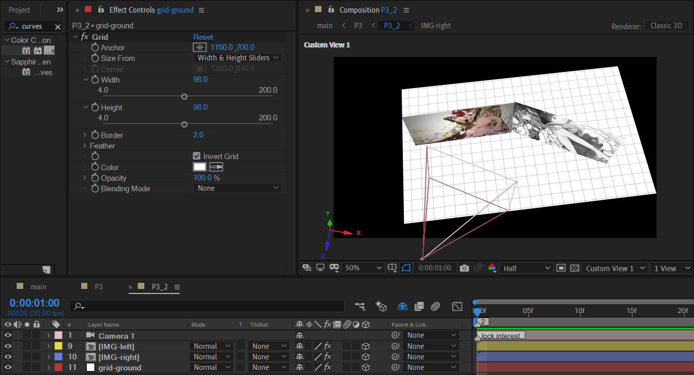
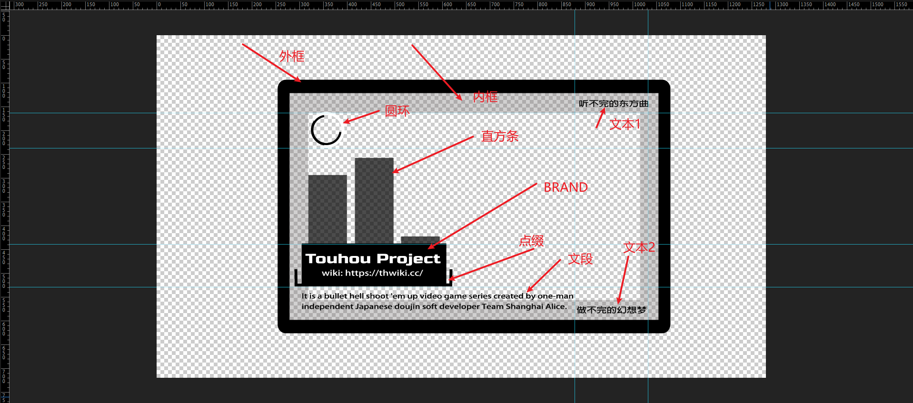
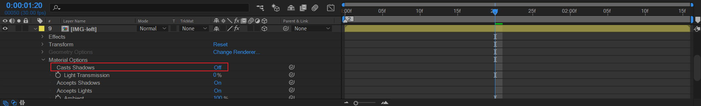

# 03 场景灯光秀

这个场景需要分割为两个子部分。也就是3_1和3_2。

## 原作

3_1

3_2

## 划分子合成时间

- P3_1长度本身是充满P3的，在1:00处标记，表示到这个时间就要结束P3_1。
- P3_2从P3_1结束位置开始，一直到P3合成结束。

## 3_1

创建一个白色纯色层作为白底。

### 格子背景

纯色层+grid效果。注意使用宽度和高度滑杆来分别控制格子单元的宽高。宽比高要大一点。

### IMG_frame

这个合成主要用于制作中间的背景图片。这个图片有灰色的描边。成品如下图。

---

下面开始制作。这里开始，我们稍微走进基本的调色方法论。

首先，我们导入素材。

从人的感觉来看，这张图偏白。从专业术语来描述，这张图过曝光，影调过白。

但是，这些都是感觉。我们需要一种更加直观和规范的观察模式。

因此，我们可以给这张图添加levels（色阶）效果来辅助观察。

### 认识色阶（Levels）

#### 认识参数面板

- 默认channel就是RGB。
- 下方直方图表示输入，含有3个箭头。
- 直方图下面是一个矩形条，含有两个箭头。
- 这5个箭头分别对应下面的五个参数。如图所示。

#### GAMMA

> GAMMA: 伽玛值是指处理位图的一种特殊效果的调整。通过调整伽玛值可以改变**图像中间色调灰阶的亮度值**，以增加图像的中间层次，而不会对暗部和亮部的层次有太大的影响。

从人眼视觉上理解：

- GAMMA影响的是中间调。中间调指的是：即不是暗部，也不是亮部的区域。

从数值上理解：

- 从左到右色阶值范围是0~256，依次表示图像的暗调区域、中间调区域、高光区域像素数量。也就是中间调是色阶值在128邻域的位置。

#### 实验和论证

首先，直方图中大部分波形位于右侧。左侧几乎没有。表示这张图集中于亮部/偏亮部区域，几乎没有暗部~中间调区域。这与这张图非常吻合。

下面以表格法来对比说明五个参数对该图像的影响。

| 操作              | level-1 设置\| level -2 观察                                 | 图片处理结果                                                 | 分析                                                         |
| ----------------- | ------------------------------------------------------------ | ------------------------------------------------------------ | ------------------------------------------------------------ |
| Input white 左移  |  |  | input white 左移导致图片之前不是很亮的区域也变得非常亮。例如之前色阶值为150的位置现在等价于最亮的色阶值255。结果就是导致图片更加亮，泛白。 |
| Input black 右移  |  |  | input black 右移导致之前中间调/偏亮部区域向着暗部迁移。例如之前色阶值为128的区域现在等价于最暗的色阶值0的效果。之前200的色阶现在可能只剩下72的色阶效果。从下方level-2观察，可以看到现在色价分布比较均匀，偏暗部~亮部都有较多像素。暗部极少，这张图从视觉上看暗部也是极少的。结果就是图片变得偏暗。 |
| Output white 左移 |  |  | 不改变input，只将output white左移。会导致输出时的中间调~亮部被抛弃了。现在只留下暗部~中间调的部分。体现为图片整体很暗，亮度不足。 |
| Output black 右移 |  |  | 不改变input，只将output black右移。会导致输出时的暗部~中间调被抛弃了。现在只留下中间调~亮部的部分。体现为图片整体很亮，过曝。 |
| 中间调右移        |  |  | 从下面level 2的观察可以看出，中间调右移后。中间调~亮部区域从1/2被挤压到很小的区域了，生存空间极小。体现就是图片被偏暗占领。 |
| 中间调左移        |  | 你能猜到结果了吧？亮部开始反击了。 | 暗部~中间调区域生存空间被挤压。结果就是图片被偏亮占领。      |

从结果来看，由于这张图本身偏亮，因此Input black 右移是效果最好的调整方法。之前的暗部~中间调区域也非常亮，调整后，整体亮度下降，图片向着偏暗发展。

然而，比起色阶，一般而言，个人更喜欢curves来进行基础的调色。

### 认识曲线（curves）

一般而言，曲线的调节比level要方便一点。

图中一共有5条线。

- 白色：RGB。
- 红色：RED
- 绿色：GREEN
- 蓝色：BLUE
- 蚂蚁线：Alpha。这条线一般不调节，调节没有效果。

调节RGB指的是明暗程度。红、绿、蓝这三条线独立调节对应的颜色分量。例如上图，

- 将蓝色保持不变。
- 绿色从中间点压低，
- 红色从中间低压低，而且压低幅度比绿色还要深。

**从曲线调节来看，就是极大减弱红色分量，稍微减弱绿色分量。即使蓝色保持不变，但这时蓝色占了主导地位。**

**此外，RGB从中间点压低。因此图片整体必然变暗。**

因此素材的灵梦的衣服中，之前的蓝色部分加深。另外，将红色压的很低，只因为不想衣服是粉红色，我希望衣服中的粉红变为深红。

| 粉红色                                                       | 深红                                                         |
| ------------------------------------------------------------ | ------------------------------------------------------------ |
|  |  |

好了。色阶和曲线到这里。先告一段落。我们接着往下走。

### IMG_frame 描边

- 选中IMG_frame，双击形状层矩形工具直接创建布满合成的mask。
- 添加stroke效果，勾选All masks。设置描边样式。

### 粒子

常规粒子使用particular制作。新建纯色层，添加particular。

- 将发射位置定于画面中心的右上角的图中位置。
- 将发射类型改为BOX，同时将发射类型改为单独XYZ尺寸，调整发射盒子大于整体画面。
- 控制发射速率不能过高，图中是30。
- 粒子速度可以稍微加大，图中是350。
- 粒子方向设置为DISC或者uniform都可以。总之，粒子是要随机方向运动。
- 发射额外设置中，必须设置一定百分比的pre-run。这样，开始时就有了很多粒子在运动。

对于样式方面的设置，可以自由发挥。

### character-profile

这里首先需要扣好的人物素材，而且要求是双人。

### 抠图方法论

人物轮廓抠图可以采用：

1. 传统PS抠图。

2. roto笔刷。按住alt是减模式，按住ctrl+鼠标左键，同时移动鼠标位置可以修改笔刷大小。它适用于动态素材抠图。如果想使用roto抠静态图像，请预合成一个1帧的合成。将图片放入再抠图。外层使用时使用time remap冻结帧。
3. linear color key或者key light之类插件来处理单一颜色背景（绿色/蓝色背景）的图片。
4. 手动给图层绘制多个mask，利用mask之间运算模式来调整内容区域。

在上面的几种方法中，静帧图片抠图推荐第1种：PS，视频素材抠图推荐第2种：ROTO。对于比较简单的素材，不想启动PS的情况下，也可以使用3,4种方法。

下面我将演示ROTO笔刷来抠静帧图片，虽然这种方法个人不推荐使用来处理静帧抠图，但还是希望读者可以了解。后面会讲述这种方法对于静帧抠图的局限性。

导入图片，选择ROTO笔刷，**在图层界面（注意不是合成预览界面）来刷取外围背景。**

然后勾选反转前景/背景。

将这个合成持续时间改为1帧。

在P3_1中，使用layer的帧冻结冻住第一帧。使用填充黑将合成着色即可。

#### ROTO抠静帧图片的局限性

- 首先，ROTO被设计成视频动态抠图。对于静帧图片，往往需要配合图层帧冻结来使用。明显增加了工作量。
- 当需要对扣好的人物素材进行进一步的调色/打光/副本图层堆叠模式处理时，ROTO笔刷往往需要重新刷新之前的抠图计算值。这带来极大的不便，也容易带来混乱。

因此，不建议使用ROTO笔刷来处理静帧图片的抠图问题。抠图一般交给PS来预处理。另外，PS还能进一步补图，这些都是AE很难实现的。

### TEXT

> The Touhou Project is a series of fan works, and a miracle.

依旧使用orbitron字体。字体可以加粗。

### 3_1 摄像机动画

通过Z轴位置K一个摄像机稍微拉远的镜头。

### 预览

## 3_2

这部分是一个3D场景+打光的合成。我们将从构建3D场景开始，然后才是摄像机动画+打光。

先看下我们的目标

### 地板

纯色层+grid创建格子地板，打上3D开关。

这个地板的方向暂时不需要过于纠结参数。后续再调也可行。

然后创建一个摄像机。

### 摆放2个背景图片

大约是这样一个图片位置。

- 两张图片尺寸推荐一致。因此将两张图片分别预合成，预合成IMG-left/right的大小都是1280x720。

- 两张图片之间几乎是相连的。缝隙不能过大。

- 右侧图片需要进行黑白处理。使用色相饱和度将饱和度降低到-100。

- 左侧图片进行暗角处理。使用CC Vignette。

  

### 左侧背景图片的十字

两个形状层解决。

---

注意将十字放于左侧图片的前面。留意Z轴位置。

### 平板

#### 外框+内框

一个形状层：绘制两个矩形路径，不要填充，只要描边。

- 外框：填充黑，opacity 100%。
- 内框：填充灰，opacity 30%。

#### 直方条

在一个形状层中：

- 创建三个一样的竖线作为路径。描边设置很大的值。就出现了直方条。
- 添加trim path，设置start为初始 35%。这样3个直方条初始都是35长度。
- 给trim path 的start添加表达式：`wiggle(8,70)` 每秒震荡8次，最大幅度为70。
- 这个图层可以勾选运动模糊。

#### 旋转的圆圈

形状层：

- 绘制两个组，每组一个半圆（通过trim path和设置start值实现）。一个黑，一个白。

- 分别给旋转应用表达式：random(0,360)
- **注意不要勾选运动模糊。勾选模糊后会导致看不到旋转时的缺口。**

#### BRAND + 点缀

点缀使用形状层绘制两个group。一个group就是两个矩形拼接。

#### 文本

> It is a bullet hell shoot 'em up video game series created by one-man 
> independent Japanese doujin soft developer Team Shanghai Alice.

面板元素很多，但是仔细拆解其实不难。

---

完成后，回到外部合成中摆放位置。将平板放于左侧图片之前。

### LOGO X2

- 创建一个250x250的正方形合成。
- 新建一个形状层，正方形，比合成稍微小一点。添加圆角。命名LOGO-matte。
- 导入灵梦素材，设置Alpha遮罩。适当缩放后，调整位置到合适观察位置。

按照这个方法，我们梅开二度。制作魔理沙LOGO。

---

> 提示：原作中LOGO是类似GIF动图的形式，这里只制作静态图。

现在，回到外部合成。制作LOGO运动。

展开两个LOGO的position，分别使用三个控制点绘制bezier运动曲线路径。

这里有两个关键点。

- 运动过程中，Z轴位置是有轻微变化的，但是Z变化幅度不能过大。从俯视图可辅助观察。

  

- 运动路径的中间控制点，对应的关键帧速度不能为0，必须提升。

  

好了。我们现在开始打光吧。

### 3盏灯光

#### 打光前的准备

首先，目前我们场景是白光的。这是默认的方式。

在打光之前，将需要打光的图层全部开启3D（如果还没开启）。

同时，确认它们的材质选项。

- 生成投影 on
- 接受投影 on
- 接受灯光 on

#### 环境光 X1

- 新建一个灯光层，选择环境光，淡黄色，类似黄昏的感觉。
- 将强度改为75%左右。不能过强，稍微打亮环境。

#### 左侧-聚光(强) X1

下面，创建一个聚光灯放于左侧，对两张图片的缝隙处方向进行打亮。下面给出前后对比图。

| 之前                                                         | 左侧-聚光(强) X1                                             |
| ------------------------------------------------------------ | ------------------------------------------------------------ |
|  |  |

右侧图片红线框区域就是聚光灯的照射范围。下面是这个灯的参数：

红线框是关键参数。Spot光源，白色光，强度50左右。红色框的参数很好理解。

下面让我们深入了解橙色框，也就是涉及光的细节参数的问题。

> Cone: 圆锥形，聚光灯就是圆锥形。

| 光的细节参数     | 翻译       | 效果说明                                         | 实验组                                                       | 参照组                                                       |
| ---------------- | ---------- | ------------------------------------------------ | ------------------------------------------------------------ | ------------------------------------------------------------ |
| Cone Angel       | 圆锥形角度 | 圆锥形照射时的视角宽窄。值越大就越宽。           | Cone Angel：12% |  Cone Angel：54% |
| Cone Feather     | 圆锥形羽化 | 圆锥形边缘是否羽化。值越大，边缘越不明显。       |  Cone Feather 0% | Cone Feather 50% |
| Falloff          | 衰减       | 灯光强度随距离衰减                               | N/A                                                          | N/A                                                          |
| Casts Shadows    | 产生阴影   | 是否产生投影。如果设置为否，灯光直接穿透遮挡物。 |  否 | 是 |
| Shadow Darkness  | 阴影模糊   | 是否在接受投影的面产生阴影模糊。值越大，越模糊。 |  0 | 350% |
| Shadow Diffusion | 阴影漫反射 | 参考物理学的漫反射光原理。                       |  |  |

很好，下面我们进行最后一盏灯光的设置。这盏灯主要作用是继续加大场景亮度，并且在地板打下鲜明的投影。

#### 顶部-聚光 X1（制造地板投影）

这里有几个地方需要注意。

- 首先，这个顶部聚光强度必须稍微强于前面2个灯光。否则无法产生投影。

- 其次，这个顶部聚光的高度必须合适，位于左侧图片上方，Z轴偏后位置。

  

- **然后，将左侧图片的材质选项的Casts Shadows关闭**。这步非常重要。

  

   因为如果不关闭，就会发生下面这种结果。
  

   理由很简单**。就是左侧图片的影子盖住了平板和LOGO的影子。**

下面，只剩下摄像机K帧动画了。

### 摄像机动画

为了方便分析，这里采取TOP视图来观察。

- 保证目标点不变。
- 摄像机稍微右移+拉远。

### P3_2 预览

## 小结

- levels和curves是基础的内置调色插件。
- wiggle表达式对于形状层的高速运动变化非常实用。
- 对于带有缺口的形状层的高速旋转，要留意需求的效果，从而合理设置运动模糊的开启和关闭。
- 灯光的设置和摆放可以极大地渲染场景的氛围。
- 中间关键帧一般需要提升速度值，避免绝对静止再启动。
