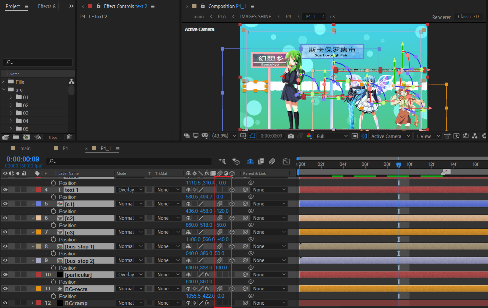

# 04 公交车站

## 原作

4_1

---

4_2

这段文字，the clear sky 在为下一个镜头做铺垫。

## 划分合成

其中【2】【3】标记点来自于对齐原作时间点。原理是非常直接的。因此，后续分割时间点时，不再赘述这个操作。

## 4_1

### 渐变背景

纯色层+梯度渐变。上方蓝色，下方绿色。

### BG-rects

新建形状层：

- 绘制一个小矩形，添加中继器，中继器副本设置足够多的数量即可。适当调节中继器的偏移位置。使得矩形之间存在间隙。

- 给这个图层添加 Roughen Edges（毛边）效果。选择Spiky类型，其他参数适当发挥。

### 静态泡泡

使用纯色层+particular创建。下面给出被调整的参数截图（选择图层按下UU键即可显示已修改参数）。

- 由于是静态粒子，因此速度属性（Velocity）一律清0。
- 粒子羽化值设置0，避免边缘模糊。
- 最后，将图层模式改为overlay。这样才能融合背景渐变的颜色到粒子中。

### 公交站牌 x2

由于这两个公交站牌制作原理是一样的。这里只讲解蓝色这个牌子。

新建一个1280x720的足够长的合成。命名bus-stop 1。

#### pole 杆子

一个矩形+渐变填充实现。

#### 牌子边框

形状层中：

- 一个矩形作为白色背景。Ctrl G打成一个组Rectangle 1。填充白，描边无。

- 在Rectangle 1组的外层，添加stroke。这个时候设置stroke就不会往内部挤压。

  

---

> 为何这里不能直接使用一个矩形：填充+描边实现？因为AE的描边也会向内挤压内部空间。（下图中白色区域变得很小）
>
> 

#### 牌子背景

纯色层BG-texture：

- 分型杂色制作简易纹理。
- TINT进行着色：将黑色map到蓝色。

接着，复制 sign 2 图层为 sign 1图层，稍微缩小尺寸，放于BG-texture上方。对BG-texture进行alpha遮罩。

> 为什么要对sign 1图层进行缩小？不缩小可以吗？
>
> 文字解释可能不够直观，请看下面这个实验：将sign 2直接复制为sign 3，保持原始比例。此时进行BG-texture的alpha遮罩。
>
> 发现背景扩散到了描边的位置。因此，如果效果上想保持描边，需要将matte缩小。
>
> 

#### 牌子文字

2个文本，一个形状层作为分割线。

---

对于另一个站牌的制作，大体上是一样的。因此制作时可以复制上面的合成，然后进行修改。

明显不同的一点是站牌的背景。下面将介绍这个站牌背景的制作。

使用S_TextureNoisePaint插件，默认配置下就是图中效果：纹理杂色绘制，并且是彩色的。

如果想选择其他的纹理样式，可以点击“Load Preset”，尝试其他的预设，再加以tuning。

### 文本 x2

> 1. 东方Project今年凉了吗
>
> 2. 末日时在做什么？有没有空？可以来拯救吗？

- text 1使用overlay融合背景，text 2保持normal下的黑色。
- 这两个文本层不推荐打开运动模糊，因为后续摄像机拍摄时位移速度很快，文字会非常模糊。

### 人物 x3

将扣好的3个人物素材分别导入。从左到右分别命名C1，C2，C3。

既然画面元素已经集齐了。那么可以设定3D空间的Z轴，也就是前后关系了。原则依旧是背景在后，人物在前。

为了让人物之间具有空间差，它们之间的Z轴位置也是有梯度的。

在实际调整中，建议使用TOP视图进行辅助观察。对于Z轴位置的观察，俯视图是非常实用的。

### 元素opacity 抖动

先从背景开始，对opacity属性k帧。

这里，推荐使用值曲线进行分析，因为此时速度曲线参考意义不大。下图为速度曲线。速度的正负不能直观观察出淡入淡出的趋势。

回到值曲线。这里将值抽取出来分析：

> 100 30 50 0 30 20 40 0  

本质上是升降opacity，重复多次后，最后淡出。

将这组关键帧复制到其他图层。然后整体排列先后顺序如下图。

- 背景先出现，人物后出现。
- 其中人物C1先出现，C2，C3后出现。

这种类型的关键帧，尽量使用复制粘贴，整体处理。请勿疯狂独立k帧。

现在，定版解决了，就到摄像机动画和调色处理了。

### 摄像机动画

---

进场的同时有一个从黑白到彩色的变化。使用Hue/saturation的饱和度k帧解决：-100 -> 0。

## 4_2

### 前景文字

新建文本层。绘制一个弯曲的mask。将文本的路径选项设置为这个mask。

下面是关键的步骤。

对position添加动画器。先设置范围选择器的高级选项：

- 基于words来处理动画
- shape为Ramp up。Ramp up就是左侧先出现，在右侧接着补上后续部分。

然后，在合适的位置记录offset为0。并设置position的Y位置为一定的正数。参考值400-600之间。这个Y轴位置设置的作用是在Y轴方向拉伸文本空间。

---

文本需要有一个Y轴方向的位置移动。

由于文本已经绑定到mask 1。因此对mask 1移动就等于文本的移动。于是对mask path k帧。

此时基础效果已经完成了。

### 背景文字

纯色层+四色渐变。

四色渐变的基础参数中，有四个位置和对应位置的颜色。

---

将上面的文本层复制一层。稍微放大缩放尺寸，这里是103%。然后对背景层应用Alpha遮罩。

最后，处理一下位置摆放。

## 过渡

回到P4合成。对4_2合成k一个轻微的缩放：从100%到90%。

## 小结

- 分型杂色可以制作常规背景。
- 文本层添加范围选择器，对offset K帧即可创建简单的出场动画。然后，可以继续设置position的X或者Y对文本空间进行拉伸。
- 文本层的路径选项可以设置为自定义的mask路径，因此如果mask路径为曲线，那么可以制作活泼的文字排列。

