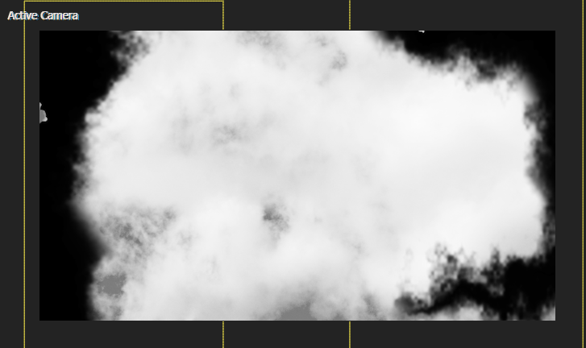

# 05 童年时代的纸飞机

## 原作


这个场景是个人很喜欢的一个场景，给人一种童年时代的怀旧感。细节处理上，中间故障信号线的运用锦上添花，虽然背景元素很丰富，但是原作者巧妙地去掉了中间部分区域的粒子阵列点缀，同时只使用非常有限的故障信号竖线，保证了观察窗口的清晰。


## 天空背景

新建合成SKY，在里面导入天空素材。


依次进行黑白化、亮度调节、模糊处理（按需）。

| 黑白化                                                       | 亮度调节                                                     | 模糊                                                         |
| ------------------------------------------------------------ | ------------------------------------------------------------ | ------------------------------------------------------------ |
|  |  |  |
| 色相饱和度中饱和度-100                                       | 加亮                                                         | 高斯模糊                                                     |


### 背景两侧黑色边缘


新建两个纯色层（sky-?-mask）。分别在左右侧绘制两个mask，mask的形状类似云朵轮廓。

---

创建一个合成，用于制作天空左右侧的分型杂色纹理。


纯色层+分型杂色，注意将分型杂色的transform中的scale稍微增大，让纹理比较粗糙。这里不需要精细纹理，因为是作为背景。

---

纹理制作完成后，回到外部合成中，对sky-left-mask和sky-right-mask应用置换map效果。


此时，基本效果完成。但是边缘比较生硬，于是对mask边缘进行处理。主要设置mask羽化和扩展值。


### 背景移动动画


三个图层都是向着右下角轻微移动。但是SKY合成的运动幅度稍大。这样，背景3个图层的移动就有明显的层次感。


### 预览




## FORM 粒子 -画面颗粒感


这里，说明关键参数：

- Size XYZ 设置成比画面稍大。
- Z粒子数设置1，XY的粒子数合理设置。
- Z旋转角度45。
- 粒子羽化值为0，使得粒子边缘清晰。因为是背景，顺便将粒子opacity稍微降低。

---

效果如下图：


## 飞机入场

导入飞机PNG素材。


如果想要更加真实的飞机模型，可以考虑3D建模，例如 AE E3D插件。

### 标记运动时间点


- enter：飞机高速入场
- keep：飞机在原地周围徘徊
- move：飞机开始右移

### 运动路径和运动曲线

主要利用TOP视图来K帧。


---

活动摄像机视角。这里，空间插值全部使用auto bezier。时间插值前半部分使用bezier，后半部分手动k帧。


下面分析运动曲线。


### 细节——镜头抖动

为了营造一种摄像机拍摄飞机时的镜头晃动感，需要对飞机图层的position属性添加wiggle。


```js
wiggle(1,40)
```

一秒抖动1次，抖动幅度为40（平均值）。属于很轻微的抖动。


## viewport 建立


创建一个纯色层，设置淡蓝色，opacity 60%，图层模式为Color。

> 为什么图层模式是Color？

下面进行实验来对比。图层模式：overlay ，color，normal。

| overlay                                                      | color                                                        | normal                                                       |
| ------------------------------------------------------------ | ------------------------------------------------------------ | ------------------------------------------------------------ |
|  |  |  |

overlay模式染色太淡，color模式染色强度适中，normal模式染色过强。因此，这里采取的是中庸之道。


### 展开动画


Scale：保持X比例不变，对Y比例k帧：从0到65%。

到这里，基本的视口已经建立，但是没有那种童年已经逝去的年代感。少了点什么呢？——故障艺术。


## viewport 故障

### 椭圆形视口


新建一个调节层，绘制一个椭圆形mask。

- 对mask path k帧，使得path缩小。

- 然后增加mask的羽化和扩展值。

- 将缩小的关键帧组按等间隔依次复制，直到填满合成长度。也就是制作缩小-放大的循环。

  > 提示：这里也可以使用loopOut表达式。

预览效果。


### 电视故障 - 横线


使用S_TVDamage插件实现。这里主要对reception master的值k帧：升降模式。

参考值：0 -  0.22 -  0  - 0.28  - 0  - 0.36


### 电影故障 - 竖线


使用S_FilmDamage插件实现。主要关注竖线信号闪烁freq（闪烁频率）相关参数的设置。闪烁速度应该适中。


### 变为黄昏色


选取适当的变化时间点，进行标记。之前是蓝色视口，之后天空背景变为淡黄色。

更加具体地描述：

- 之前：黑色两侧（阴影），白色天空（中间调），白色（高光）/视口（蓝色）。
- 之后：黑色两侧（阴影），淡黄色天空（中间调），白色（高光）。

很明显，想要的目标和三色调非常吻合。因此新建调节层，添加三色调，设置中间调为淡黄色。然后对blend 属性k帧。

> 参考值：100 - 9 - 100 -9 -100 - 0

这种混合变化会导致画面中间调在之前的蓝色和现在的淡黄色之间快速变换。


### 剧烈的横条故障


依旧使用S_TVDamage来实现。

- 首先绘制一个等价于之前viewport位置和大小的mask。

- 接着对Bar细节进行丰富：使用表达式将横条剧烈抖动。`wiggle(20,1)`中频率为20次每秒，非常剧烈。

最后，在时间轴上将出入点对齐下一层的着色图层。


## 左侧箭头


这个箭头在之前P2合成中已经实现。唯一区别在于加了一个竖排文本。


> just copy and paste this comp


### 出场方式


- 添加滑块控制，在合适位置对值k帧：从100到0。

- opacity对齐上面关键帧，从0到100。对opacity应用表达式：`wiggle(6,effect("Slider Control")("Slider"))`。

  表达式原理说明：

  - 在opacity 0的关键帧时间点之前。箭头的opacity受wiggle控制会随机变化，体现为闪烁效果。
  - 在opacity 100的关键帧时间点后。因为此时slider值恒定为0，wiggle无效。箭头的opacity会固定100。

## 文本和加载进度条

### 文本


> It was a dream of my past self

这句是标题。标题有一个水平擦除入场动画。选择opacity属性制作动画，对offset k帧。


---

> The is no meaning  for this long text.Its purpose is to enrich the picture.
> Now I can’t think of some meaningful sentences. So I decide to search some.
> Now I  come back. Here is the search result. Would you like to see something disappear from this world?

这段长文本使用一种不想让观众看懂的字体：England Script。

其他可选的备选字体推荐：CastilloSignature-rgaey-2  FrasellPersonalUse-2

| CastilloSignature-rgaey-2                                    | FrasellPersonalUse-2                                         |
| ------------------------------------------------------------ | ------------------------------------------------------------ |
|  |  |

> 不演了，我摊牌了

这里是一句调皮的吐槽。


### 进度条


- 边框：一个形状层，绘制矩形，只要描边。

- 进度条：复制上面形状层，描边无，设置渐变填充。添加线性擦除效果。擦除方向为水平向右，过渡完成的参考k帧值：87-77-63-55-53。


这里运动曲线为缓动处理。


## 目前的效果


**虽然大体上效果已经模仿成功，但是发现了一个问题：画面有点脏。**经过和原作的对比，分析关键的原因。

| 原作                                                         | 本次模仿                                                     |
| ------------------------------------------------------------ | ------------------------------------------------------------ |
|  |  |

这个画面过于脏乱的解决思路：

- 给form粒子层绘制一个椭圆形mask或者多个mask，模式设置invert。这步是为了去掉部分区域的form粒子。

- 另外，蓝宝石插件的故障效果不要设置得过于强烈，原作仅仅使用了竖直线条故障。


## P5出场


回到P5合成中。在合适时间点标记，并打断p5_1。

- 在打断时间点，使用时间重映射（或者帧冻结）锁定最后一帧画面。
- 消失动画：Y轴往上，往下，恢复到中间。期间一直在缩小。

关键帧的时间点-帧分析：

| 1                                                            | 2                                                            | 3                                                            | 4                                                            |
| ------------------------------------------------------------ | ------------------------------------------------------------ | ------------------------------------------------------------ | ------------------------------------------------------------ |
|  |  |  |  |


## 小结

- 蓝宝石的S_TVDamage、S_FilmDamage插件可以制作旧电影/电视时代的故障艺术效果。
- 当画面因为使用的插件效果过多导致画面脏乱时，应该思考如何减弱特效，来保持画面的干净。可以尝试：调整插件参数来减弱特效，绘制mask来去掉部分区域的特效，或者降低背景图层的opacity等。
- 缩小+位置移动飞远也是常见的出场方式。

