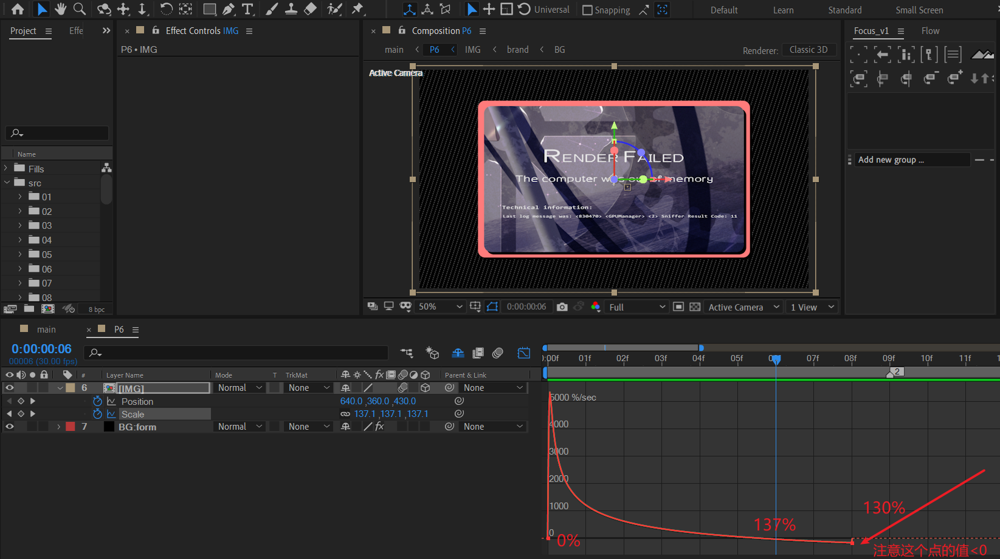
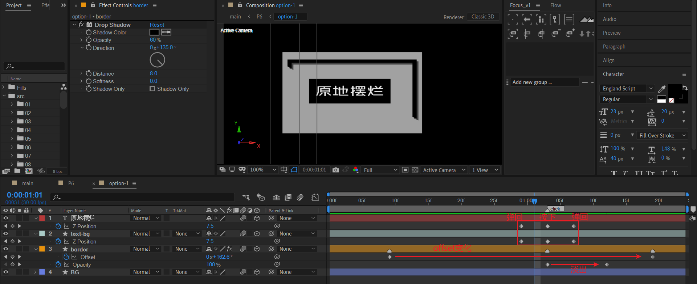
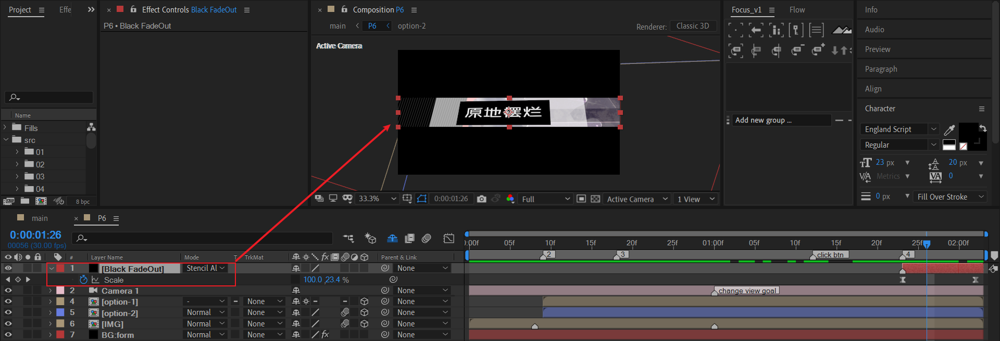

# 06 快乐二选一

## 原作

## 背景——粒子阵列

form 粒子。

关键参数如下图：

- Z空间不需要 => Size Z 设置0；Z空间粒子不需要 => Particles in Z 设置0或1。
- 粒子size设置1。
- 图层的transform属性中合理设置rotation。

## 背景——面板

### BRAND

- 四个文本
- 一个形状层，绘制矩形作为背景图片的遮罩（BG matte）
- 一个合成作为背景图片（BG）

这里，有两个注意点：

- 标题和副标题文本使用的是【几何圆体粗】字体。报错标题和报错信息使用的是典型的等宽字体——Consolas。

  > Consolas 字体是编程环境中常见的一种等宽字体，对于代码的显示非常友好。

- 标题Render failed中，每个单词的首字母稍微增大字体尺寸。

  

### 给BRAND添加投影

将上面的BRAND预合成为新合成IMG。这个合成的作用主要是添加边框和投影。

- 新建一个形状层border：添加描边，填充为渐变。
- 给两个图层（BRAND和border）都添加drop shadow来制作投影效果，投影方向是135度。

---

出场动画：放大，然后稍微缩小。

这里会第一次介绍运动曲线速度溢出的用处。

首先，k一个从0到130%的缩放。如果不做特殊处理，可以想象出，这是一个很直白的缩放。

但是，如果想创造一种放大后稍微缩小一点的回弹效果。例如 0 到 137%，然后再回到130%的缩放呢？有两种方法：

- 使用三个关键帧进行标记k帧。
- 使用两个关键帧进行k帧。这种方式就是下面使用的方式。

打开速度面板，将结束关键帧的值稍微往下拉，速度此时是负值。于是在这部分时间，缩放从137%下降回130%。

## 2个选项

### option-1

- BG：一个纯色层。
- border：使用形状层实现。
- text-bg：option-1的按钮背景。
- 文本层：option-1的按钮文本。

---

border的实现细节。

首先绘制矩形。

然后添加修剪路径。

- 设置start和end的值，使得旋转中心（锚点）和背景矩形的几何中心重合。
- 设置offset的初始值为大致图中倾斜角度。

然后我们在里面继续绘制一个小一点的矩形填充。

接着，使用合并路径将里面矩形减掉。

### option-1内部动画

首先是按钮背景+按钮文本的按压效果动画。通过Z position k帧实现：0-15-0。

border的旋转动画通过offset值变化实现，顺时针旋转。在合适位置补充opacity淡出。

### option-2

选项2可以复制选项1来加以修改实现，注意去掉关键帧。

## 选项入场动画

将两个选项图层的出场时间点稍微推迟到图中【2】标记点。

- 先记录关键帧结束点位置，图中是完美的（640,360,0）。然后使用TOP视图对初始帧k帧，制作从远处飞近的效果。
- 补充opacity淡入。

## option-1特写

### 基本特写

新建摄像机。在特写开始的时间点，首先记录影响的图层（index 4，index 6）的初始位置。

然后，page down右移时间轴一帧。此时，需要调整影响图层的位置。这步就是摆特写的位置。~~开摆了开摆了~~。

这里摆位置有个要求：按钮平行，并且居中于画面中心。

### 特写过渡加强

使用twitch插件来制作快速滑动，营造镜头剧烈晃动的模糊感。

- 新建一个调节层，放于option-1图层之上，添加twitch效果。

- 勾选【滑动】开关，并对幅度属性k帧： 0 -300-300-0。总之，目标效果为镜头朝不同方向快速滑动几次。

## 出场

这里依旧使用纯色层scale+模板alpha图层模式来制作压黑边成线的出场。

## 小结

- Twitch插件可以制作剧烈、高速的画面抖动效果。它有几种抖动类型，这里使用的是滑动类型。同样地，wiggle表达式也可以制作抖动效果。两者的作用相似。

