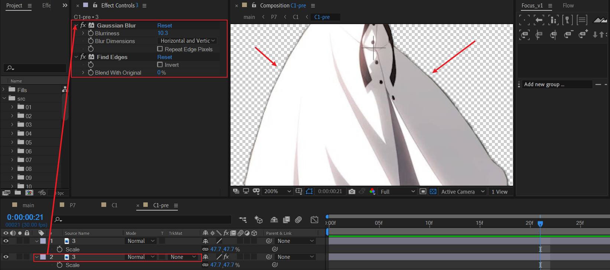
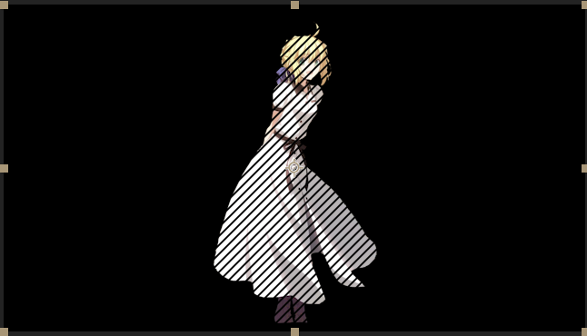

# 07 异世相遇

## 原作

一个白色背景，传统压黑边视口。四个异世相遇的二次元人物角色。人物头顶有名称介绍。

视口底部背景位置有一行长文本，文本上方是一个网格正方形元素作为修饰。

## 背景+视口

## 动画人物角色 x4

首先寻找四个抠好的人物素材。在这里，我刻意制作了一个使用PS粗糙抠图处理的人物边缘。目的是为了讲述人物边缘的常规处理问题。

### 人物轮廓描边：模糊+寻找边缘

这里以C1为例说明。导入人物saber。

放大图片观察比例，关注点请放于人物边缘。

可以看到人物边缘的黑色描边缺失严重，而且抠图处理的边缘粗细~~非常随意~~(X)，简直菜到不行(✓)。

---

步骤描述：

- 将人物复制一层，对于底层副本，分别添加高斯模糊和寻找边缘。
- 将高斯模糊的模糊度适当增大，这个取决于素材的比例。
- 寻找边缘使用默认参数。

可以看到人物边缘已经有了一层比较柔滑的黑色渐变描边。然而，这种处理方式的描边效果比较微弱，局限性比较大。

### 人物轮廓描边：自动跟踪+stroke

对人物图层进行自动跟踪（Alpha）：

获得非alpha的边缘轮廓的mask组。

然后对图层添加stroke效果。

关键参数说明：

- 勾选All masks：这些mask由自动跟踪获取，可以按需微调。请勿手动使用钢笔工具硬描。
- color：描边颜色。
- brush size：描边粗细。细线一般1-3之间就好。
- brush hardness：笔刷的硬度，设置为0。笔刷非常柔化，边缘不明显。
- opacity: 描边不透明度。

这种方式可调节度更高，比较推荐。

> 修复人物轮廓描边问题后，可以进一步了解边缘融合技巧：[让合成更自然的“边缘融合”技术](https://www.yuelili.com/edge-fusion-technology-to-make-synthesis-more-natural/)。

### C1内部动画

- 文本和横线整体淡入淡出。

- 人物合成使用百叶窗过渡，选择合适的过渡方向和width。

  

---

C1完成后，根据相同的原理，分别制作C2-C4。

这里，简要介绍模仿中这些素材的来源。从左到右，分别表示C1-C4

- C1：Artoria Pendragon ，阿尔托莉雅·潘多拉贡，出自《FATE》系列。
- C2：Elaina，伊蕾娜，出自《魔女之旅》。
- C3：Hinanawi Tenshi ，比那名居天子，出自《东方Project》。
- C4：Okunoda Miyoi，奥野田美宵，出自《东方Project》。

---

然后，在P7合成中：将C1-C4分别摆放到定版位置。

将它们的3D开关打开，设定人物Z轴空间关系——景深，为之后的摄像机动画奠定前提。

在调节过程中，合适使用TOP视图进行辅助。

### 人物自身淡出动画

C1，C3首先淡出；C2，C4然后淡出。

这里的方法论个人认为是交错。

- 设想C1,C2一组淡出，C3,C4接着淡出。这样难免空间失衡感明显（一侧空白，另一侧不空白）。

- 或者，C1，C4一组，C2，C3一组淡出。这样也会导致两侧先空白，然后中间再空白的违和感。

因此，间隔分组淡出是有审美根据的——交错感。

## 摄像机动画

### 人物向左侧平移

新建摄像机并空对象绑定。

****

使用空对象制作X方向的平移动画。上图为TOP视图，红色箭头表示X移动幅度。

效果示意图。

### 人物下移

直接对摄像机Y位置k帧，制作下移。

## 背景文字+网格

> I am the bone of my sword. Steel is my body,and fire is my blood.

在外层合成中，思考对该合成grid-and-text k帧。

它的动画也是X左移入场+Y下移。这里，对于Y的下移，使用了bezier曲线路径，而不是直线路径。

## 小结

- 将多个人物在3D空间的Z位置设置不同的值，就可以产生远近关系，此时摄像机K帧就能制作明显的空间景深感。
- 多个人物在空间的出场方式如果设计为交错淡出，不会产生画面失衡感。
- 当文本层的单独出现过于单薄时，可以考虑添加形状层元素进行组合，这里使用了正方形网格。

