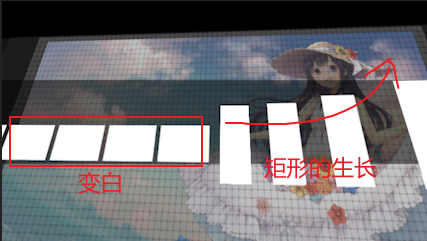
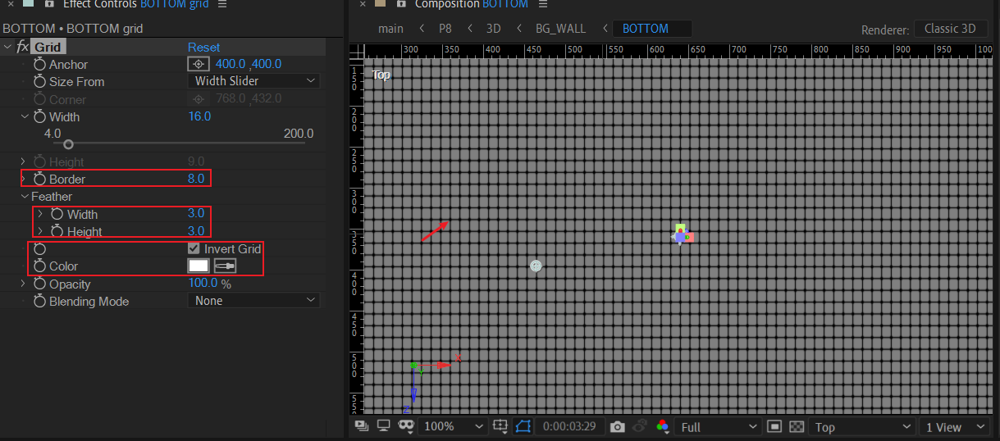

# 08 图片画廊和3D盒子

## 原作

## beehive 蜂巢图案

### beehive 周围

新建形状层，8个内容组：LEFT|RIGHT|TOP|DOWN。TOP-LEFT|TOP-RIGHT|BOTTOM-RIGHT|BOTTOM-LEFT。

由于同构性，只需要制作3种。分别是TOP，TOP-RIGHT，RIGHT。

> 制作过程中可能遇到的功能需求：快速独显特定形状层的某个组：How to solo display one group of shape layer quickly in AE？
>
> 这个需求可以借助一些AE第三方插件解决。

---

图案的制作过程。

#### TOP

创建一个六边形，打组TOP。使用trim paths去掉上下边：

- 由于100/6=16.67，这个16.67就是六边形中每一个边占的路径百分比。trim path时start设置18%。
- 通过offset调节缺口位置。

然后，添加中继器：设置副本4，设置负的Y值，让生长方向为向上。

#### TOP-RIGHT

打组TOP-RIGHT。新建空组（图中group 3），绘制6边形。使用修剪路径修剪成图中的形状单元。

这步完成后，该组通过中继器重复副本。

该组完成后，将该组复制2次。调整副本group的位置排列。

#### RIGHT

然后，根据类似原理制作上方延伸。（Y取反或者重新绘制都可行）

剩下的也是相同原理，就不赘述了，可以自由发挥。关键原理是修剪路径+中继器。

#### 完整的周围图案

淡入淡出动画。

### beehive 中心

- 新建纯色层白底。
- 新建形状层，绘制6边形。描边稍微加粗。

接着，复制上面的形状层，并调整位置。修剪路径为一半。

最后，添加中继器，调整旋转角度和副本数。

复制周围图案（edges）的动画关键帧到中心图案（hexagon）。

---

现在，可以预览到完整的beehive图案。

### 文本

> Once you do something, you never forget. Even if you can't remember. 

文本Y下移，然后淡出。

## viewport建立

黑色纯色层+2个mask，初始化opacity 100%。这样，就只剩下中间白色可视区域。

> 为什么要这样实现，而不采用传统压黑边技能?  因为mask区域这部分遮挡，在后面要消失，从而揭示整体画面。
>

定义好viewport之后。可以开始beehive的动画k帧。

## beehive合成的动画

### 主体动画

记录初始属性。

---

然后在标记【3】处，开始摆位置。

过程分析：

- 位置表现为：X左移。

- 缩放表现为：缩小。

- XYZ的旋转在上图看不出变化的中间过程。从数值上看是X半圈，Y一圈，Z反向半圈。其中一个中间帧截图如下。

  

### 细节与出场

## 粒子环绕背景

### 初始化

新建合成particular-BG。

新建6个点光源，灯光颜色全部设置为黄色。

---

新建一个纯色层+particular，关键参数：

- 设置发射类型为lights，注意设置时要确保能识别灯光群。
- 粒子参数一律清0，粒子发光强度改为跟随灯光强度。
- 设置粒子混合模式为Add，加亮发光效果。

---

新建摄像机，设置摄像机位置和目标点大致如下图。也就是观察视角要稍微近一点。

### 灯光路径K帧

绘制路径时，有两个注意点：

- 必须是bezier曲线路径，不能是直线。
- 曲线路径的中间尽量设置折返环绕（一个圈）。

效果预览。

### 粒子曲线运动的另一种实现

关于多个粒子光束的曲线运动，也可以参考particular的预设：organic Lines。

### 淡出动画

选中该图层particular-BG，在左侧绘制矩形。然后对齐beehive图层的淡出关键帧来设置自身的淡出关键帧。

## 3D 图片画廊

现在，到了比较难的一个合成的制作的时刻。**请准备充分的耐心和毅力。**（~~啊这，开摆时刻~~）

在开始动手实现之前，我们先来看下几个关键的中间过程。

### 分析摄像机镜头运动

| 1                                                            | 2                                                            | 3                                                            |
| ------------------------------------------------------------ | ------------------------------------------------------------ | ------------------------------------------------------------ |
|  |  |  |

| 4                                                            | 5                                                            |
| ------------------------------------------------------------ | ------------------------------------------------------------ |
|  |  |

因为这个分镜的摄像机运动比较复杂。因此，这里会花费大量笔墨来演算说明摄像机的初始观察视角。

### 摄像机的初始观察视角

首先，我们先导入背景图片，预合成为BG0。

然后，我们使用形状层创建一个小矩形，打开3D。

创建一个摄像机，摄像机这里是Z=-532.9的值（这个值仅仅表示摄像机现在位于rect-matte图层的后方）

---

接下来是重点。我们想象镜头推近，对应将摄像机的位置和目标点的位置的Z全部设置为0。此时得到:

也就是此时摄像机位置的Z和rects-matte位置的Z相等。

接着，我们将摄像机位置的Y设置为0，目标点位置的Y先保持360不变。此时，从TOP视图观察摄像机的视角。

摄像机此时已经变成了正俯视的视角。可以切换到front视图和left视图进一步确认。

| front                                                        | left                                                         |
| ------------------------------------------------------------ | ------------------------------------------------------------ |
|  |  |

上面front和left视图中，摄像机目标点位置Y依旧是360。下面我们来考察：此时摄像机目标点位置Y变化的区间对视角的影响。

当摄像机目标点的Y从360~0这个区间变化时，依据能保持观察到rects-matte图层。

一旦摄像机目标点的Y超过0，变为负值，此时摄像机观察视角方向就变反了。

#### 结论

经过上面的实验，我们已经可以初始化正确的摄像机位置和目标点位置。然而，此时我们观察不到rects-matte图层。

还记得之前的left视图吗?

摄像机视线已经和rects-matte平行了。因此，我们需要将rects-matte的X旋转+90度。

回到活动摄像机视角观察。

视角大体上是正确的。但是位置稍微左偏了点。此时需要对摄像机位置Y进行拉远修正。

很好。到了这里，相信你已经能够完全理解这个摄像机初始观察视角的演算过程。

我们从默认的摄像机初始化参数开始，一步一步调整摄像机的观察视角，直到达到合理的初始视角。

这个推演的思想和方法论，本质上属于【猜想-实验-观察-修正-归纳】的过程。

后续，我们就可以创建空对象来绑定摄像机。

> 注意：通过多层父子链接绑定后，空对象和摄像机的位置/目标点参数会变得不够直观，而且我们还会根据自身需求微调参数。此时参数已经面目全非，很难追溯原理。因此请务必消化上面的推演过程，理解一般性（演算过程和原理）而不是具体性（数值）。

---

下面，我们开始一步一步地实现摄像机动画。

### 格子的生长和左移

- 对空对象part-1的position的X位置k帧：画面左移。
- 对于rects-matte：
  - 对copies数k帧实现生长，最终生长副本数为5个。保证5个副本数的总宽度稍大于画布的宽度。
  - End opacity设置淡入关键帧。

复制上面的rects-matte为rects。这个图层的目的是rects-matte淡出后，能够出现在原位置替换为白色以补充空间。

rects图层需要在末尾处添加淡出淡出关键帧。

### 格子变白+观察矩形生长（圆环右侧）

格子变白的关键帧在上面已经处理。这里，关键在于矩形生长为圆环（3/4左右的圆）。

在实现之前，我们来梳理一下实现步骤：

1. 采用点光源图层来绘制位置路径。
2. 采用particular插件来跟踪这个路径。粒子纹理需使用自定义合成（矩形砖块）来替换。

我们先从绘制圆环路径开始。新建一个点光源，然后对路径进行k帧。

然后，选择left视图确认圆环的Z位置在0位置附近，而且保持一致。图中是3.0。

---

现在，我们开始制作矩形生长。

首先创建一个空合成rectangle，尺寸稍微小一点（这里是326x174），以节省粒子纹理替代时的资源占用。

在里面使用形状层绘制一个白色矩形。

---

新建一个纯色层，添加particular效果。

关键参数说明：

- 粒子发射类型选择灯光，注意灯光名称设置。
- velocity相关属性全部清0，设置跟随light intensity。
- 粒子生命时间要大于该合成的总时间。该合成为7秒左右，这里粒子生命取值9.2。
- 将粒子纹理替换为上面制作的rectangle合成。时间取样设置静帧（still frame）。
- 设置XY rotate为90度，使得呈现平放的效果。如上图所示。

---

下面我们来处理这段时间的摄像机动画k帧。

首先，记录开始时的位置属性和旋转属性。

接下来，我们通过修改这4个属性，然后记录关键帧。实现目标：镜头右移，同时观察圆环右侧。

为了加深理解，下面是摄像机运动路径示意过程。

| 开始和中间过程（自定义视角2）                  | 结束位置帧（活动摄像机视角）                                 |
| ---------------------------------------------- | ------------------------------------------------------------ |
|  |  |

### 观察矩形生长（圆环左侧）

我们继续挑选合适时间点（图中【6】标记时间点）对摄像机k帧，在这个时间点打断空对象和摄像机图层。

此时观察方向是圆环左侧。活动摄像机视图如下，这个视角一定要调整到比较满意的位置，让圆环侧看居中。

因为后续摄像机要在此视角继续推近。

到了这里，我们可以开始制作背景墙。于是我们将时间轴的竖线拨回前面。

### 背景墙 BG-WALL

先看下目标成品的效果。

| TOP视图                                                      | 侧面（自定义2视图）                                          |
| ------------------------------------------------------------ | ------------------------------------------------------------ |
|  |  |

将这个3D墙划分为5个部分。分别是：

- BOTTOM 地面墙。尺寸稍大。
- BACK 底墙。
- LEFT 和 RIGHT，两侧墙。
- BG2 位于上方，含有背景的墙。

#### BOTTOM 墙为例

注意上面图层升降是改变Y轴（不是Z轴）。

- index 4：先使用纯色层制作一个纯色背景。Y位置在最低位置。
- index 3：背景素材。
- index 2：纯色层，同色系。opacity降低，这个图层目的是为了压暗背景亮度。
- index 1：纯色层+grid效果。用于制作网格。伪造大屏幕LED的感觉。

这里，含有网格效果这一层有些地方需要注意。

设置border厚度为8。设置羽化的宽高为3。选择勾选反转grid。

**此时网格正方形格子的交汇点会有小圆点的效果。**

---

对于其他部分的背景墙的制作，原理类似，不赘述。

那么，我们继续。

#### 位置摆放

将3D合成拖入合成p8中，放于合适的index位置。由于3D合成这个图层本身不k帧，因此工作量在于摆位置。

关于位置的摆放，请记住两个不变量（目标），下面列表说明。

| 目标位置1                                                    | 目标位置2                                                    |
| ------------------------------------------------------------ | ------------------------------------------------------------ |
|  |  |

图层修改的属性是位置和旋转。值是项目/图层依赖的，每个人的值不一样。朝着上面的目前视角去调整即可。

#### 内部动画

在外层标记时间点：这个时间点就是底层背景完全消失，侧面背景开始进入时的时刻。图中为【5】。

根据时间点标记传递，分别对相应背景墙制作opacity变化的关键帧。

到了这里。我们基本已经解决背景墙这个困难的部分。

现在来回顾一下这个摄像机运动的过程。

背景墙完成后，我们可以开始补充前面的画面点缀。

### 黑色矩形和背景揭示

- Black transition：对图中背景的黑场揭示和黑场淡出。
- 中间黑边-修饰：指的是图中黑色矩形背景的淡入淡出。

### BRAND

目标效果。

画面元素有白色台子，台面文字，电视屏幕，电视下方文本，一个广告牌。

#### 台子和正面文字

台子使用一个大矩形作为主体，两个小矩形作为裁剪部分，使用合并路径-减去模式来制作。

台子的横线使用钢笔绘制，添加描边。

#### 电视

电视边缘形状组EDGE。

同构图形，只需要制作一侧，然后复制一层，加以变换。

一侧拆解：

| shape 1                                                      | shape 2                                                      | shape 3                                                      |
| ------------------------------------------------------------ | ------------------------------------------------------------ | ------------------------------------------------------------ |
|  |  |  |
| 矩形减去梯形                                                 | 描边-dashes设置                                              | 梯形减去三个小圆点                                           |

---

电视内容。这里的电视内容可以自由发挥。

采用particular跟踪光源路径。光源位置使用wiggle表达式来实现随机漫步（random walk）。

particular图层：使用两层不同半径的发光效果。

---

最后，在TV合成中，对屏幕内容图层添加适当的故障艺术。绘制一个屏幕矩形作为matte。

#### 广告牌

#### BRAND内部动画

在BRAND合成中：

- 对TV合成淡入。
- 对于广告牌，开启3D，初始化一定的Z轴旋转，然后对Y轴k帧，同时对齐淡入关键帧。

### 最后的摄像机动画

镜头推近+BRAND入场出场。

#### 镜头推近

#### BRAND入场出场

- 往前K帧：寻找合适的旋转角度和位置，使得BRAND居中消失于远处。
- 往后K帧：镜头居中推近，顺时针旋转出场。上面可以添加调节层处理黑场问题。

## P8 横线和文本修饰

### GRID_TEXT

矩形+中继器制作文本BOX。

## 小结

- 在形状层中，使用修剪路径+中继器，可以制作带有重复性结构的图案。对于含有同构单元的图案，使用同构单元的副本组，然后变换，可以提高制作的效率。
- 摄像机位置和目标点的初始化，对于复杂的3D场景合成而言，非常关键。演算的方法论对于这个问题很有帮助。
- 网格+大图片这种图层堆叠方式可以模拟液晶显示屏。