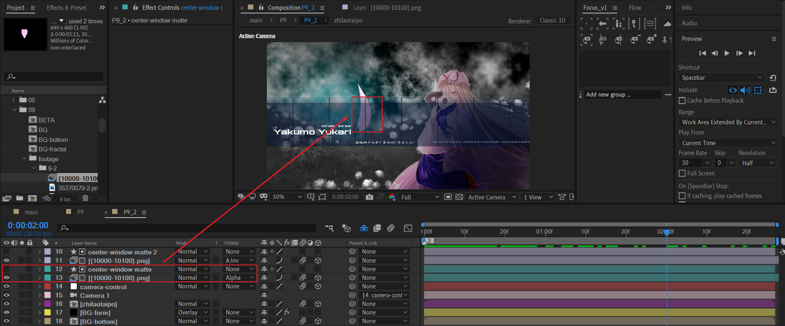

# 09 行云流水

## 原作


---


## 分割合成


## 9_1

### TEXT 合成

新建一个文本图层，输入文字:

```
When I first meet this MAD I decide to imitate it.
```

首先设置下面参数：


- 在更多选项中，设置锚点分组规则为Word。
- 在动画范围选择器中，设置：
  - 基于words管理
  - 形状为Ramp Up

设置offset关键帧初始为0%，结束为100%。同时opacity初始为0%。可以看到从左到右出现opacity渐变。


---

设置position的Y为一个正数，使得文本空间在Y轴拉伸。


---

增大scale的值，例如600%。


---

设置rotation的值为一定的负值。


---

因为希望文本从无到有，从左到右地出现。因此需要将offset的初始值改为-100%。


---

背景的文字使用较大字体，淡入出场。


回到9_1合成中，对TEXT合成做一个缩小的动画。


### BG 合成

原作截图。


#### 先处理背景图层


这里的图层都不需要特殊处理。唯一需要注意的是背景图片左下角的标题需要设置颜色渐变。


#### 再处理前景人物图层


导入人物合成（图中index 3的BETA合成）

- 对Y轴k一个旋转：1x->0。opacity淡出：100-0。

复制一层（图中index 4的BETA合成）

- 去掉opacity淡出。

- 添加梯度渐变效果，上面深红，下面黑。

这样处理之后：在上面人物图层opacity淡出后，画面显示的是渐变填充的图层。

| 中间帧1                                                      | 中间帧2                                                      |
| ------------------------------------------------------------ | ------------------------------------------------------------ |
|  |  |


#### 内部动画：压黑边+白场消失


#### 入场

回到外部合成中，在结束位置先记录关键帧，然后时间轴往左设置开始关键帧。

- 位置移动
- 逆时针旋转


### 上下文本

TEXT_TOP


---

TEXT_BOTTOM


#### 文本动画

Y轴方向合并动画。一个往下，一个往上。


黑白反转+淡出。另外，使用一个空对象text-control来统一管理2个文本的左移。


### 文本分割线


### 背景图片入场

> 背景图片 credit： ID: 83883964  user: 5662397 淺春


先是淡入。

然后添加S_AutoPaint效果。原作中，图片开始出场时笔墨已经比较重。

这里，我希望图片开始出场时是稍微混入手绘笔墨，最后才是完全笔墨状态。

| S_AutoPaint     | 1    | 2    | 3    | 值变化趋势 |
| --------------- | ---- | ---- | ---- | ---------- |
| Stroke Length   | 0.1  | 0.87 | 1    | 单调递增   |
| Stroke Align    | 0.66 | 0.47 | 0.59 | 先减后增   |
| Mix With Source | 1    | 0.2  | 0    | 单调递减   |

---

在摄像机k帧之前，我们可以先看下目前的效果。


显然，图片出场的冲击力有所欠缺。因此，原作制作了图片的曲线路径入场。


### 摄像机动画


给camera-control空对象k位置帧，一共三个关键帧，分别记为A，B，C点。

- A -> B：从TOP视图来看，摄像机从右下角方向拉远。

- B -> C：摄像机稍微左移，同时保持拉远的趋势，趋势比较小。这里依旧在模拟物理惯性。中间关键帧速度不能为0。

  

现在，我们再次预览。注意摄像机运动路径的线框。


这个镜头也是本人很喜欢的一个运镜，让我想到了一个词：行云流水。


## 9_2

### 制作背景 BG-BOTTOM

背景需要杂色纹理，先制作纹理层BG-fractal。


- BG-fractal 是简单分型杂色。
- BG-fractal:TOP darken 是BG-fractal 的副本，在上面绘制一个矩形mask。通过调节分型杂色的亮度参数加暗处理。
- 空对象evolution-control 是为了统一两个杂色图层的演化速度而创建。添加滑块控制，滑块值比较方便调整参数。
- lights合成是打光层。作用是在中间的某个时间范围绽放径向光芒。

下面说明lights合成的制作。


- 创建一个点光源在合适位置。
- 新建3个粒子层，跟随光源位置。粒子大小设置小，中，大。发射方向设置径向扩散。
- OF层使用optical flares效果，跟随上面的光源。作用是制作中间最亮的光斑。

---

有了背景纹理，那么我们导入一张图片来丰富细节。


- 绘制mask，显示需要的区域。mask适当羽化和扩展边缘。
- 模糊+黑白化+曲线。这步按需处理。


### FORM粒子-叠加背景


### 人物合成

原图素材。人物两侧较亮。


---


- index 5：使用模糊+查找边缘来制作轻微轮廓描边。
- index 4：整体压暗。
- index 3：右侧绘制mask，压暗。注意mask羽化值要大。
- index 2：左侧绘制mask，提亮。注意mask羽化值要大。
- index 1：可选。再次调节整体的亮度。这里可以使用LOOKS等插件替代。

---

对于侧光的处理，也可以使用下面的方法：


- 复制一层人物层，位于上方。添加梯度渐变。分配黑白的渐变区域。
- 设置渐变图层的图层模式为multiply这类暗系模式。


### 摄像机动画


第一阶段：初始点在右侧，向着左下方方向弯曲，然后稍微返回到居中位置。

第二阶段：摄像机位置k帧，镜头居中拉远。


这里注意运动路径曲线的弧度，必须向左侧稍微溢出，然后折回。


### 中间矩形内容


图层示意图。全部设置淡入动画。


现在，预览一下效果。


还剩下最后的元素：一个伴随背景光束绽放，而飞近的花瓣。


### 飞舞的花瓣

#### 素材实现

这是一种使用PNG序列拼接成花瓣动画的做法。PNG序列示意截图：


我们将这个PNG素材导入。


- 复制之前的矩形视口图层作为matte。对花瓣PNG序列进行alpha反转遮罩。

- 接着对PNG序列图层（index 11）进行下图的位置k帧。同时添加进场淡入。

- Time remap在于截取PNG序列中的部分时间范围作为动画。

  

现在，我们可以得到飞舞的花瓣。但是出现了一个问题：矩形视口内的花瓣部分显示效果很弱。


为了增强红色框区域花瓣的显示，我们可以复制上面的花瓣PNG序列图层和对应的matte层，将alpha反转遮罩改为alpha遮罩。



至此，p9_2完成。


#### particular预设实现

对于花瓣飞舞的实现，也可以利用particular的预设。相比较于上面的素材实现，这种实现或许更加灵活。


在particular预设中，找到Falling Feathers。这个预设的效果很类似花瓣飘飞。然后，就可以利用位置k帧，和粒子物理系统（风吹等）来实现。

这里只是打开思路，不做更多的讲解。


## P9_2消失转场

### RECT_DANCE


先新建一个形状层，目标：让这个矩形随着时间的变化，X位置随机变化，自身Y轴随机旋转一定角度。

---

绘制一个竖直方向的矩形，然后对position应用表达式：

```javascript
seedRandom(index,0);
[random(100,800),transform.position[1],transform.position[2]]
```

第一行代码初始化随机种子，第二个参数（timeless）设置为0，表示随着时间变化而变化。

第二行代码中，主要变化了X位置的值，random(100,800)表示在100~800数值范围随机生成一个值赋值给X。维持YZ值不变。

---

对于Y rotation

```js
seedRandom(index,0);
random(0,60)
```

random(0,60)设置Y旋转角度在0-60之间随机。

---

然后，对该形状层添加淡入动画。并复制5个副本，形成一共6层。


### 转场

回到p9合成中，复制一层P9_2，并将P9_2副本在末尾的合适时间点打断。

使用打断的P_2对RECT_DANCE合成进行luma遮罩。同时RECT_DANCE自身设置一个淡出动画。


## 小结

- 文本层添加范围选择器后，自由组合position、scale、rotation、opacity等属性可以创造更加丰富的文字动画。

- 摄像机的曲线路径的位置关键帧，能够制作更加有冲击力的画面出场效果。

- 运镜是静止系MAD的基本技能，一个行云流水的运镜可以为作品添加亮点，吸引观众的注意力。

- 分型杂色的演化可以制作变化的背景。
- 飞舞的花瓣是MAD中常见的一种画面点缀元素，由远及近的位置运动可以提供良好的景深感。

