# 10 How time flies

时光飞逝。


## 文本

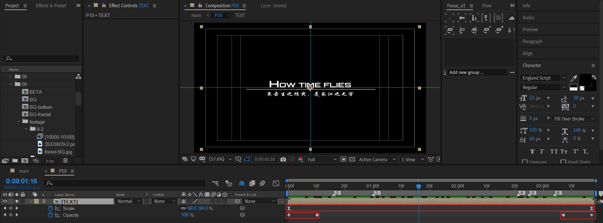

这个文本合成由一个标题（上），横线（中），和诗句（下）组成。

- 制作一个全程的轻微放大动画
- 开始淡入，末尾淡出


## square

### square-bottom

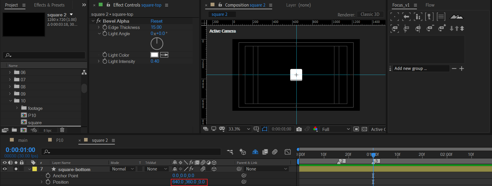

使用形状层创建一个绝对居中的正方形。可以使用bevel alpha效果设置边缘厚度。

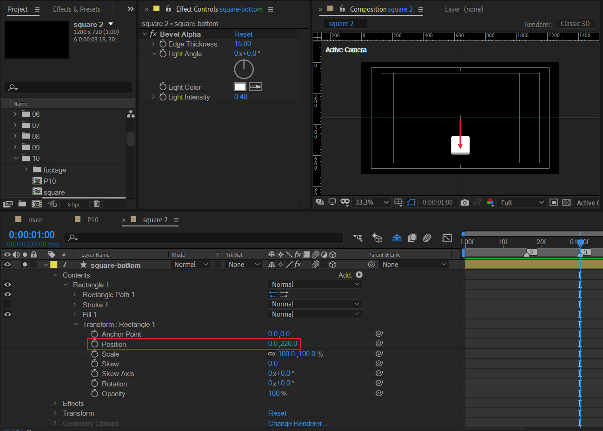

展开形状层的内容，在transform属性下设置Y位置下移。


### square-bottom 动画

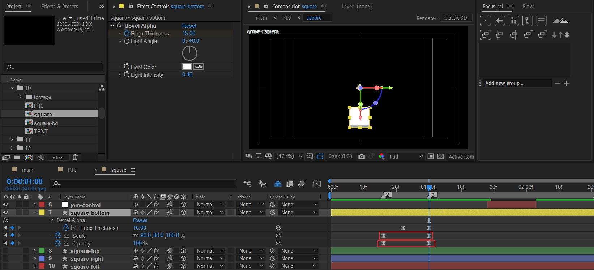

- bevel alpha边缘厚度从无到有
- scale 放大
- opacity淡入


### 其他square

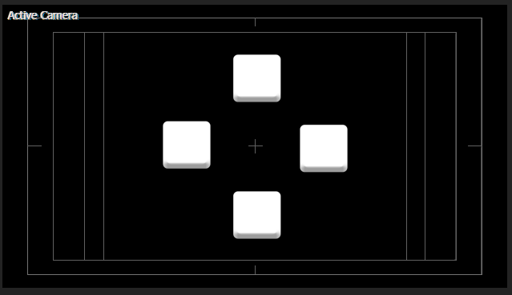

通过square-bottom的副本复制，以及设置Z旋转为90度的整数倍来实现。


### edge、scale、opacity的延迟绑定

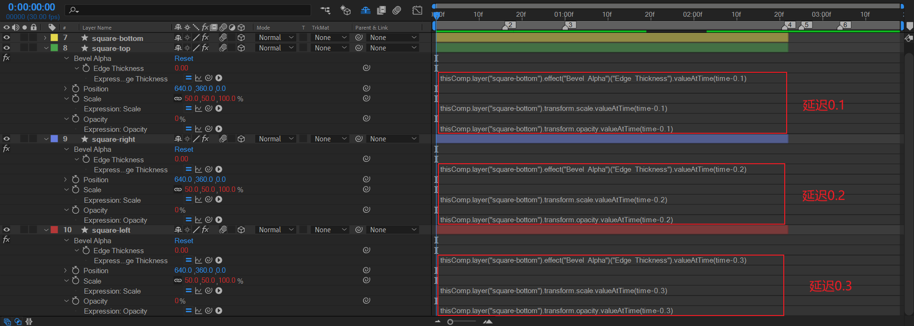

以square-bottom的动画关键帧为基准。top，right，left分别延迟0.1,0.2,0.3秒。绑定的属性有：edge thickness，scale，opacity。

下面列举square-top的表达式来进行分析：

- edge thickness

  ```js
  thisComp.layer("square-bottom").effect("Bevel Alpha")("Edge Thickness").valueAtTime(time-0.1)
  ```

- scale

  ```js
  thisComp.layer("square-bottom").transform.scale.valueAtTime(time-0.1)
  ```

- opacity

  ```js
  thisComp.layer("square-bottom").transform.opacity.valueAtTime(time-0.1)
  ```

式子中，valueAtTime(time)表示取某个时间点的值进行评估。time-0.1表示比参考图层在时间上延迟0.1秒。

举例说明，假设现在time=1.0，那么opacity属性中.valueAtTime(time-0.1)计算为.valueAtTime(0.9)，取的是square-bottom图层在0.9秒的opacity属性。这就是滞后0.1秒的含义。


### position 延迟绑定

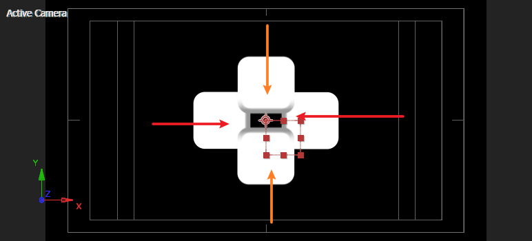


这步是为了实现方块在中间的某个时间范围内顺时针旋转时，同时向内汇聚。

这里，同样使用AE表达式来简化处理。

新建一个空对象Expression Control，添加2个滑块控制，X初始化640，Y初始为360。

| 方块   | AE表达式                                                     |
| ------ | ------------------------------------------------------------ |
| BOTTOM | `[value[0],(thisComp.layer("Expression Control").effect("Y AXis")("Slider")-value[1])*(-1) + value[1],value[2]]` |
| TOP    | `[value[0],thisComp.layer("Expression Control").effect("Y AXis")("Slider"),value[2]]` |
| RIGHT  | `[(thisComp.layer("Expression Control").effect("X AXis")("Slider")-value[0])*(-1) + value[0],value[1],value[2]]` |
| LEFT   | `[thisComp.layer("Expression Control").effect("X AXis")("Slider"),value[1],value[2]]` |

我们先从LEFT、RIGHT的X属性进行数学分析。

记 `(thisComp.layer("Expression Control").effect("X AXis")("Slider")` 为X0，画布中心X位置640为CX。那么

- RIGHT的X：2CX-X0

- LEFT的X：X0


满足 [(2CX-X0) +X0]/2=CX。也就是LEFT 和RIGHT关于画面中心在X方向完美对称。

---

同理，记`thisComp.layer("Expression Control").effect("Y AXis")("Slider")`为Y0，画布中心Y位置360为CY，那么

- BOTTOM的Y：2CY-Y0

- TOP的Y：Y0


满足 [(2CY-Y0) +Y0]/2=CY。也就是BOTTOM和TOP关于画面中心在Y方向完美对称。

---

根据上面的分析，我们得到了简化标记的结果。

- RIGHT：2CX-X0
- LEFT：X0
- BOTTOM：2CY-Y0
- TOP：Y0

其中X0和Y0是变量，是可以改变的参数。换言之，可以对其K帧。CX、CY是常数。

再次回想我们的目标：我们想要这样的效果。


对应X0变大，Y0变大。之后恢复回到原位置。

于是创建空对象join-control，并添加两个滑块，分别对应上面式子的值X0，Y0。

现在，对滑块值进行k帧。

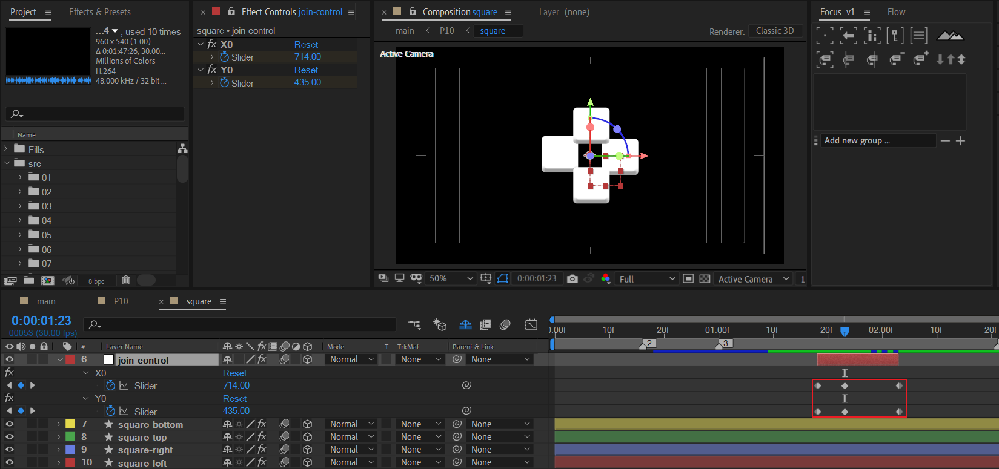

|      | 值1  | 值2     | 值3  |
| ---- | ---- | ------- | ---- |
| X0   | 640  | **710** | 640  |
| Y0   | 360  | **450** | 360  |

预览效果。

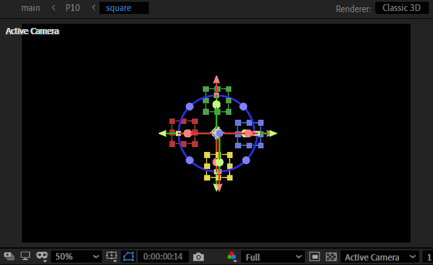


### 出场

#### 位置关键帧

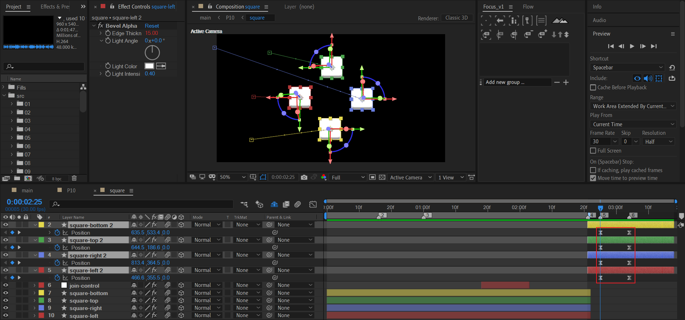

将四个square图层在合适时间点打断，然后去掉它们的position表达式。接着对位置k帧：往左侧移动，表示出场。

为了丰富出场细节，出场时增加适当的旋转。


#### 旋转关键帧

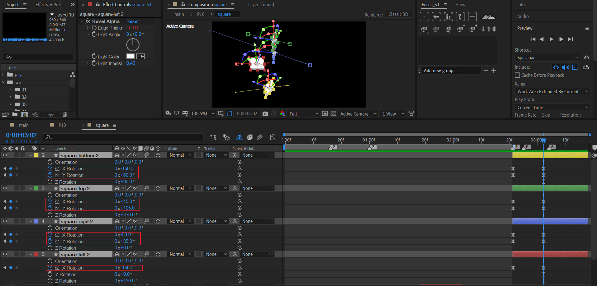

这里的k帧自由发挥。交错选择两个轴维度进行不同幅度的旋转是一种可行的方法。

举例：选择XY轴进行旋转，X从0到-150，Y从0到60。


### 调节层

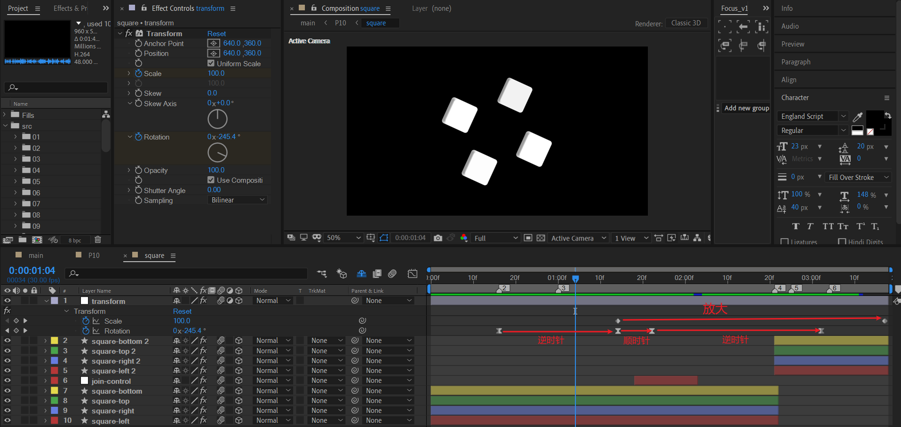

新建调节层，添加transform效果。主要有两个动画：

- 放大
- 校正初始旋转的角度后，按逆时针-顺时针-逆时针方式旋转。

速度曲线需要注意。

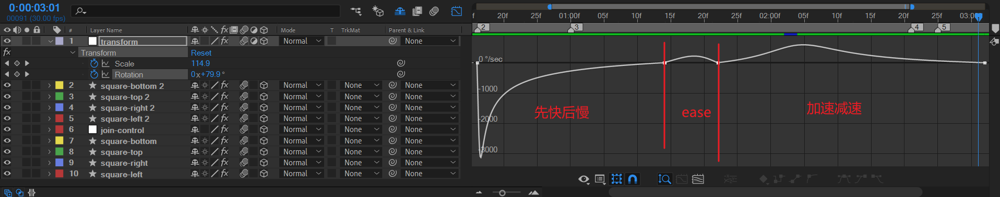

目前效果。


好了，square合成完成。我们开始square-bg的制作。


## square-bg

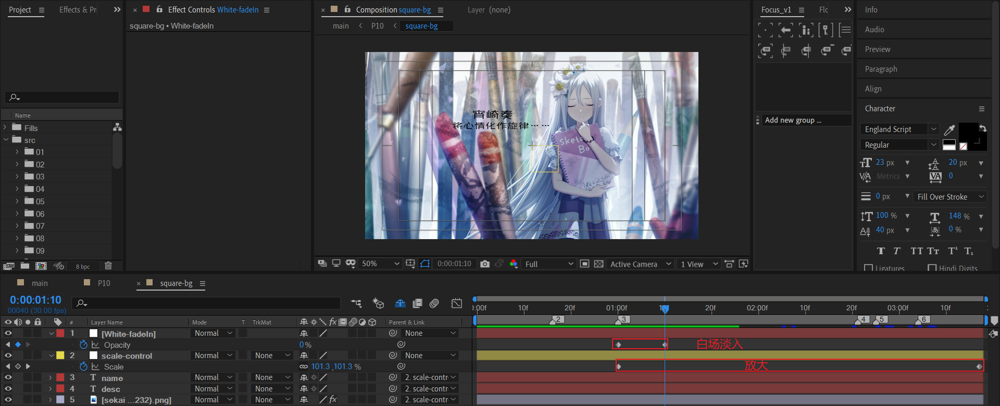

- 在中间某个时间范围使用白场淡入。
- 使用空对象统一处理全部元素的放大。


## p10

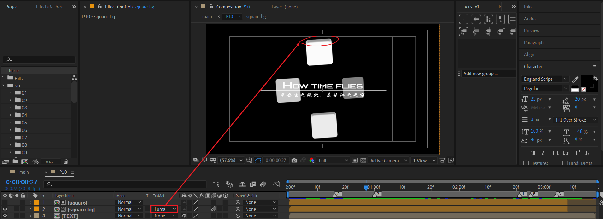

在外部合成中，使用luma遮罩对square-bg进行处理。注意这里不能使用alpha遮罩，因为bevel alpha不兼容alpha遮罩。

示意图：bevel alpha在alpha遮罩下的显示。

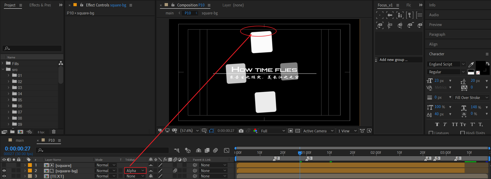


## 小结

- 在AE表达式中，valueAtTime()函数可以对引用图层的某个属性进行延迟或者超前的绑定。
- 通过轴线对称的分析方法，可以实现多个图形向中心聚拢的位移效果。