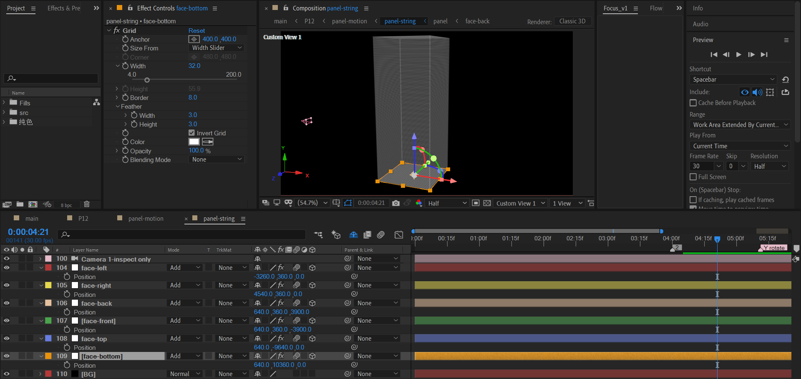
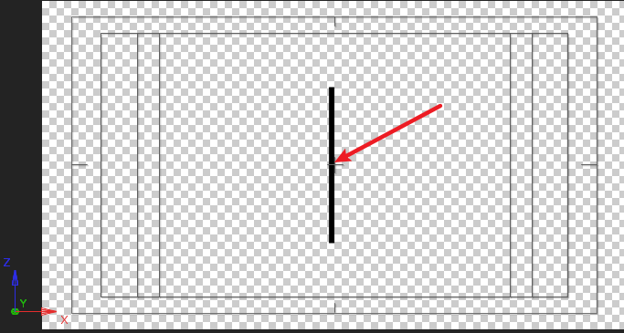
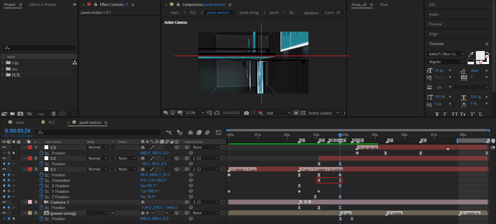

# 12 一分为二，合二为一

## 原作


> When I met Touhou Project for the first time, I was attracted by the dream world view setting.
> Whether it's ordinary daily life or chaotic changes, it is a desirable peach blossom source.

这个合成比较吃电脑计算资源。最困难的部分是面板串以及包含它的立方体空间。


## 面板（panel）

我们在制作面板串之前，先要制作面板。而面板最主要的是正面和反面。

### 正面 face-front


新建一个1280x720的合成，在里面制作一个350x200大小的矩形面板。

- 右下角的发亮：使用纯色层+mask羽化来实现。
- 面板上有很多简短的标题和句子。


### 反面 face-back


绘制矩形制作遮罩层，内容层使用分型杂色进行演化，然后使用三色调对中间调着色。

为了使得效果更加朦胧和突出，在顶层添加调节层，添加S_Rays，做发亮处理。


### 其他修饰面


补充其他黑色填充修饰面的制作。整体感觉上像一个现代的家用电视，背后有个挂墙的横栏。这就是panel合成。


## 面板串（panel string）+ 立方体

### 目标

我们先看下要实现的目标：

- 制作一个立方体空间，将多个panel副本垂直排列，放入其中。
- 从TOP顶视图看，这个panel串是完美居中的。


### 实现思路

先来分析一下实现思路：

- 创建一个长方体，有6个面。由纯色层打开3D实现。
- 制作时，创建一个摄像机仅供观察，辅助制作，不k帧。

设计长方体的体积尺寸。底面是一个正方形，取值8000x8000。接着考虑高是多少？这里设计为20000。

也就是计划制作一个8000x8000x20000的长方体。

两种制作方式：

- 800x 800x 2000 分别放大边10倍。（√）这种方法对于前期观察和网格效果添加非常友好。
- 直接8000x8000x20000尺寸构建。（X）前期不方便调整和观察，抛弃。


### 立方体



制作的示意图。可能你已经注意到了：这里的数值和上面的设计并不严格一致。例如：

- 根据上面的计算，这里应该出现8000/2=4000的数值。
- 但是，这里却是3900。为什么要往内缩小边长尺寸呢？


我们放大边角来进行说明。


往里面缩小的目的是为了制作侧边交汇时的白色竖线。


---

然后，我们再来明确看下立方体底面和顶面的Y跨度。


结论：对于立方体的Y跨度，我们依旧维持了之前设计的20000整数。


### 面板串

现在来分析面板串在空间上的排列方式。


TOP视图观察一个完整的旋转模式。


- 旋转中心完美居中于画面。

- 四个面分别旋转90度的整数倍。并且每个面距离旋转中心都存在一个相等的X、Z偏移距离。

  

同时，如果以顶面为参考。那么每个面板在Y轴上的位置值是等差数列（可以理解成等间隔往Y正方向排列）

> 图中显示了最开始的四个面板排列在空间的位置。


---

现在我们进入具体的实现环节。

首先，我们将panel放入panel-string合成的顶部（index=1）。

将position X： 640-> 638。anchor point的X：640->450。这步目的是为了维持旋转中心位于画面中心，并且panel距离旋转中心点需要有一定XZ的偏移距离。

| 之前                                                         | 偏移后                                                       |
| ------------------------------------------------------------ | ------------------------------------------------------------ |
|  |  |

上面这步完成后，就可以对position和Y rotation应用表达式了。


position表达式中：

- 55 这个偏移量是为了第一个panel不至于顶到天花板。

- 200为每个panel的Y间隔。99* 200 + 初始offset（55）=19,855 < 20000 临界值。

Y rotation表达式中：

- index *（-90）表示每层递进旋转-90度，循环下去。

---

很好。我们根据上面的分析，将index=1的panel图层疯狂复制到index=99，一共是99层。


由于这个合成图层太多，因此注意降低预览分辨率和尽量关闭图层参考线框。

---

补充画面打光。


这个合成到这里，先告一段落。


## panel-motion

将panel-string预合成为panel-motion。这个合成非常关键，重点在于摄像机动画。

先保证panel-string的位置不变，然后使用空对象C1初始化摄像机的位置在立方体底部。

> 图中的C1,C2,C3都是用于控制摄像机运动的空对象，形成一条父子链。可以按需逐级添加。


由于我们之前设计的立方体底面的Y位置位于10000附近。所以初始化摄像机时Y位置也必须在这个位置附近。C1的Y取值9405。

预览一下初始拍摄的地点。


### panel-motion 动画

#### 位置Y上移+Y旋转


- Y轴上移：Y position 从 9405到 7240。变化量大约2000。
- Y旋转 ：从100 到 1x+100。旋转1圈。


#### Y上移+XYZ旋转+摄像机推近


- camera position Z： 不需要过于留意数值变化，稍微推近即可。

空对象C1：

- Y上移：7240 -> 5640。变化量大约1000。
- XYZ rotation： 这里没有定式，目标是调出图中稍微倾斜-准备翻转的关键帧。实际上，关键的维度是XY轴旋转。


#### 旋正：十字瞄准



这步关键在于将面板串翻转，将位置和角度摆放成图中十字瞄准的样子，为下一步冲刺准备。

这里有几个注意点：

- **Y上移依旧要维持，但是上移幅度不能过大**。因此这里镜头重心在于旋正，不是Y上移。
- 旋正角度主要依赖C1的方向属性和XYZ旋转属性。


#### Z上移


直接对panel-string合成的position k帧。


#### Y 上移 上移 上移


最后，就是Y不断地上移，对应视角往里面走的镜头。

这个过程分为三段，三段都是Y上移。只是速度曲线不一样。


- 第一段：速度类似于ease。这个阶段对应开始往前启动，速度较慢。
- 第二段：速度开始加速，后期加速度a快速变大。这个阶段对应面板沿Y轴主动高速旋转。
- 第三段：速度已经处于很高的状态，这个阶段均匀加速。加速度a比较稳定。对应末尾全屏时面板沿Y轴主动高速旋转的特写。

> 这个过程可以先这样设计，因为后续还需要结合页面效果微调。

上面提到的这个Y上移有三个阶段，三个阶段都对应面板Y主动旋转。

因此，我们需要返回panel-string合成来对panel-string添加关键帧。


## p12

### panel-motion的变体


- 复制panel-motion为panel-motion left，目的是黑白处理。
- 复制panel-string为panel-string left，目的是去掉立方体。


#### panel-string left 去掉立方体


#### panel-motion left 黑白处理


- 在合成中，将panel-motion left中之前的panel-string替换成已经去掉立方体的panel-string left。
- 对panel-string left填充黑色。


### 左右对称的面板


说明：

- panel-motion：之前制作的panel-motion
- panel-motion left：黑白处理+去掉立方体的panel-motion 变体
- panel-motion right：之前制作的panel-motion

关键帧：

- 在合适的时刻，淡入panel-motion left。
- 给左右对称的panel-motion制作缩小+位移关键帧，同时使用vegas效果来制作描边。
- 末尾处，淡入panel-motion。

图层垃圾回收（GC）：因为这个合成非常吃资源，可以裁剪的地方绝不放过。


### TEXT


### center-content


### vertical lines

目标：大量垂直的线条。粗细随机，位置随机。


通过三个关键点来实现：

- 初始化位置到（640,360）附近。

- 初始化stroke的值为0.3。添加表达式，生成随机stroke值。

  ```js
  seedRandom(index,1)
  random(0.2,1)
  ```

- 初始化transform的值为(0,0)。然后添加表达式:

  ```js
  seedRandom(index,1)
  dx = random(-410,875);
  dy = random(-250,350); 
  [dx,dy]
  ```

  假设出生地为400,400。那么范围分布为：X（-10,1275） Y （150,750）。将显示区间局限于画布内。

到了这里，p12基本已经完成。还差panel-string的自身旋转。


## panel-string 自身旋转

在对称窗口显示之后，panel string开始逆时针Y轴旋转。

### 第一个开始旋转的panel的index

可以通过取消显示的方式来寻找第一个开始旋转的index。


### 最后一个需要旋转的panel的index


### 重构Y rotation的表达式

之前的Y rotation的表达式是这样的：

```js
index*(-90)
```

依赖于index，进行初始化之后就不能更改。现在，为了支持Y旋转的关键帧，需要修改成：

```js
index*(-90)+value
```

保留了利用index进行初始化的能力，又添加了value变量来支持k帧。


### 暴力的分组k帧


- 四个一组。对Y轴主动旋转。这里从0旋转到180度。

- 从index 78一直延续此模式到上面确认的末尾index（或附近）的图层。
- 对于某些Y上移过快的关键帧区间，可以8个图层一组。
- 对于某些Y上移较慢的关键帧区间，适当增加旋转关键帧的运动持续时间，或者时间上稍微延迟排列。

到了这里，保存AE工程，喝口水休息一下。这工作量有点惊人。


## 小结

- 对于大尺寸3D立方体的创建，可以先创建一个等比例缩小的小立方体，观察保证无误后，再设置scale值进行放大。
- AE表达式依旧是快速创建图层变体的一种高效方法。

