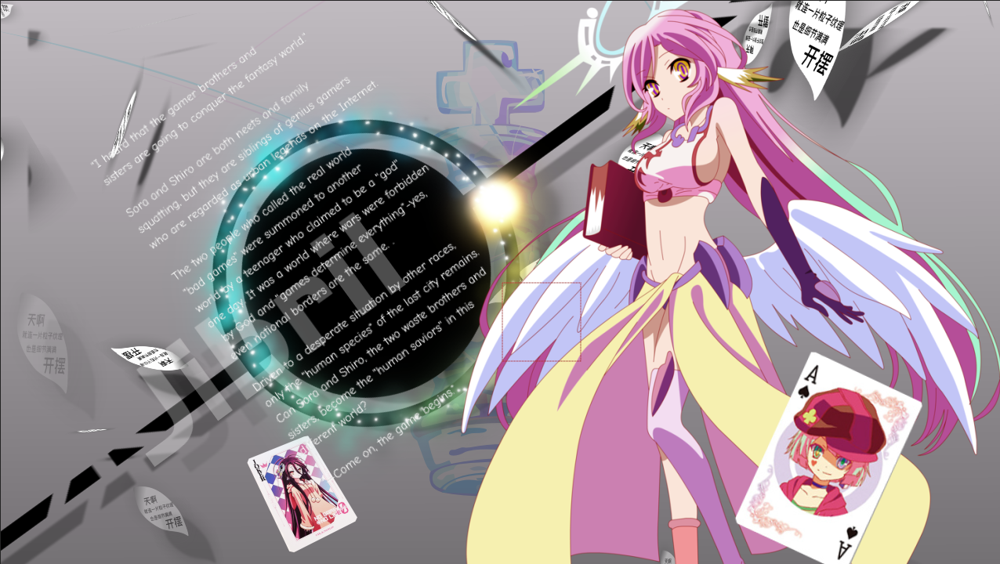

# 13 K-ON！

## 原作


## 分割合成


## 13_1 潘多拉之心

### Alice-white

人物与圆盘。


- 形状层绘制一个椭圆，作为圆盘。
- 使用表达式将圆盘位置绑定到人物位置，并设置Y偏移量。

---

位移动画


简单的X左移。


### Alice-red


根据类似原理，制作另外一侧的人物合成。


### 外部合成


- 上下文本动画：Y位移，旋转180度。
- 中间的箭头动画：Y旋转，淡入。
- 其他元素：淡入。

---

13_1预览


## 13_2 重启咲良田


这个场景和上面的合成制作原理差不多。中间人物是从下方往上入场。


### reset clock

这个元素指的是上图中的时钟。


- 时针逆时针旋转一定角度。逆时针是为了符合重启的含义。
- 使用表达式将分针绑定到时针，并设置一定的初始角度差。


### 背景

这里背景的制作，有一个需要注意的地方。由于前景人物已经偏白色，偏亮。背景颜色此时如果还是纯白的话，整体画面就非常白。

因此，为了平衡画面整体的色调，进行了特殊处理：

- 将纯白背景改为灰色背景。
- 给背景添加点缀/修饰，可以使用半调、百叶窗、网格、渐变等元素进行丰富。示例中使用百叶窗+半调。


在原作中，人物元素已经是深色系，因此背景不需要太多处理。

总之，前景和背景尽量要有所分界，容易辨认。不要出现一团白或者一团黑的情况。


## 13_3 游戏人生·吉普莉尔



分析：

- “开摆”的粒子贴图替换。
- 右侧人物主体。
- 背景图案，大段落文本，黑色粗横线，圆环和圆环光束旋转生长。合成投影。
- 两张大扑克牌。
- 摄像机k帧保持物理惯性。

这里，选取圆环光束和摄像机k帧来讲解。

### 圆环光束


新建点光源层，绘制一个圆环路径，亮度衰减。

新建一个纯色层，添加particular效果。下面是制作细节。

首先对particular的发射进行设置，跟随光源，速度清0。


---

接着，设置粒子参数。


- 粒子生命时间1s左右。这个值需要特别留意。

- 粒子纹理为cloudlet（云朵类型）。

- 增大粒子大小，例子中是15。

- 设置粒子着色为over life，然后设置具体的着色为渐变类型。

  

- 设置blend模式为Add，加亮粒子。

---

最后，需要在发射主粒子的同时，携带子粒子的发射。在这个例子中，我们来放大观察子粒子，如下图。


这个效果通过particular的aux system（辅助系统）来实现。


主要需要设置粒子速度，生命长度，粒子大小，粒子颜色。


### 摄像机k帧——保持惯性


在摄像机空对象的k帧时，首先高速下落，然后根据物理惯性，向着之前的运动方向轻微移动很小的距离。


### 背景段落文本

---

```
“聽說遊戲玩家兄妹要征服幻想世界。”

空與白既是尼特族又是家裡蹲，但是在網絡上卻是被奉為都市傳說的天才遊戲玩家兄妹。

稱呼現實世界為“爛遊戲”的兩人，某一天被自稱是“神”的少年召喚至異世界，那是個戰爭為神所禁止，“遊戲決定一切”的世界─沒錯，甚至連國界也一樣。

被其他種族逼至絕境，只剩下最後都市的“人類種”，空與白這兩個廢人兄妹能夠成為這異世界之中的“人類救世主”嗎？

“——來吧，遊戲開始了。”
```

---

```
"I heard that the gamer brothers and sisters are going to conquer the fantasy world."

Sora and Shiro are both neets and family squatting, but they are siblings of genius gamers who are regarded as urban legends on the Internet.

The two people who called the real world "bad games" were summoned to another world by a teenager who claimed to be a "god" one day. It was a world where wars were forbidden by God and "games determine everything"-yes, even national borders are the same. .

Driven to a desperate situation by other races, only the "human species" of the last city remains. Can Sora and Shiro, the two waste brothers and sisters, become the "human saviors" in this different world?

"—Come on, the game begins."
```


## 13_4 游戏人生·十条盟约


- 背景合成：大段文本，分点阐述。
- 前景合成：人物填充围着圆环对称旋转90度。


### 背景合成

```
十条盟约
特图在击败其他神、成为唯一神后，所作出的世界上的绝对法则。
以下为十条盟约的内容：
【一】这个世界禁止一切的杀伤、战争与掠夺。
【二】所有纠纷一切以游戏胜负解决。
【三】游戏须赌上双方判断对等的赌注。
【四】在不违反【三】的情况下，游戏内容、赌注皆不受限制。
【五】受挑战的一方有权决定游戏内容。
【六】举凡《向盟约宣誓》的打赌绝对要遵守。
【七】集团纠纷应指定全权代理人。
【八】游戏当中若有不正当行为，一旦败露视同败北。
【九】以神之名宣布，以上各条皆为不变的规则。
【十】大家一起和平的玩吧!!
```

> [NO_GAME_NO_LIFE_游戏人生](https://zh.moegirl.org.cn/NO_GAME_NO_LIFE_%E6%B8%B8%E6%88%8F%E4%BA%BA%E7%94%9F )
>
> 本文引自[萌娘百科](https://zh.moegirl.org.cn)，文字内容默认使用《知识共享 署名-非商业性使用-相同方式共享 3.0》协议。

---

```
[1] This world prohibits all killing, war and plunder.
[2] All disputes will be resolved by the outcome of the game.
[3] The game must bet on equal bets judged by both parties.
[4] As long as it does not violate [3], the game content and bets are not restricted.
[5] The challenged party has the right to decide the content of the game.
[6] All bets in the "Oath to the Covenant" must be strictly followed.
[7] A full agent shall be appointed for group disputes.
[8] If there is any improper behavior in the game, once it is revealed, it will be deemed as defeated.
[9] Declared in the name of God that all the above rules are unchanged.
[10] Let's play peacefully together!!
```


### 前景合成


- 导入两张抠图后的人物素材，填充黑色，对称摆放。
- 使用空对象管理两个人物的旋转。


## 小结

- 这4个子分镜都体现了居中构图的思想，使用了左右对称来保持画面的平衡感。
- 构图排版时，需要注意背景和前景的颜色风格，不要出现一团白或者一团黑的情况，因此这种情况可读性极差。

