## 14 海天一色与昼夜更替

## 原作

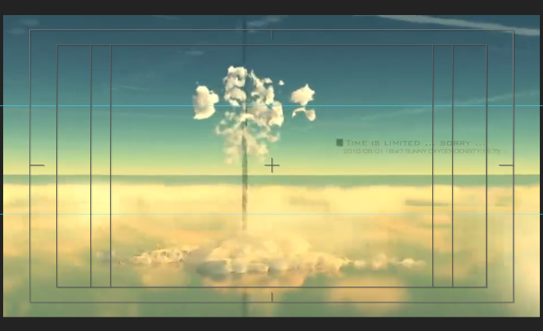

这个场景属于真实自然场景渲染。原作使用的是VUE xStream软件进行制作。

在这个教程中，将采取AE伪实现的方式进行实现和讲解。同时，会稍微提及VUE xStream这个软件。

## AE 伪实现的思路

| 画面元素                   | 图层维度 | AE 伪实现方式                                                |
| -------------------------- | -------- | ------------------------------------------------------------ |
| 海面与远处天空背景         | 2D       | psunami 插件。对于天空背景，也可以使用纯色层+渐变。          |
| 海面云朵                   | 2D       | particular 插件。                                            |
| 杆子                       | 3D       | 四个纯色层组合。也可以使用E3D插件，或者CC cylinder插件。     |
| 环绕杆子的云朵             | 2D       | particular 插件。                                            |
| 昼：天空中网格线条状的云朵 | ？       | 类似飞机划过后留下的痕迹。教程中不实现。VUE XStream 中有这个预设。 |
| 夜：天空中的星星           | 2D       | 使用蓝宝石插件的S_nightSky效果实现。                         |

## psunami 

### 介绍

一个在AE中模拟海面和天空的插件。真实性对比3D建模软件来说效果较差。

### 一些参数说明

Camera:

| 参数                 | 作用                        |
| -------------------- | --------------------------- |
| camera field of view | 影响视角Z深度。离水面远近。 |
| elevation            | 影响俯视水面的高度          |
| roll                 | Z轴旋转                     |
| pan                  | 左右移动                    |
| tilt                 | 上下移动                    |

Light:

| 参数    | 作用                                                 |
| ------- | ---------------------------------------------------- |
| light 1 | light intensity 0.5 1.0 分别模拟日落时分，日出时分。 |
| light 2 | 同理。理解为插件可以多一个灯光。                     |

---

swells：波浪设置。

ocean optics：海水光学颜色。

---

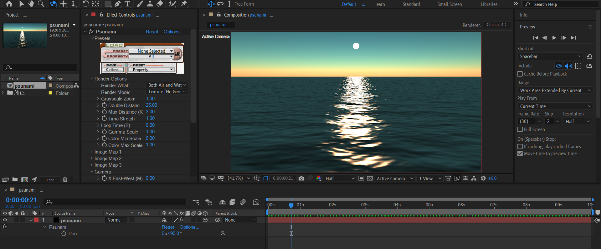

去掉太阳和水面反射光。仅保留海水和天空。

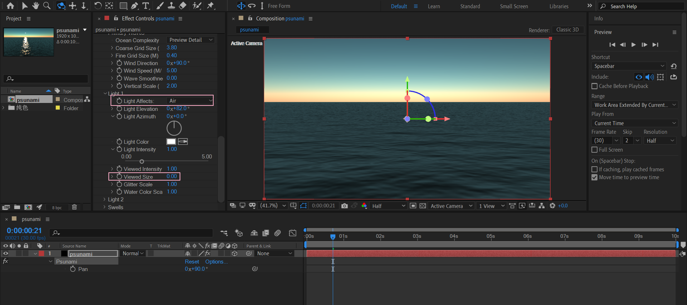

## pseudo-VUE

新建一个合成，这个合成用于制作整体场景。

### 海天一色

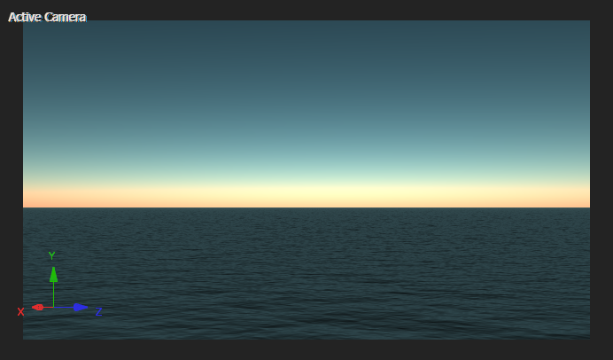

利用psunami插件在纯色层中实现。

### 杆子 pole 

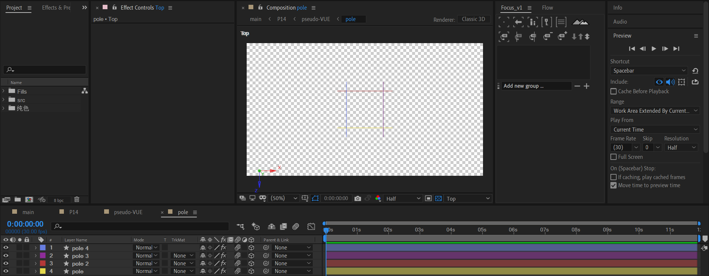

使用4个形状层（长矩形）来模拟一根很长的杆子。图中为TOP视图。

---

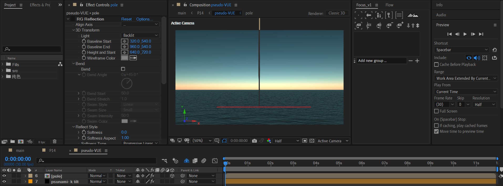

在外层合成中，注意到应该在海面补充一个杆子的倒影。倒影通过RG Reflection来实现。

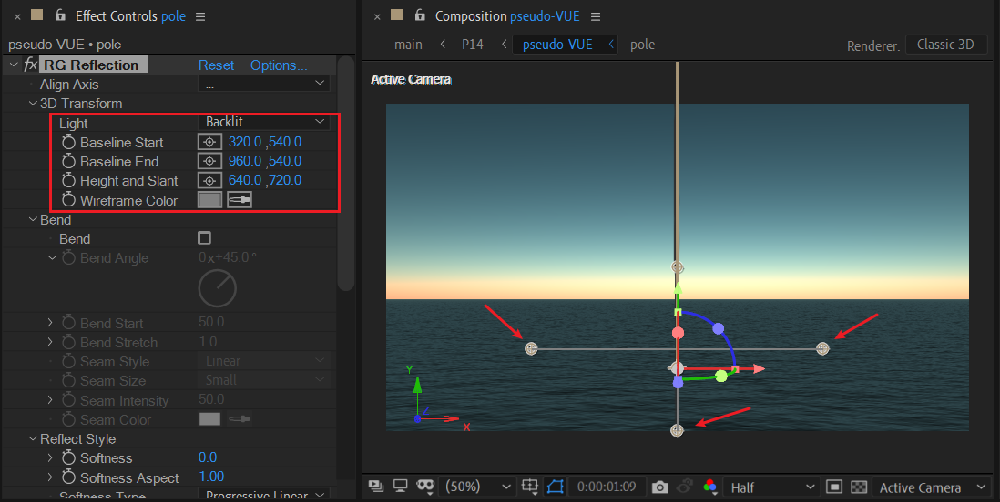

关键参数在于设置倒影的基准线的起始点，高度和侧重，倒影颜色。

### 海面的云 cloud-bottom

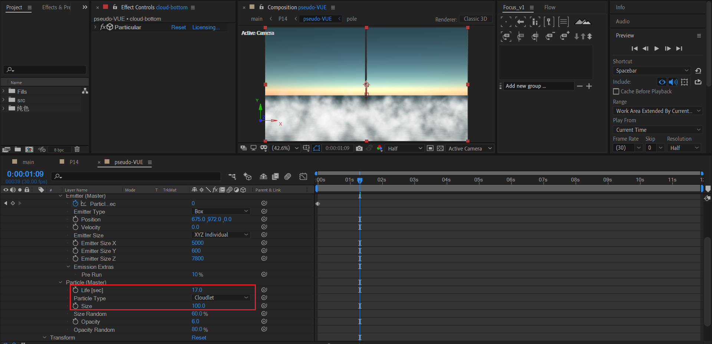

通过particular粒子来设置。关键说明：

- 将粒子云分布局限于画面下方。
- 将粒子生命周期设置大于合成时间，粒子类型为cloudlet，粒子大小设置非常大的值（例如100）。

### 太阳光晕 lens flare

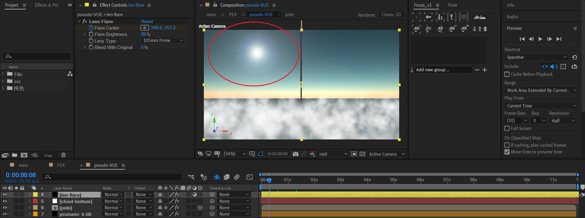

白天的太阳光晕。这里没有使用OF光，而是使用AE自带的五毛特效：Lens Flare。

### 环绕杆子的云朵 cloud-around

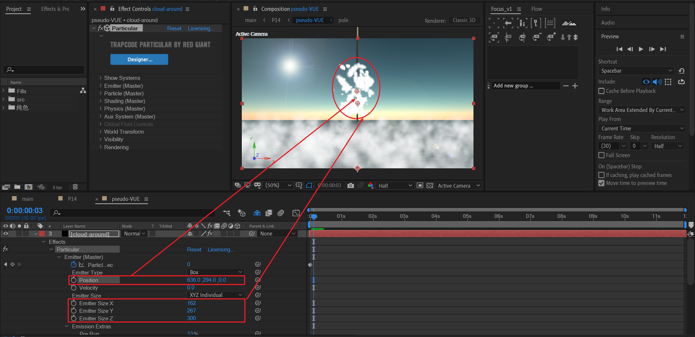

类似于海面的云的制作。主要调整：

- 将发射粒子的XYZ空间局限于图中椭圆形的区域。
- 将position的位置定于椭圆中心位置。

到了这里。静态场景元素基本准备完毕。下面我们开始摄像机K帧。

### 摄像机K帧

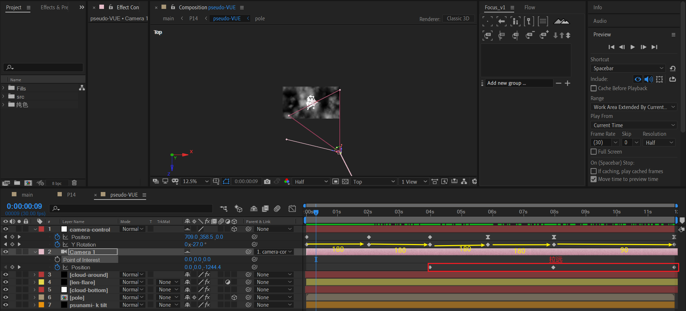

图中是TOP视图。请留意图中黄色标注和红色标注的部分。先忽略空对象camera-control的position k帧。

- 黄色标注代表摄像机的旋转，每个分段代表逆时针旋转180度。

- 红色标注代表摄像机的拉远。

> 摄像机旋转时，是以目标点作为旋转的中心。因此摄像机的目标点等价于普通图层的锚点。

为了更加直观地表示这个旋转，下图为动态图解。

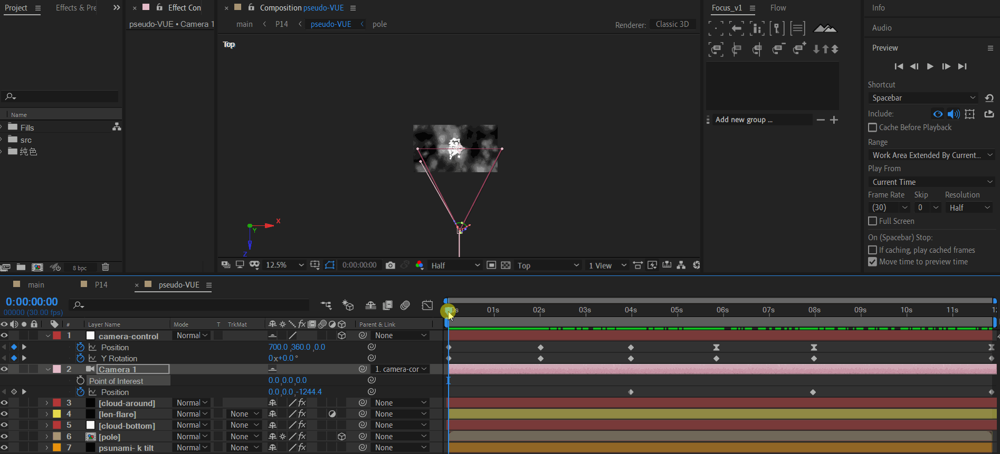

上图直观地显示了旋转2x+90度的摄像机拍摄。

锚点前期有轻微改变，后期大幅度改变。这个原因在于position的k帧。下面开始说明。

| 1-偏左                                                       | 2-偏右                                                       | 3-偏左                                                       |
| ------------------------------------------------------------ | ------------------------------------------------------------ | ------------------------------------------------------------ |
| 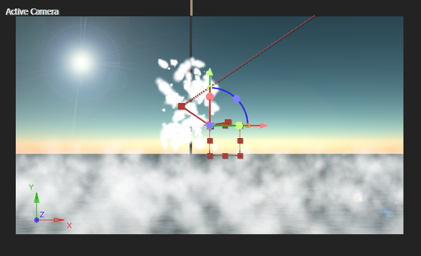 | 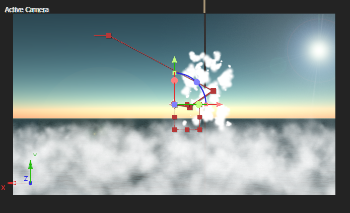 | 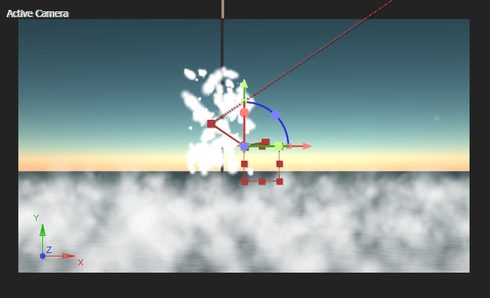 |

| 4-偏右，下沉                                                 | 5-偏左，下沉                                                 | 6-偏右                                                       |
| ------------------------------------------------------------ | ------------------------------------------------------------ | ------------------------------------------------------------ |
| 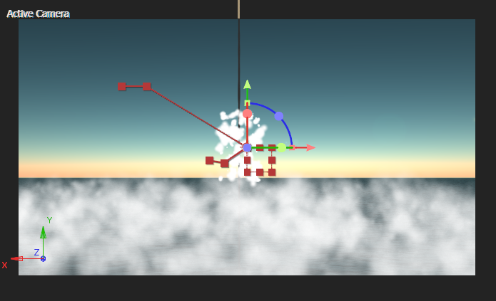 | 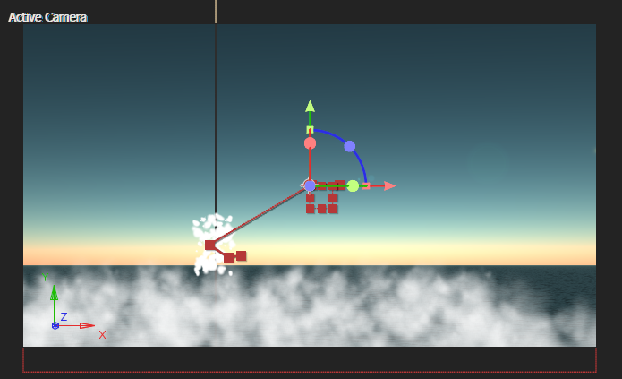 | 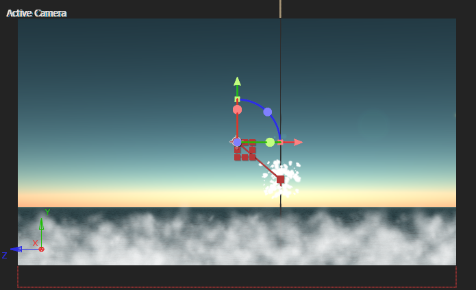 |

摄像机position k帧的目的是给后续的文本图层腾出合适的显示位置。

### 其他元素的动画

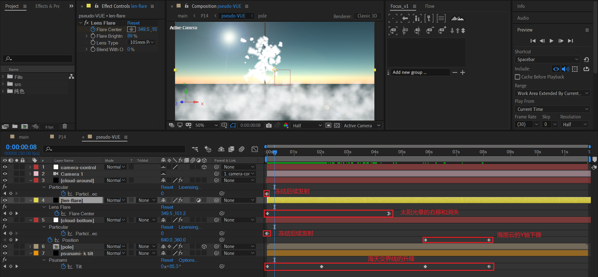

由于psunami图层不是3D图层，为了使得海平面能够跟随摄像机position Y关键帧的变化而升降，需要对psunami图层的tilt属性k帧实现Y轴升降。

> 另外一种思路：将psunami图层预合成，然后打开预合成的3D开关。这样，psunami合成这个图层就可以被摄像机影响。

## p14

### pseudo-VUE 进入黑夜

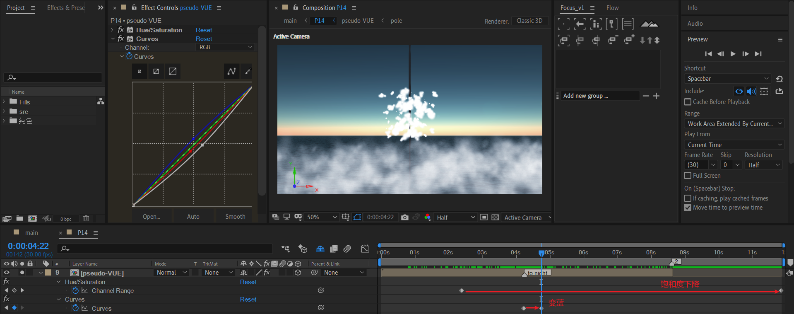

- 添加curves，实现色调变蓝
- 添加色相饱和度，设置饱和度下降

### 白天的黄色环境光

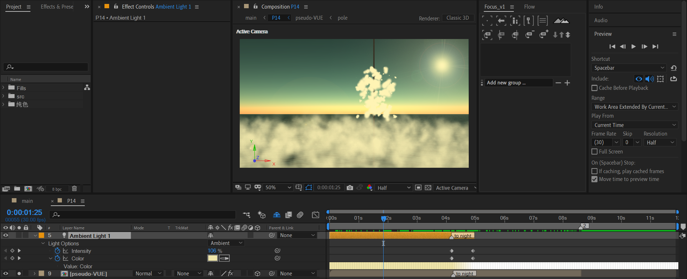

在白天时分补充一个淡黄色的环境光。并在夜晚时刻过渡为白色。

### 故障的前兆

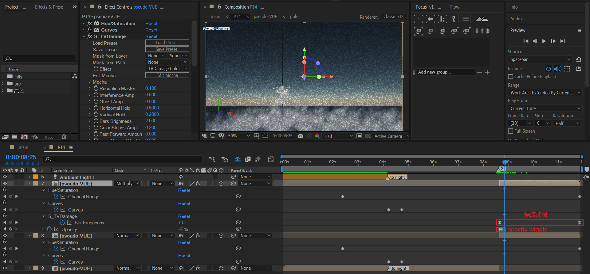

- 在合适的时刻将pseudo-VUE（index 9）打断，得到副本图层（index 8），然后复制index 8图层为index 7图层。
- 将pseudo-VUE副本（index 7）的图层模式设置为multiply。
- 对index 7图层设置故障艺术：
  - S_TVDamage 不断增加故障噪波的频率，频率越快，画面颗粒感越强。
  - opacity进场淡入，并且使用wiggle(3,40)进行闪烁。

### 昼：天空中网格线条状的云朵

> 该教程中，没有实现这个效果。这里简要描述在VUE xStream中的预设实现。

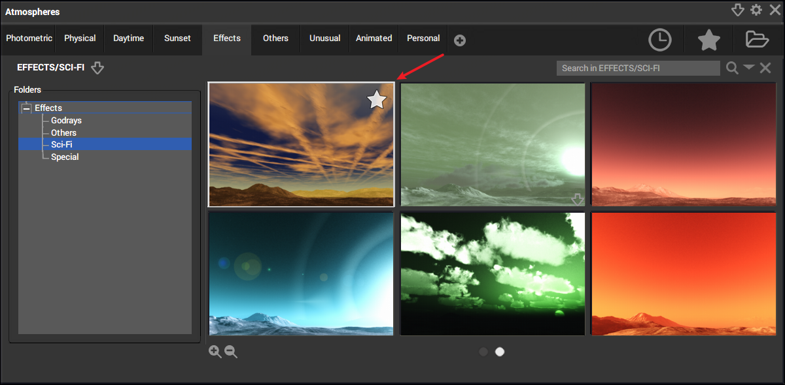

渲染静帧截图：

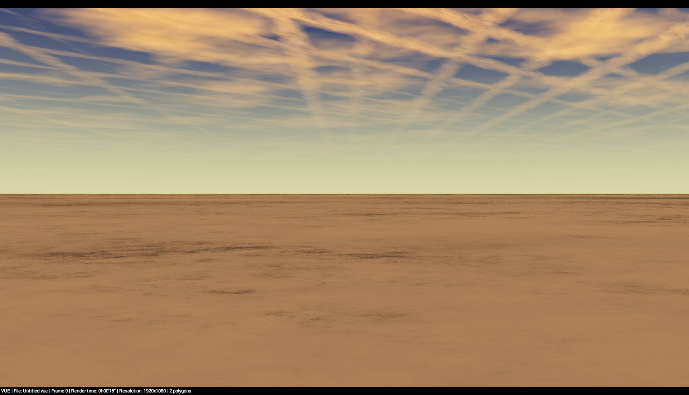

### 夜：天空中的星星

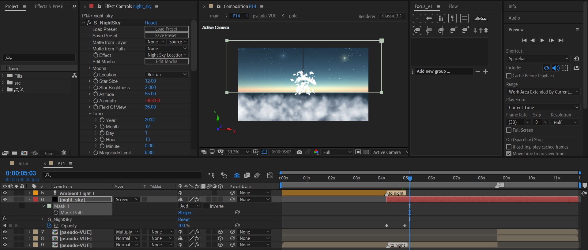

使用纯色层，添加S_NightSky效果。

接着根据天空区域绘制一个mask，因为星星不能出现在海面区域中。mask注意设置合适的羽化。

### 文本合成

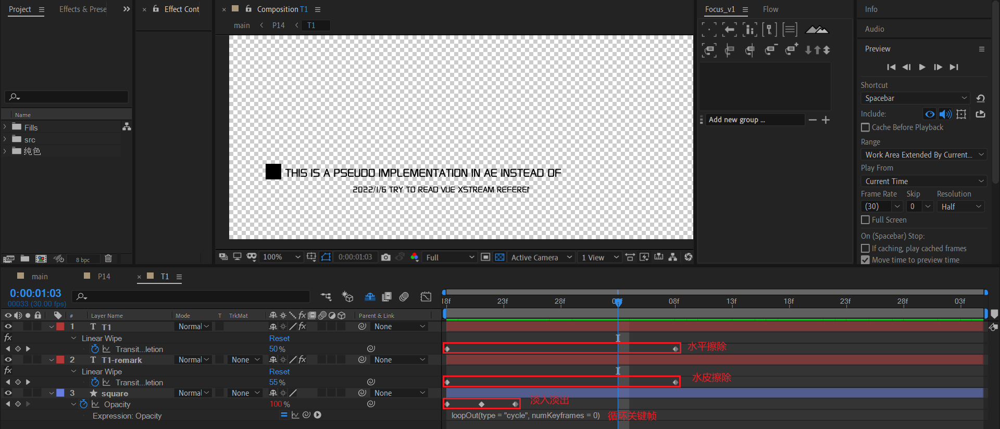

文本合成1的制作：

- 两个文本都是线性擦除，从左到右。
- 左侧正方形首先对opacity k帧实现淡入淡出，然后使用loopOut表达式循环关键帧。

回到外层合成p14中，将文本合成1放到合适的位置，并设置末尾淡出。

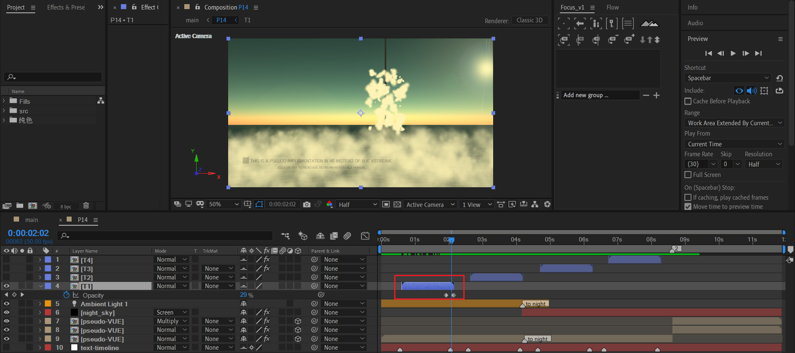

其他文本合成2-4的制作原理类似。

## 小结

- 在MAD中加入一个真实自然环境渲染的3D场景，是一个加分点。
- 传统的静止系MAD以2D制作为主，但随着时代的变化，3D场景会越来越受到青睐。
