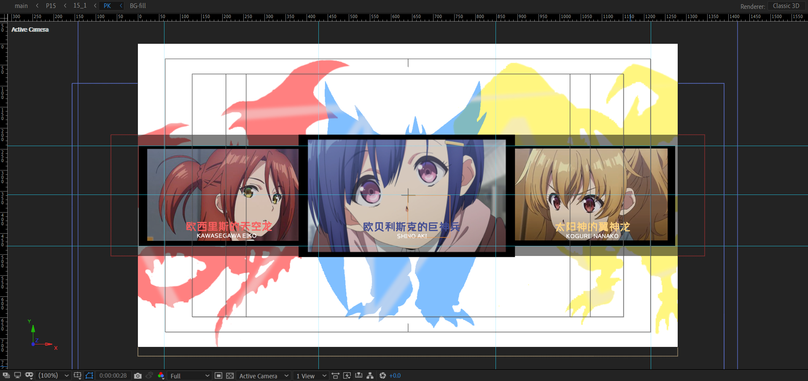

# 15 重铸蓝毛荣光——巨神兵

> 那年，是青梅对阵......


## 原作


attention please 有一个水平扫光。


## 分割合成


## WARNING-LIST

### WARNING 合成


- 四个角。
- 黑色背景矩形。
- 两个红色警告文本，淡入。
- 一个标题“心肺骤停”，淡入，同时使用CC Light Sweep制作水平扫光。
- 一个黄色警告三角形。

---

下面说明黄色三角形合成的制作。


- 对三角形描边（index 3）图层添加CC Light Sweep，对Center属性k帧：右移。实现水平扫光。
- 使用空对象控制整体的Y旋转，一共旋转2圈。


### WARNING-LIST 合成


首先对WARNING合成进行Y缩放的k帧。

将WARNING复制一层，得到WARNING 2。删除scale关键帧。使用表达式进行随机处理：

- 随机位置：静态初始化

  ```js
  seedRandom(index,1)
  x = random(-50,1330);
  y = random(-10,730);
  [x,y]
  ```

  使用random定义X和Y位置的随机值，返回包含X和Y值的数组结构。

- 随机缩放：动态设置

  ```js
  seedRandom(index,1)
  x = random(30,50);
  t = random(0.53,3)
  y = easeOut(time,t,t+0.2,0,x); // 重点关注这行代码
  [x,y]
  ```

  `t = random(0.53,3)` 为定义运动的时间范围，符合你的合成时间长度即可。

  `y = easeOut(time,t,t+0.2,0,x);`这句似乎有点陌生，因为不清楚easeOut()这个函数的作用和参数。

  我们可以查阅Adobe 官方文档的API。

  > https://ae-expressions.docsforadobe.dev/interpolation.html#easeout-t-tmin-tmax-value1-value2

  > easeOut(`t`, `tMin`, `tMax`, `value1`, `value2`)
  >
  > **Description**
  >
  > Similar to ease, except that the tangent is `0` only on the `tMax` side and interpolation is `linear` on the `tMin` side.

  用直白的话来说明，在tMin~tMax时间范围内，随着时间time的增加，y的值从value1缓动变化到value2。

  在我们上面的例子中，就是在t~t+0.2的时间范围内，y的值从0变化到一个生成的随机确定值x。

  一直以来，我们习惯于使用图表曲线来可视化调节运动曲线（速度曲线或值曲线），但在这里，使用表达式来控制运动曲线是一种更加程序化的方式，当你理解这个方式之后，就能逐渐体会到它的强大和高效。

- 随机opacity：静态初始化

  ```js
  seedRandom(index,1)
  random(20,70)
  ```

---

很好，我们已经完成了WARNING阵列的基本单元WARNING 2。后续就可以复制生成副本。

示例中使用了61个WARNING 2的副本，加上WARNING 2本身的话一共62个小WARNING。


### 高速粒子拖尾


创建点光源层，绘制图中的曲线路径。

新建纯色层，添加stardust效果，用于制作高速粒子以及形成拖尾残影。

下面我们来看下stardust的关键参数设置。

---

#### 发射器


- 设置发射类型为Light，自动识别。如果需要自定义，请展开Emitter的Starting With选项，输入灯光图层名称的有效前缀。

  

- 设置合理的particles per second，也就是粒子发射速度。速度越大，粒子路径越密集。
- origin Time sample: 设置 x 10 或者 Exact。不要设置normal，因为normal取样频率不够高。
- Speed：设置为0。速度偏高或者偏低都会导致路径的粒子产生位置扩散偏移。


#### 粒子


这里主要设置合理的粒子生命长度和粒子大小。

- 粒子生命长度的计算：

  例子中合成为30帧，运动持续时间为4帧。也就是4/30=0.13秒。所以需要设置的生命长度大约是这个值0.13。图中是0.1。

- 粒子大小：

  例子中设置为25。中等大小。

---


我们回到合成WARNING-LIST中，

- 复制3层WARNING作为matte层；
- 复制3层粒子层作为内容层，命名为p-1, p-2, p-3。

- 为了差异化三个粒子路径的粒子大小，需要分别设置p-1，p-2，p-3合成中的粒子大小。图中粒子是两小一大。


#### 动态模糊

这个高速粒子运动，建议添加运动模糊。CC force motion blur或者 BCC 插件都可以实现。


## 15_1

### BG


白色纯色层+扩黑边的基本操作。


### TEXT


这个TEXT合成内部并没有动画帧，只是矩形形状+文本层的摆放。

从内容上看，这里在为后面的PK内容铺垫。

> But life is only once, can not be remade. 
>
> 人生只有一次，不能被重制。


### PK

最终效果。



这里，选取了《我们的重制人生》的3个女主角进行同台PK。根据头发颜色分配了游戏中的三幻神卡牌进行背景装饰。


#### 背景三幻神

背景三幻神首先使用填充进行着色。


为了制作雾气的效果。使用形状层绘制了杂乱的线条，然后复制三幻神的合成来进行matte。


#### 人物的出场控制


确定定版时间和记录结束关键帧后，返回合成开始的位置，进行摆位置。

开始时的位置参考。


主要是XY轴的旋转和位置的下移。


#### 背景的出场控制


#### 选手文本介绍的出场控制


淡入+位置移动。上移，左移，右移。


### PK - 百叶窗


### 存在感极低的矩形组


伴随画面整体Y上移，一闪而过从上方出场的3个矩形，不透明度很低。


### 顶部文本描述


淡入处理。


### 画面整体的TV故障


使用调节层放于顶部，添加S_TVDamage效果。SOLO的效果：


这个有个地方需要注意。

> 在Bars Details 中设置Bar Roll Speed为负值，就可以改变故障条的扫描方向。


## 15_2

### BAND的制作

这里以BAND-1为例进行说明。


使用白色纯色层新建一个中间矩形，添加高斯模糊，设置模糊方向为垂直：仅对垂直方向进行模糊。

---

新建一个Y方向略小的矩形作为matte，用于背景图片的显示。


然后导入图片，设置alpha遮罩。


并主要使用Cartoon效果进行卡通化处理。

---

格子带的装饰制作。


使用形状层绘制小矩形，使用中继器进行副本生成。然后对position添加左平移动画。

---

BAND-1效果预览


根据类似原理，我们一共需要制作4个这样的BAND合成。


### BAND-LIST


这个合成的制作有3个关键点。

- 摄像机镜头为稍微拉远。

- 4个BAND都添加线性擦除，从右到左擦除。
- 4个BAND都存在位置k帧，但视觉上依旧是往里面轻微缩小。


### TEXT 合成的制作

#### 原作诗句赏析

> 未觉尽时空萧瑟，千里无处别故人。他山远野闲来顾，栏上秋水寄浮尘。

在寻找出处时发现应该是evanlet自己所创作。下面是简要赏析。

这是一首七言绝句。韵脚：（se），（ren），（gu），（chen）。

诗句译文：

- 还没有察觉到结束的时候，只能白白地独自凄凉，相隔千里，因此没有地方告别朋友。
- 别处的山麓，远处的郊野，等我空闲的时候再来观赏。栏杆上，那秋日江河上清澈的水，只能暂时寄托给空虚的灰尘。

主旨上是一首寄托离别之愁的诗句。1,2句描绘对朋友离别的愁思，3,4句表示对记忆中恬静自然的山野风景的留恋。整体风格偏向恬淡。


#### 诗句的创作

自己创作时，可以一样采取借景抒情，寄情于景的方式。这里不遵守仄起平收的基本原则。

​                      yuè                         xuě

西行妖上云映月，白玉楼旁花吹雪。

凭栏一顾微风起，尽是一院墨染香。

​                               ——《白玉楼·云映月·花吹雪》


注：

- 花吹雪：樱花飞雪似地飘落下来。

参阅：

- 《文选．曹植．洛神赋》：「髣髴兮若轻云之蔽月，飘飖兮若*流风之回雪*。」
- 岁月流年花不复，若水韶光樱飞时。
- 隙间白玉，花开满庭，墨染樱轮，西行幽幽。
- 樱花满地集于我心，蝶舞纷飞祈愿相随。——《罪恶王冠》
- 如梦落樱满熏香，梦醒犹记四月谎。——《四月是你的谎言》
- 水晶帘动微风起，满架蔷薇一院香。——唐代高骈《山亭夏日》

---

另外，这是我随手写出的另一首五言绝句，因为五言字数不够长，所以AE工程中没有采纳这首。

墨香染西行，花散空悲雨。

魂蝶飞白玉，生死一幽冥。

​                      ——《忆西行幽幽》

---


#### 制作


- 诗句的1,2句，对End k帧进行从左到右的淡出：0%-100%。
- 诗句的3,4句，对start k帧进行从左到右的淡入：0%-100%。
- 将它们的关键帧在时间轴严格对齐。
- 将他们的字体设置严格控制一致。

此外，画面整体轻微放大。


### TEXT 合成的进场


### 离场动画

背景先变蓝，整体画面发亮。


- 对BG设置上黑下蓝的渐变。
- 对BG进行opacity 0到100%的淡入。同时对顶层调节层使用exposure效果进行曝光加强。

---

画面间隔性闪烁，白场出场。


- 对顶层调节层添加Glow，对发光强度k帧进行亮度反复横跳，制作亮度闪烁。
- 在末尾时间范围，顶层调节层使用色阶进行白场加强，一直到过曝出场。这个过程称为白化（white out）。
- 在末尾时间范围，将BG的上渐变颜色过渡到白色，防止蓝色干扰画面，导致出场颜色不一致。


## 15_1与15_2之间的过渡


使用motion tile对15_1合成的Y方向进行拼贴。同时淡出处理。

我们可以仔细观察拼贴的效果。


这个效果很类似三个图案的抽奖娃娃机。


## 小结

- 这个合成的分镜制作并没有太难的地方，反而是诗句文案的创作占了大部分时间。
- 在MAD中，用心的文案设计也是不可忽略的重点。