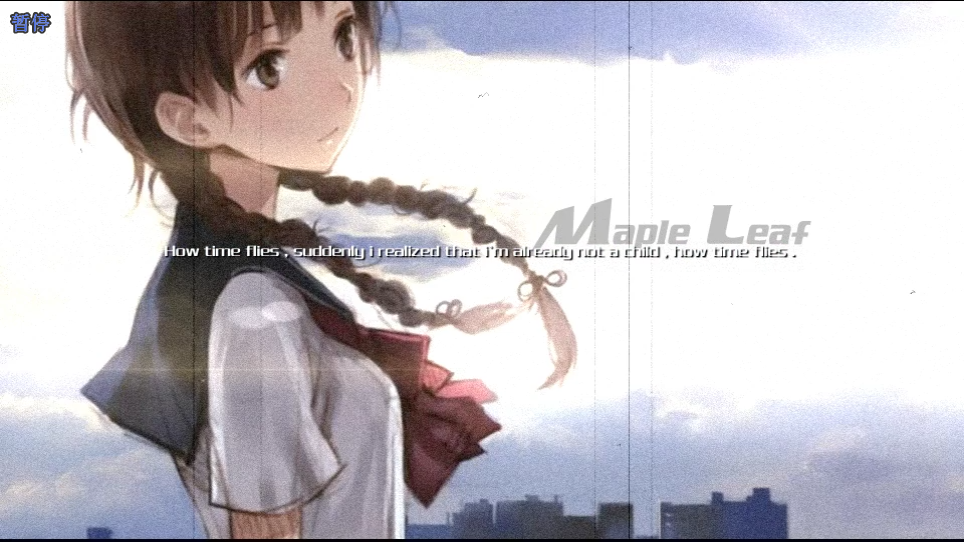
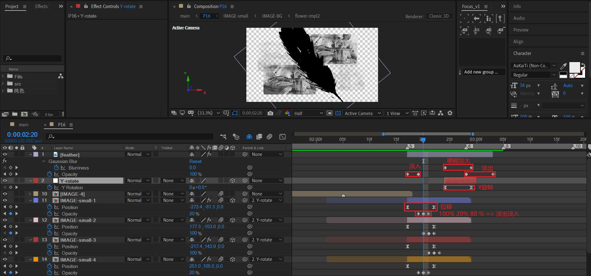

# 16 忆往昔童年岁月愁


## 原作

|  |  |
| ------------------------------------------------------------ | ------------------------------------------------------------ |
|  |  |
|  |  |
|  |  |
|  |  |


## TEXT

新建一个合成TEXT。输入标题和文本。右对齐。


## 开头的三张旧照片


首先将3张图片导入，按序列方式排列。一张图片展示时间为18帧，这个需要先设计决定。

图片自身动画已经在图中标注。下面讲解一下这3个调节层对图片的处理。


### 调色层——LOOKS

LOOKS调色层。主要对图片进行暗角，边缘柔化，调色（低饱和度，改色），添加噪点（颗粒感）处理。

| looks处理之前                                                | looks处理之后                                                |
| ------------------------------------------------------------ | ------------------------------------------------------------ |
|  |  |

在look中关键的滤镜已使用红色框圈出。


> 注意，在该教程中，不会对looks进行细致的讲解。重点是知道调色的目标：渲染旧时代的氛围，增加怀旧感。
>
> 因此，才会进行这些处理：暗角，边缘柔化，调色（低饱和度，改色），添加噪点（颗粒感）。


### 过渡层——色阶

绝对白场的实现：使用色阶将输入的白色设置为最左，也就是输入全部是白色。


恢复正常的色阶参数。将输入的白色设置为255。


### 故障艺术层——S_FilmDamage


在这里，将stain、dust、hairs全部设置0，因为只需要垂直的故障信号线。

因此，只需要设置scratches的值为合理的正值。


## IMAGE_4

我们先来看下这个合成最后的效果。


这个合成的动画部分有以下方面：

- 摄像机动画。

- 中间盛开的花束。
- 右侧OF光的颜色改变。

我们先制作静态的画面元素，然后进行动画部分的处理。


### 背景与噪点


### TEXT-zero

#### 文案的来源

> 距今超过六千年的**远古世界**，天地割裂的**凄惨战争**持续不断，**毫无还手之力的人类**被拥有强大力量的各个种族逼入绝境，**濒临灭亡**。此时率领**人类的年轻领袖**里克，与**机凯种少女**休比偶然相遇。被同伴抛弃的休比，为了修复故障，拜托里克把“人类的心”告诉自己。机凯种少女的单纯与真诚，使得里克对休比逐渐放下戒备、敞开心扉，二人感情亦日渐升温。最终二人带领人类共同面对终极一战，少女休比也将面临**恋人与生命的残酷抉择**。末日来临，在**251秒的时间**里，赌上**一场深情告白**。

- Imanity 人类种。

- 感情与逆命的壮丽史诗

- 最终，以牺牲绝大多数的机凯族为代价，勉强「获得」了星杯，并创造了神灵种「特图」，在这局游戏中达成了平局，人类终于获得了平等的待遇，世界也就此和平

- 虽然我的生命犹如尘埃，我愿献上我的一切。只要他能结束这场战争，就让那个人拥有星杯。

  > 缩短：在这个绝望的世界，我愿献上一切来结束这场战争。

- 十六种族

#### 制作细节


主题是这句话，模式保持normal，这是为了让这句话保持本身的颜色：白色。

```
In this desperate world, I would give everything to end this war.
```

另外的10个词语，需要设置soft light模式。这样做的原因是为了让这10个词语可以融入背景。


### OF光

这里，solo显示OF光的初始位置和颜色。


### 中间盛开的花束

#### 实现1——粒子跟随灯光


- 使用点光源对position k帧，绘制运动路径形成花瓣。
- 使用p粒子跟随粒子运动。对physics Time Factors k帧1->0冻结后续粒子发射。


#### 实现2——3D stroke


- 新建一个纯色层，添加 3d stroke 效果。
- 使用mask绘制图中紫色的路径，形状是一条曲线。
- 设置3d stroke的关键参数：将repeater打开，设置instances数量为4。

然后对3D stroke的Bend 和 Y rotation 属性k帧。


这个方式实现的效果很不错，也很简洁。因此推荐这个方式。


### 动画部分

#### 摄像机动画


上图为自定义视图1视角。摄像机动画分为两段：

- 第一段动画：摄像机视角从图片底部移动到图片顶部。
- 第二段动画：摄像机快速拉远，同时视角回到图中居中位置。

如果从左视图观察，可以得到更加准确的理解。


#### OF光颜色改变与背景黑白化


另外，在背景黑白化过渡过程中，添加一个白场（图层index 8）。


## 羽毛+IMAGE small x4



关键的动画关键帧处理都在图中标注。


#### 羽毛的处理

simple choker 阻塞工具：小增量缩小或扩展遮罩边缘，以便创建更整洁的抠图效果。

> 参阅 https://helpx.adobe.com/cn/after-effects/using/matte-effects.html


#### IMAGE small的制作

- 首先复制IMAGE的副本，命名IMAGE-BG。

- 圆角的制作：将IMAGE-BG预合成为IMAGE-small，然后创建一个等大小的矩形，设置圆角，使用它作为matte层。

  

- 进入IMAGE-BG合成，取消OF光图层和摄像机动画相关图层。


## Sphere 合成


这个合成由3个重要部分组成。分别是地球map，背景的扰乱球形线条，四个文本组。

### map

这个地球的制作有很多步骤，因此按序号标注进行讲解。

1. 导入地图素材，开始时是平铺摊开的地图。

   

2. 曲线调节影调。这步目的是亮部变很亮，暗部变很暗。本质是加大明暗对比度。为下面fill准备。

   | 效果                                                         | 当前结果                                                     |
   | ------------------------------------------------------------ | ------------------------------------------------------------ |
   |  |  |

3. channel combiner将亮度映射为alpha信息。结果是将白色保留，黑色去掉。

   | 效果                                                         | 当前结果                                                     |
   | ------------------------------------------------------------ | ------------------------------------------------------------ |
   |  |  |

   

4. CC sphere将其变成球体。并对Rotation Y k帧制作Y旋转。

   | 效果                                                         | 当前结果                                                     |
   | ------------------------------------------------------------ | ------------------------------------------------------------ |
   |  |  |

5. 发现色调不够黑，依旧存在白色区域。使用Fill填充黑。

   | 效果                                                         | 当前结果                                                     |
   | ------------------------------------------------------------ | ------------------------------------------------------------ |
   |  |  |

6. 添加强制运动模糊效果。这步是为了上面的球体旋转时产生动态模糊。

   | 效果                                                         | 当前结果                                                     |
   | ------------------------------------------------------------ | ------------------------------------------------------------ |
   |  |  |

   


### BG-plexus

新建纯色层，添加plexus插件。

---


新建两个组，两个组都是球体。设置不同的球体半径，切片值，堆栈值。球体一大一小。

记小球体为组1，大球体为组2。

---

对第2组设置transform，此时开启line渲染。

|  |  |
| ------------------------------------------------------------ | ------------------------------------------------------------ |

结果如下，我们的目标就是制造两侧都存在锯齿状的重叠线条。


---

最后，增加噪波影响器，将第2组线条打乱。

|  |  |
| ------------------------------------------------------------ | ------------------------------------------------------------ |


### IMAGE-TEXT x4

这个合成的制作原理是取之前的IMAGE副本，仅保留文本和中间花朵。

然后在合适位置进行花朵合成的帧冻结。


### 主体动画


IMAGE-TEXT x4 自身的位移动画。

---


画面整体的Y 旋转控制。


## 围墙与天梯

### 围墙的制作

我们先看下成品效果。


这是一个圆柱形的围墙，没有上下面，只有侧面。

关于侧面的制作，我们可以先制作一根竖直的矩形带。然后使用表达式来进行旋转，直到360度闭合。

现在问题就转化为：如何制作这样一根竖直的矩形带？


我们可以使用纯色层+百叶窗效果来绘制。

---

接着，我们开始副本的生成。


这里有2点需要注意。

- 精确设置position和anchor point。关键在于设置锚点Z为-1500。1500就是圆的半径。
- 合理设置图层的scale属性的X和Y值。缩小X，增大Y。

现在，对这个face-1 的Y旋转设置表达式：

```js
(index-1) * (360/36)
```

360/36表示使用36个副本组成侧面，一个face旋转12度。

最后，复制face-1，直到face-36。一共36个图层。


### 天梯的制作


#### 实现方式概述

关于阶梯阵列螺旋的生成，有下面几种方式：

- 原生实现-AE表达式

  > 这个方式使用表达式来进行Y位置增加，Y轴逐渐旋转。

- 插件实现-echospace

  > 使用echospace快速生成副本，并调整成螺旋排列。本教程中使用这个方法。

- 插件实现-stardust

  > 这个也是可行的办法。


#### 砖块合成

新建一个1280x720的合成brick，创建标准小立方体作为砖块。


#### 螺旋天梯——by echospace 


首先添加 Echospace 效果。

然后设置合理的position和anchor，将旋转锚点定于某个圆心。关键数值是anchor的X位置值，增加就能看见明显效果。

关键参数有三个：

- 实例数量100。也就是生成100个副本。

- Y offset 设置合理的值，这里是400。这个值指的是在Y轴方向的生长间隔。

  

- Y 旋转值，设置20。指的是每一块砖块围绕旋转中心旋转的角度值。从TOP视图可以很直观理解为何是18块。因为360/20=18。

  


### stairs-and-wall 合成

这个合成的重点是场景布置和摄像机K帧。下面会细致地说明如何实现。


#### 布置初始化场景

> 布置墙

挑选一个合适的摄像机位置和角度，使得身在其中，仰望天空。大致是这样一个参考角度。


打开custom view观察。


摄像机位置位于圆柱中（偏后），目标点在前上方。

---

> 布置螺旋梯


将螺旋梯放置在围墙中。将螺旋天梯和围墙的Z轴底部对齐。


#### 摄像机K帧


将视图切换到Left视图。在这个摄像机动画中，同时对摄像机的目标点和位置k帧。

- 开始观察视角：摄像机位于P1，目标点在A1。此时，活动摄像机的截图如下：侧面观察天梯，方便观察砖块飞速旋转。

  

- 最后观察视角：摄像机位于P2，目标点在A2。此时，活动摄像机的截图如下：仰望天空。

  


#### 螺旋天梯动画：主动降低帧率


对stairs合成添加posterize time效果。将帧率降一倍。这样的目的是为了增强侧面观察天梯时砖块的飞旋效果。


##  后续动画：球体、围墙、天梯 


- 首先是sphere和stairs-and-wall合成之间opacity的过渡关键帧。这里不需要赘述。彼消我长即可（叠化）。

- stairs-and-wall 合成使用cartoon效果进行风格化处理。

- 关注index 17这个调节层：使用色阶设置高速反复的白场闪烁。因为这段时间内，音乐是快节奏的，需要契合音乐节奏。

- 对于stairs-and-wall 合成，在时间末尾使用色阶进行白场化。

  

- 发现因为index 17这个调节层的白场作用，导致画面亮度过高，因此使用了一个低opacity的黑纯色层来压暗画面。

  

  


## 图片快闪 IMAGES-SHINE

这个合成是快速闪过的图片展示。


- 首先将P4拖入，另外添加5张大图。这样就有了6个图片显示。
- 将这6个图片的图层按图中顺序摆放。一个图片显示的时间是7帧，图片之间的过渡为4帧。

然后我们来观察图片之间过渡的关键帧。


- 第一个图片展示因为是合成（P4），因此需要特殊处理：在合适位置冻结关键帧。
- 图片过渡之间效果都是：缩小+淡入淡出。只不过缩放的幅度根据素材原尺寸的不同而不同。


## FINAL TEXT

### 诗句创作——梅开二度

我们来看一下原作：

> 霭霭春空，画楼森声凌云渚；樱樱白玉，幽思冷袭漫庭头。

前半句出自：《烛影摇红·题安陆浮云楼》，是宋代词人[廖世美](https://baike.baidu.com/item/廖世美/4932901)的作品。

后半句无法考察出处，疑似原创。

---

译文：

- 春日的天空，薄雾茫茫，画楼高耸入云。樱樱白玉，伴随幽深的思绪，冰凉的空气直袭全身，漫过庭院的尽头。

译者注：

- 白玉，疑指白玉楼。

---

个人选取东方Project中的博丽神社作为地点，制作一首诗。

​                                          feng                                           yuan

悠悠世外，飞檐斗拱立破风；袅袅轻烟，对樽浅酌醉田园。


参阅：

- 世外悠悠隔人间，不忍凄凄乱世烟。慨怀潇潇任风逝，云霭冉冉绕仙山。——《轩辕剑》炼妖壶

- 博丽神社建筑学。这里主要考察破风这种建筑结构的历史。

- 棠梨煎雪，一首流行古风歌曲。这里取它的意境。陶醉田園生活，害怕失去友情的小女兒家心態。比较符合博丽神社聚会的场景。


### 制作


这里主要说明OF光和粒子球体湍流的制作。


#### OF光

首先在OF插件中实现一个这样的OF预设。


然后对 OF图层的位置K帧。


#### 粒子——球体湍流


- 新建一个点光源，初始的亮度强度极高。参考值30000%。
- 然后对点光源绘制一条前进-曲折的路径关键帧，并设置强度衰减到0的关键帧。

最后，创建纯色层并添加particular效果。

在这里，最为重要的调整参数是物理属性下的turbulence field（湍流场）和spherical field（球形场）。


**当球形场施加在往右移动的粒子时，就会产生右侧弧形的轮廓效果。**

为了更加直观地讲解，下面使用动态图来演示。


---

**湍流场影响的是粒子的扩散程度。**


#### 文本层——背景残影抖动


复制一层文本层，裁剪生命长度，对scale应用表达式：

```js
s=random(80,120);
[s,s]
```

因此背景文本图层的scale会在80%-120%之间抖动。

最后，在p16合成中对FINAL-TEXT合成做一个淡出。


## 小结

- 3d stroke，或者P粒子跟随点光源路径，都可以制作花朵绽放的效果。
- CC Sphere可以将一个平铺的图片转化为一个球体表面。
- Plexus 插件可以制作杂乱的球体线条。
- echospace，stardust，AE表达式都可以实现螺旋天梯的效果。
- 对于比较复杂的摄像机K帧，需要分别独立地处理摄像机目标点和位置的关键帧。这时，就不能够使用空对象绑定摄像机。
- 有时为了营造画面快速闪动的节奏，可以考虑主动降低合成的帧率，方式有posterize time内置效果，AE表达式，或者第三方抽帧插件。
- 图片快闪的实现原理是：缩小+淡入淡出。
- P粒子的turbulence field（湍流场）和spherical field（球形场）可以制作炫酷的粒子球体湍流效果。

