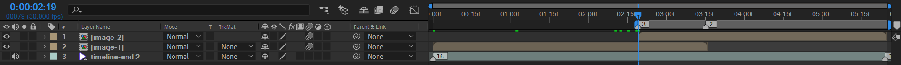
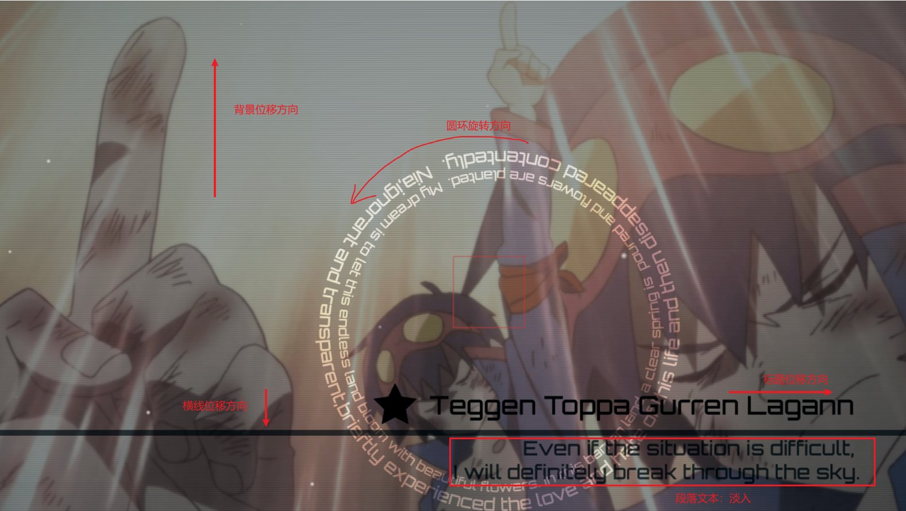
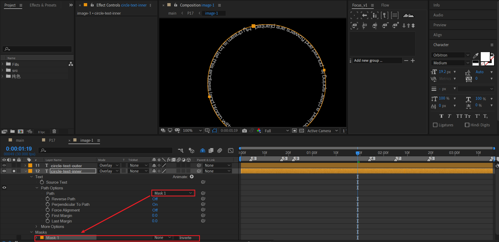
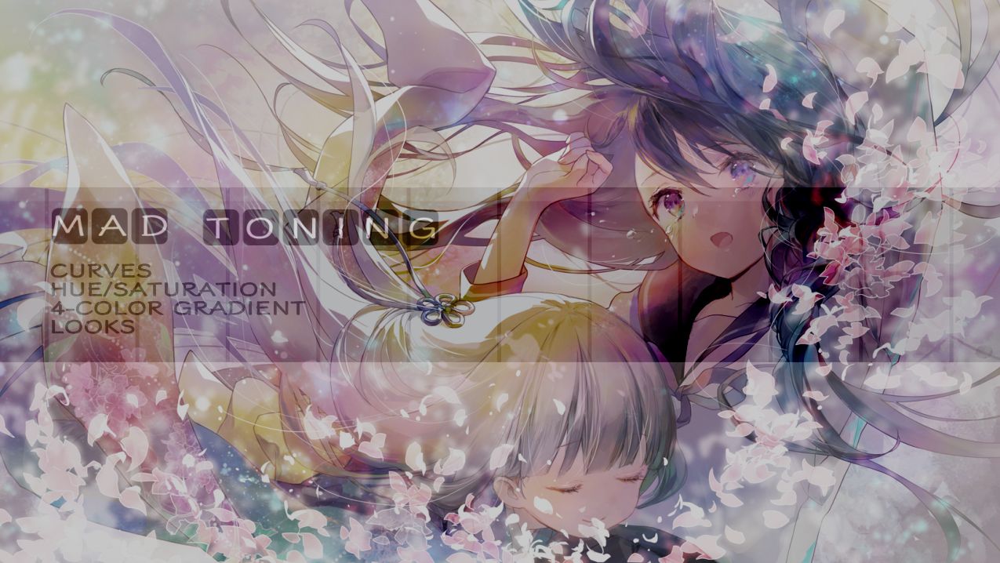
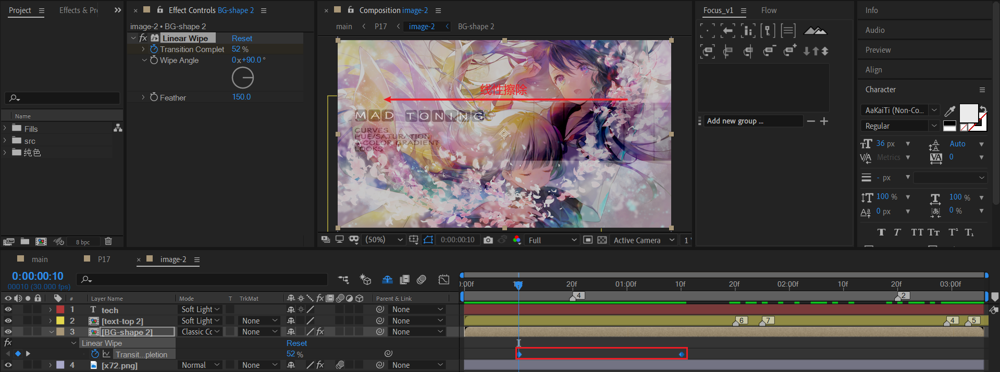

# 17 心有猛虎，细嗅蔷薇

## 分割合成

合成17由两个非常类似的合成组成。

## 17_1 心有猛虎

我们可以先分析最终效果的构图。

- 一个背景。因为这张背景素材本身带有Y上移的趋势，因此确定背景移动方向为Y上移。
- 两个白色的文字圆环。逆时针旋转。
- 一个带有形状图形的标题文本。X右移。
- 一个文本分割的黑色横线。Y下移。
- 一段描述性的文字。淡入。
- 粒子飘飞效果。粒子为白色，尺寸很小，从左下角飞向右上角。
- FX：画面细横线——百叶窗效果。
- FX：画面整体调色。

下面讲解一下文字圆环路径的制作。

### 文字圆环路径

- 新建文本层，输入文字。
- 在这个文本层上绘制一个标准的圆作为mask。
- 展开文本层的path属性，设置path为上面绘制的mask。
- 适当调整文本内容的字数和文字大小，使得刚好完美分布于圆环上。
- 最后，设置图层模式为overlay，融合背景。

梅开二度，制作外层的圆环文本。

## 17_2 细嗅蔷薇

- 一张带有花束、动漫女孩的背景图片。由于该背景素材本身具有Y下移的趋势，因为确定背景为Y下移运动。
- 中间是一个矩形，带有竖直的线条作为间隔。注意这个矩形的图层模式融合了背景。
  - 文字小方格。
  - 多个短文本作为要点描述。

---

对于矩形合成（BG-shape 2）：

- 图层模式设置classic burn，加深了与背景的融合。
- 添加线性擦除效果，制作从右侧到左侧的内容擦除入场。

## 小结

- 圆环，星形，正方形，这些都是常见的画面点缀元素。
- classic burn这种图层模式可以强烈地加暗图层的显示效果。

