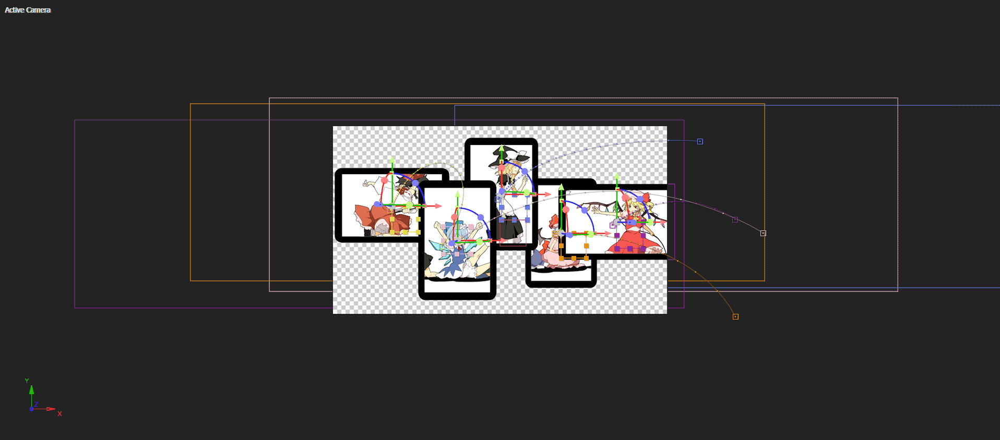
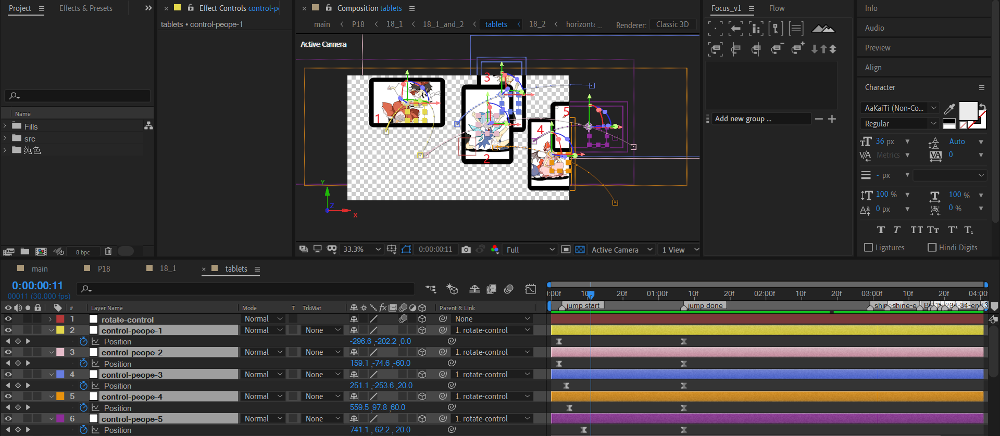
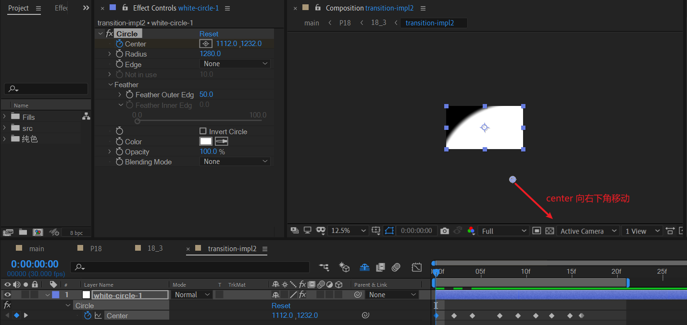

# 18 放下回忆，迈步向前

## 18_1_and_2 

### BG

使用纯色层+grid效果制造底层网格。

---

使用form粒子来制作背景中杂乱的粒子群。关键参数：

- 设置twist和fractal field对规则的粒子分布进行扰乱。
- 设置粒子为白色。

我们梅开二度，复制一层BG-form-white，重命名为BG-form-black。

- 修改粒子颜色为黑。
- 修改扰乱参数，使得扰乱程度和上面的白色粒子群不一致。

---

最后，我们来制作两个旋转的粒子圈。

- 新建两个点光源层，绘制弧形路径。

- 新建纯色层，添加particular效果，设置跟随灯光。

- 选中这两个点光源图层，将图层在时间轴的位置整体左移。同时，对particular图层，使用physics 1->0冻结。

  

### tablets

这个合成的制作分下面步骤：

- 制作五个平板电脑；
- 曲线路径入场；
- 整体Y旋转；
- 淡入淡出序列和背景替换。屏幕内的图片按一定的顺序闪烁，然后淡出。最终显示另一个背景图片的部分。在做这步之前，可以先去做18_2合成。

#### 制作五个平板电脑

这里，以其中一个平板电脑（序号为2）为例子。

- 使用形状层（index 13）绘制一个黑色圆角矩形，作为边框。
- 使用形状层（index 12）绘制一个白色矩形，稍微小一点，作为屏幕显示。
- 复制index 12图层，作为matte（index 8），将图片导入后（index 9），设置图片图层模式为alpha遮罩。

根据这个操作，制作5个平板电脑。

#### 曲线路径入场

新建5个空对象，分别用于控制这5个平板电脑的转换。

---

展开关键帧后，调整平板电脑的出场先后顺序。从左到右，依次延迟一定时间入场。

#### 整体Y旋转

- 新建一个空对象rotate-control，将上面5个平板控制的空对象（control-people-?）都绑定到这个空对象。
- 对这个空对象的Y 旋转属性k帧。逆时针旋转2圈。

#### 背景替换

这里，依旧以屏幕电脑2为例子。

1. 复制index 12图层，作为matte层，重命名为tablet-screen matte copy 2（index 10）。
2. 在这时，开始制作18_2。或者先使用一张图片作为临时替代，后续完成18_2后，再使用18_2替换掉该临时图片。

> 上面这个步骤2属于典型的自上而下的策略。对于，index 11这个图层位置。
>
> - 如果先是空实现，就是自上而下的策略。
> - 如果先完成18_2，再回来制作18_1的这部分，那就是自底向上的策略。
>
> 两种方式都是殊途同归的，本身没有优劣之分，可以根据具体情况和个人喜好来决策。

#### 屏幕内容淡入淡出序列

现在我们来处理时间轴之前的屏幕内容淡出和闪烁的动画。

首先，**屏幕内容的淡出顺序为：(2,1,5,3,4)**。上述截图中的时刻，2,1,5已经淡出，3，4还没有淡出。

---

接着，再次制作淡入淡出的闪烁序列。图中红框中，

- 含有5个关键帧的opacity序列为：0 - 80 - 0 - 60 - 0
- 含有3个关键帧的opacity序列为：0 - 60 - 0

**示例中，序列依次为：(2,1,5,4,3)。**

它们开始的时间点依旧是按一定延迟序列编排的。参考粉红色扫描线。从左到右进行扫描，可以很方便看出延迟间隔。

---

最后，对5个屏幕的背景图层都应用淡出，对5个18_2图层都应用淡入。只不过，开始顺序再次变化，为**（[2,1,5],4,3）**。

---

这些淡入淡出序列的排列，要注意例如1,2,3,4,5这种方式要尽量避免，过于直白，没有变化。

**稍微打乱顺序，加入倒序，都能创造一种随机的感觉，即使这个顺序依旧是人为编排的，或者是计算机的伪随机算法。**

### 末尾过渡

## 18_2

### 18-2-TEXT

这个图案是一个主体大矩形减去两个小矩形而形成的。制作时，先制作大矩形和2个小矩形，然后添加修剪路径，设置减去模式即可。

---

### 水波纹转场

使用调节层，添加Ripple效果:

- 将波纹中心定于图中圆心位置。

- 对radius k帧：增大。

此时，会发生底部边缘穿帮的问题。此时，考虑使用motion tile拼贴。注意勾选镜像边缘。

### 墨色线条擦除转场

| S_TextureFlux                                                | Brightness & Contrast                                        | Tint                                                         |
| ------------------------------------------------------------ | ------------------------------------------------------------ | ------------------------------------------------------------ |
|  |  |  |
| -                                                            |  | -                                                            |
| 初始化                                                       | 加大对比度和亮度                                             | 黑白化                                                       |

为避免过渡生硬，在过渡开始时，需要添加一种淡入类型的过渡：块熔解。

## 18_3

分析一下原作。

- 寻找一个扣好的面向正面的人物图像。最好人物本身和前景的植物有关联。原作中，女孩在捡枫叶。
- 寻找前景的植物素材。添加particular效果。
- 制作地板背景。背景由分型杂色生成。

- 摄像机动画：镜头拉远。

### maple-scene 合成

#### 黑白方块背景

利用分型杂色的 Block 噪波类型来实现。

#### 人物补图的必要性

| 原图                                                         | PS补图                                                       |
| ------------------------------------------------------------ | ------------------------------------------------------------ |
|  |  |

> Q：静止系MAD为何经常需要补图？
>
> A：原素材本身轮廓不全，扣图后完整性缺失。而在MAD中有时需要完整的轮廓，因此只能补图。如果具有绘画基础，补图难度将大大降低。

在这个粒子中，灵梦的扫把的杆子不完整（不够长），因此需要修补。主要利用仿制图章进行修补。

#### 枫叶围绕的视角

1.基本操作：纯色层+particular效果，设置枫叶贴图替换。

2.设置基本的空间位置和速度清0：注意这里设置了position的Z为一个-2300左右的值。

3.球形场被中心吸引，枫叶向中心聚拢。

首先设置球形场的Z为-2300左右。

然后对关键的radius属性进行k帧。在适当的radius范围内，radius降低，枫叶向中心聚拢。

#### 摄像机拉远

| 开始                                                         | 结束                                                         |
| ------------------------------------------------------------ | ------------------------------------------------------------ |
|  |  |

### scene_2 合成

#### 背景模糊——双边模糊

| 之前                                                         | 双边模糊                                                     |
| ------------------------------------------------------------ | ------------------------------------------------------------ |
|  |  |

双边模糊可以非常有效地模糊物体内部，保留轮廓，而不是一视同仁地对全部像素进行处理。

#### 文字动画

- 新建5个文本，每个文本一个汉字。
- 红色框为没有特殊处理的文本关键帧：淡入到60%，缩小到100%。线性关键帧。
- 黄色框为特殊处理的文本关键帧：淡入到60%，缩小到100%。ease关键帧。运动开始时间滞后，运动持续时间增大。
- index 4图层words-control：对5个文本层进行以画布中心的缩小控制。

#### 灵梦出场动画

使用值曲线编辑器对opacity属性进行k帧。参考关键帧值：

|      | 半显示 |      | 半显示 |      |      | 半显示 | 半显示++ |      | 完全显示 |
| ---- | ------ | ---- | ------ | ---- | ---- | ------ | -------- | ---- | -------- |
| 0    | 20     | 0    | 20     | 0    | 0    | 20     | 40       | 0    | 100      |

#### 小球对称运动

使用形状层绘制白色小球，添加echo（回声）效果：

- 设置回声时间为负值（例子是-0.08），表示延迟。
- 设置回声的实例数量：2

制作完ball-1之后，复制ball-1为ball-2。根据对称性，如果以画面中心为旋转锚点，旋转180度即可得到对称的另一边。

这个过程可以通过对ball-2添加transform来实现。设置旋转为180度或者scale取反为-100都可行。

### maple-scene过渡到scene_2

首先对maple-scene在末尾添加淡出关键帧。

#### transition impl1

新建一个黑色纯色层。添加淡入关键帧。

然后，为了实现从左上角向右下角弧线扫过的过渡转场。需要在这个纯色层绘制一个大椭圆mask：

- 开始时覆盖住整个画面，
- 结束时收缩到画布右下角不可见的位置。

这个就完成了maple-scene的出场。下面我们来实现scene-2的入场。

#### transition-impl2

新建白色纯色层，添加circle效果。

将center的初始位置定于图中⊕位置，然后k帧：向右下角移动。这样就能在画面中产生弧线扫过的效果。

---

我们将white-circle-1图层复制一层，来制作过渡带的灰色沙粒区域。

- 使用蓝宝石插件S_Retime制作运动滞后效果。

  我们将输入的帧率设置30，输出的帧率稍微提高，示例中是33.3。这样，这个图层相对于前面图层产生滞后运动。

- 将这个图层的opacity降低。

此时灰色区域已经完成，但是没有沙粒感。现在，我们来制作这个纹理。

新建纯色层texture-noise，添加S_TextureNoiseEmboss。然后使用滞后的circle图层white-circle-2来作为matte，自身设置luma遮罩。

#### 实现

- 复制之前的椭圆形mask路径关键帧到transition-impl2图层，这个transition-impl2依旧作为matte。
- 对scene-2图层进行luma反转遮罩。

### scene-2 的出场

### rects 合成

8个小矩形横向排列。

### TEXT-final

#### 合成的制作

这个文本有个细节：横线线条模糊，使用starglow来实现。

#### 出场

- 对顶层的TEXT-final进行左移和淡入淡出处理。
- 在顶层TEXT-final淡出结束的时候，使用index 3的TEXT-final进行淡入，补充位置。

---

接着，使用rects自身进行转场修饰，以及使用rects对文本和背景进行遮罩（参考下图鼠标选中的图层）。

---

最后，使用一个纯色层+particular实现画面粒子。

## 18_4

- 绘制一个中间矩形当作视口（iindex 8），对视口的Y比例k帧，实现展开效果。
- 使用视口对背景图片进行alpha遮罩。背景图片自身向右上角移动一定距离。
- 文本层一律淡入处理。
- 最后，使用一个黑色纯色层实现黑场。

## 小结

- 水波纹过渡转场是一种温和的过渡方式。
- S_TextureFlux 可以制作墨色线条擦除转场。
- S_TextureNoiseEmboss 可以制作沙子颗粒感的纹理效果。
- starglow 可以制作文本层横线线条模糊的效果。
