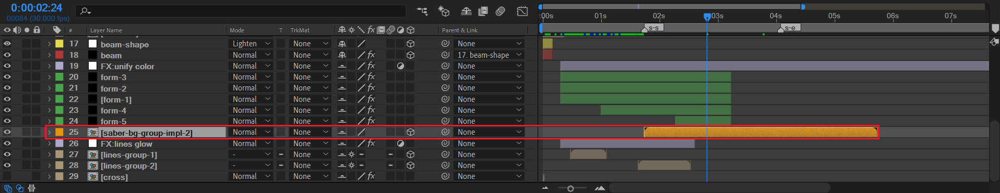

# 19 LOGO动画——线条灯光秀

## 摄像机运动

在这个合成中，我们率先处理摄像机的运动。否则后续粒子运动效果不方便预览和调试。

- Z位置从-130到-1800。初始速度400左右，先加速，然后一直柔和地减速到0。

  

- Z 旋转从-15到0。初始速度大约为9，然后柔和地减速到0。

  

上面给出的是曲线速率参考值。实际上，只要运动趋势差不多即可。总体上运动速率是降低的。

## 开场的光束

### saber 的应用

- 新建白纯色层beam-shape，绘制一个小椭圆的mask。
- 新建纯色层beam，将beam-shape的mask复制到自身。使用父子链接链接到beam-shape。
- 给beam图层添加saber效果，设置颜色为淡黄，预设选择雾。在自定义主题中选择mask。

> saber的局限性：
>
> - 只能应用于纯色层，不能应用于形状层，
> - 不能识别形状层的mask，也不能处理形状层中mask的模式。

---

- 给beam-shape的位置k帧，创建从右下角到左上角的快速位移运动。
- 添加中间关键帧，使得中间关键帧时位置位于画面居中。

此时，当光束beam运动到画面居中时，需要增加OF光衬托。

OF-1：中间很亮，但是发光范围比较小。

接着，补充一个与它成90度角（垂直）的OF光。

---

当beam运动到左上角时，在左下角增加一个超亮的强曝光。

OF-3：点光源形式，淡黄色，将OF参数中的亮度设置到很大的正值。

---

### 3d stroke 的应用

stroke-1合成用于创建曲线描边光束。

- stroke-1用于制作初始曲线生长路径。白色。对offset k帧：-84到100。
- 新建纯色层beam，将上面的曲线路径mask复制到这个图层，添加saber效果。
- 然后，复制stroke-1的一个副本stroke-1 matte，用于对beam图层的遮罩。这样，这个曲线运动具有了saber发亮的特效。
- 为了加强曲线的发光，可以创建顶层调节层，添加S_Glow效果。

## 背景——粒子阵列

5层form粒子。这里需要特别留意form参数的position属性的Z值。

|                      | form-1 | form-2 | form-3 | form-4 | form-5 |
| -------------------- | ------ | ------ | ------ | ------ | ------ |
| form参数的position-Z | 2000   | 1600   | 1200   | 1400   | 1400   |

关键帧都是3个一组：淡入淡出。依次序列化淡入开始的时间。

在form粒子阵列出现的时候，线条群也同时出现，使得画面更加丰富。

## line-group

### line-group-1

新建一个合成。在里面绘制线条。

- 右边竖直线条4根。最先出现，标记①。
- 左侧竖直线条4根。接着出现，标记②。
- 水平线条6根。最后出现，标记③。

关键帧都是3个，形成淡入淡出。

在这个合成内部，不要进行任何关于线条颜色填充和发光的特效处理。保持最为原生的实现。特效留给整体合成本身。

### line-group-2

- 底面水平线2根。最先出现，标记①。
- 上面水平线5根。接着出现，标记②。

---

- 左侧竖直线4根。标记③。
- 右侧竖直线1根。标记③。

标记都是③，表示同时出现。

### line-group-？合成的Z空间位置

调整lines-group-1和lines-group-2合成的z位置到1400，以及设置合适的scale。

上图为line-group-1的空间Z位置示意图，它位于Z为1200和Z为1600的form粒子层之间。

## saber-bg-group-impl-2

创建两种粒子纹理：横线和竖线。

| bar-horizontal-texture                                       | bar-vertical-texture                                         |
| ------------------------------------------------------------ | ------------------------------------------------------------ |
|  |  |

---

接着，制作右移的粒子群（图层particular-from-left）。并在中间合适时间点冻结后续发射。

- 位置的Z值设置1400。一定要明确Z值的设置对视图显示的影响。

其余三个方向的粒子群制作原理和上面类似。

在这里，可以考虑新建顶层调节层，添加deep glow来使得粒子条发光。

---

回到外层合成，将它摆放到合理的开始时间。

## stroke-shapes 线条汇聚成文字

### 确定LOGO文字

这里给出两个文字选择的反例。

| 序号 | 反例     | 理由                                                 |
| ---- | -------- | ---------------------------------------------------- |
| 1    | 水天一色 | 笔画过于简单，汇聚效果太差。                         |
| 2    | 魑魅魍魉 | 笔画过于复杂，汇聚时间太长，线条太密集，工作量太大。 |

这里，以【风月无边】为例。

### 确定字体

考虑预处理的所需字体。字体选择准则：

- 必须是粗黑体。
- 必须没有衬线。
- 字体笔画尽量是直线，避免曲线。曲线后面需要修正为直线。

|  |  |
| ------------------------------------------------------------ | ------------------------------------------------------------ |
|  |  |
|  |                                                              |

最后选择几何圆体粗。

### 确定定版

创建一个新合成，实现定版画面。

### 根据定版描绘笔画 => shape layers

根据上面的字体，在不选中任何图层情况下进行笔画描绘，得到这四个字笔画的形状层。**一个形状层对应一个分割单元。**例如feng-1。

此时任何一个分割单元都还没有继续切割为多个线条。

---

然后对每个分割单元，利用2个mask（先绘制一个mask，然后复制该mask并且模式取反）切割成两个mask部分，作为线条。

> 提示：这里一个分割单元都是切分成2个线条，与原作不同。原作是一个分割单元切分为3个线条或者任意数量线条。

这步结束后，我们得到了位置运动的实际单元——线条。**一个线条对应一个运动单元。**

但是，此时线条是mask形式，而且附着在原来的分割单元中。

**我们必须想办法将每个mask表示的线条提取到单独的形状层中。**例如feng-1被提取1为feng-1-Mask-1和feng-1-Mask-2。

有什么办法呢？

1. 新建形状层，一个又一个手动复制mask到新的形状层中。几乎不可行，因为工作量巨大，重复性劳动过多。
2. 借助可能存在的mask分离AE脚本，快速提取。

幸运的是，这样的mask分离脚本是存在的：AK这位作者开发的 `MasksToLayers.jsx`。

### masks => shape layers

利用 `MasksToLayers.jsx` 脚本将上面所有形状层内的所有masks转化成独立的形状层图层。

上面是一个简易的实验演示。实际操作时，你需要全选之前的形状层，然后找到脚本运行。

该教程中，有29个代表分割单元的形状层，最终得到58个独立的运动线条图层。

接下来，我们可以对线条的位置k帧。

### 线条汇聚动画

先记录结束位置的关键帧，然后设置开始位置的关键帧。注意，一个分割单元的两个线条的运动方向刚好相对。

> 注意，此时建议不要开启图层3D开关。同时取消【显示mask功能】在合成预览的显示，否则mask线框会干扰位置k帧。

---

对于有一定倾斜角度的笔画，可以同时选中图层，这样容易从视觉上判断是否满足或者接近三点一线。

关键帧全局预览。

此时线条的汇聚没有交错的感觉。是因为关键帧的运动都是一致的。因此，需要对关键帧进行随机处理。

可选的方法论：

- 增大、减少部分关键帧的运动持续时间。
- 错开部分关键帧运动开始的时间。

预览效果。

没有任何修饰的特效，这个文字汇聚的雏形到这里已经完成。

### 线条的修饰——发光

自动追踪获取线条轮廓，得到独立的纯色层。

上图是一个演示。

- 独奏显示任意一个线条图层，使用图层——自动追踪（默认alpha）模式来得到该线条的轮廓：一个对应的纯色层。

---

- 对自动跟踪得到的纯色层应用saber效果，设置主体类型为遮罩图层。

此时就可以得到线条发光的效果。然后设置saber的发光细节的参数即可。

为了将线条和发光的线条轮廓看成一个整体的运动单元。因此需要将这两个图层预合成。

根据类似的原理，我们梅开58度（~~啊这~~）,可以得到58个预合成：

---

最后，为了统一颜色和后期处理。可以在stroke-comps合成的顶部，新建一个调节层。

- change to color：将之前的saber的颜色统一为新的颜色，这里是蓝变为黄。
- deep glow：这里是为了增强saber的发光效果，呈现金黄色。

### 文字的替换

替换前：

---

替换之后:

## OF灯光秀

| 1                                                            | 2                                                            | 3                                                            | 4                                                            |
| ------------------------------------------------------------ | ------------------------------------------------------------ | ------------------------------------------------------------ | ------------------------------------------------------------ |
|  |  |  |  |

| 5                                                            | 6                                                            | 7                                                            | end                                                          |
| ------------------------------------------------------------ | ------------------------------------------------------------ | ------------------------------------------------------------ | ------------------------------------------------------------ |
|  |  |  |  |

上面的图示中，序号1-7分别表示7个OF光图层，对应7个不同的OF光的参数设置。

好了。我们已经完成了所有的大合成，p1-p19。对于合成之间的过渡方式，还没有实现。下一节就是处理大合成之间的过渡问题。

## 小结

- saber 可以制作物体轮廓发光的效果。局限性在于只能应用于纯色层及其mask，不能应用于形状层及其mask。
- S_Glow 可以加强物体的发光效果。
- deep glow 可以加强物体的发光效果。此外，Real glow与deep glow的作用效果非常类似。
- 线条汇聚成文字的实现再次体现了自上而下的方法论：将字拆为分割单元，将分割单元拆为线条。然后对线条进行位置K帧。

