# 20 大合成之间的过渡

本节处理和探究P1-P19合成之间的过渡问题。

> 淡入淡出必须添加黑场/白场前缀说明，否则有歧义。

## 1-2 黑场淡出+扩黑边

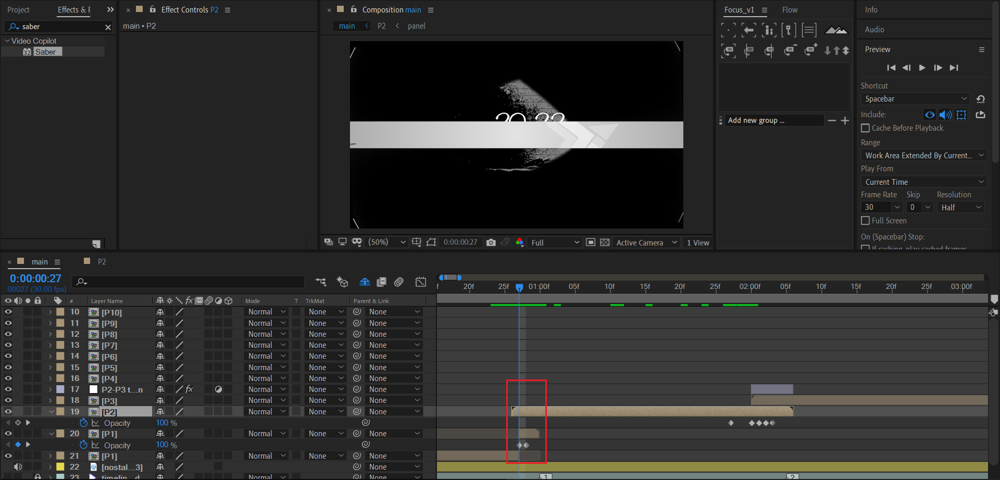

P1黑场淡出，P2内部自带扩黑边。

## 2-3 反复叠化

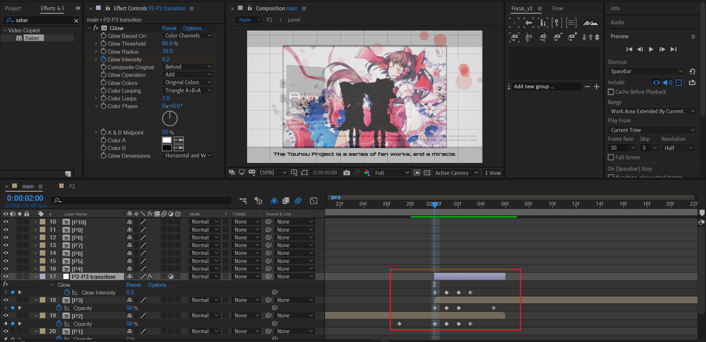

|                | T1   | T2      | T3     | T4      | T5     | T6   |
| -------------- | ---- | ------- | ------ | ------- | ------ | ---- |
| 调节层（GLOW） | -    | **0.2** | 0      | **0.3** | 0      | -    |
| P3             | -    | 50      | 100    | 50      | -      | 100  |
| P2             | 100  | 50      | 25     | 50      | 0      | -    |
| 分析           | P2   | P3=P2   | P3>P2  | P3=P2   | P3>P2  | P3   |
| 效果           |      | 叠化    | P3主导 | 叠化    | P3主导 |      |

## 3-4 叠化

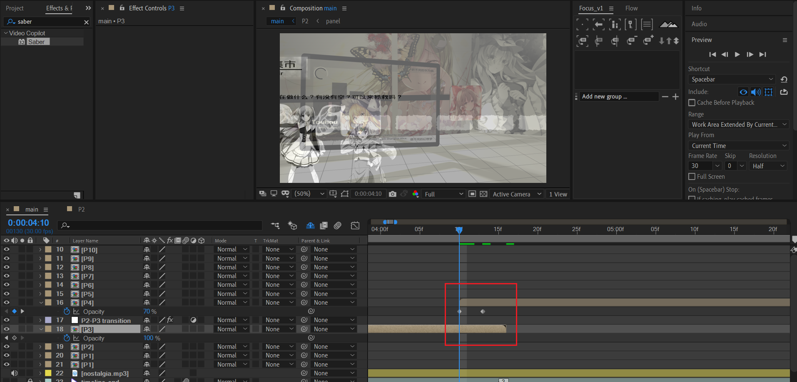

P3无处理，P4淡入。

## 4-5 一致黑背景

| 4                                                            | 5                                                            |
| ------------------------------------------------------------ | ------------------------------------------------------------ |
| 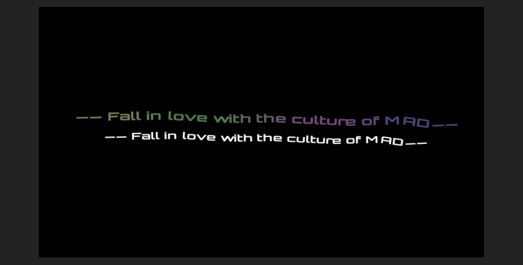 | 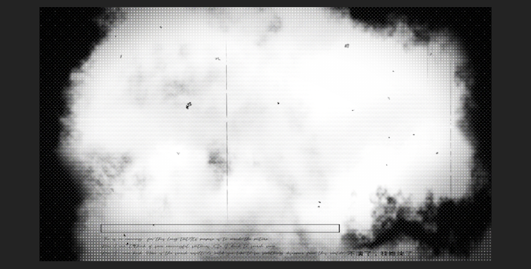 |

镜头关联性不强。

## 5-6 图形缝合

| 5                                                            | 6                                                            |
| ------------------------------------------------------------ | ------------------------------------------------------------ |
| 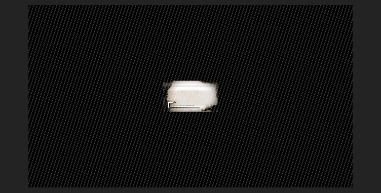 | 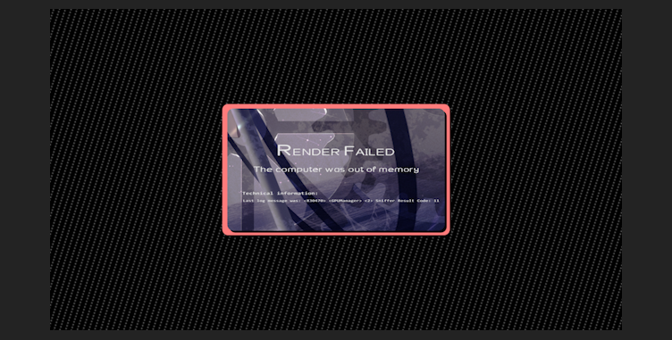 |

镜头5缩小，镜头6放大，形状类似，关联性很强，本质是蒙太奇理论。

## 6-7 压黑边+黑背景

| 6                                                            | 7                                                            |
| ------------------------------------------------------------ | ------------------------------------------------------------ |
| 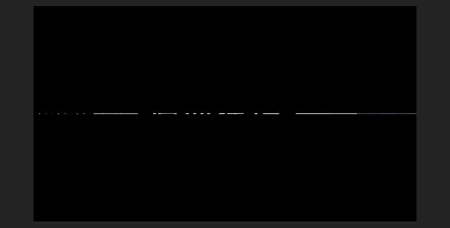 | 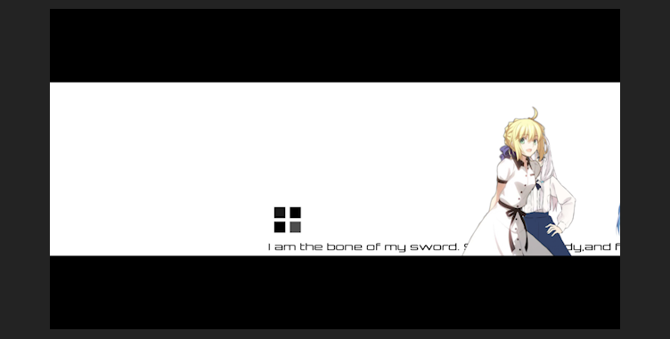 |

镜头6压黑边成横线后消失，同时镜头7直接显示。镜头关联性不强。

## 7-8 图形缝合

| 7                                                            | 8                                                            |
| ------------------------------------------------------------ | ------------------------------------------------------------ |
|  | 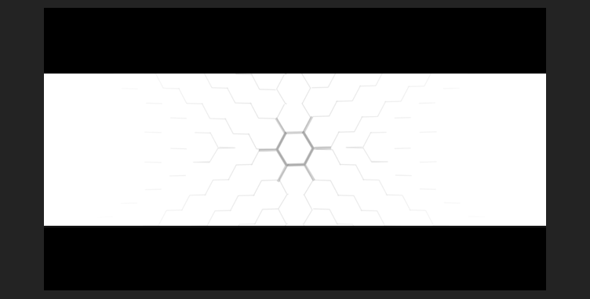 |

镜头7人物消失后保留白色矩形背景，镜头8制作同样位置和尺寸的白色矩形背景，开启后续动画。关联性很强。

只要白色矩形位置和尺寸一致，几乎很难察觉这是不同的合成。

## 8-9 黑场淡出+黑场淡入

| 8                                                            | 9                                                            |
| ------------------------------------------------------------ | ------------------------------------------------------------ |
| 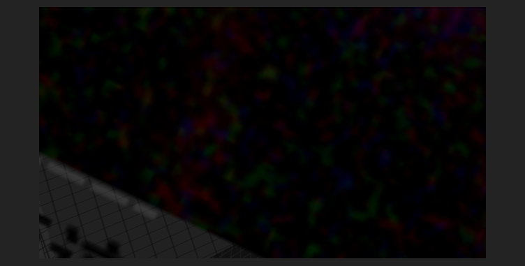 |  |

镜头8黑场淡出，镜头9黑场淡入。这种过渡形式非常常见和实用，相似地，也有白场过渡。镜头关联性不强。

## 9-10 黑场淡出+黑背景

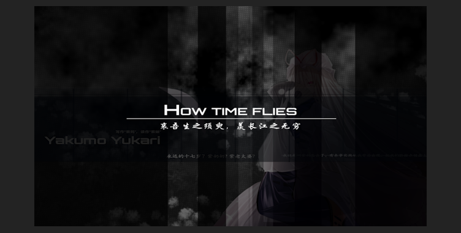

镜头9黑场淡出，镜头10无处理。镜头关联性不强。

## 10-11 黑场淡出+黑场淡入

| 10                                                           | 11                                                           |
| ------------------------------------------------------------ | ------------------------------------------------------------ |
| 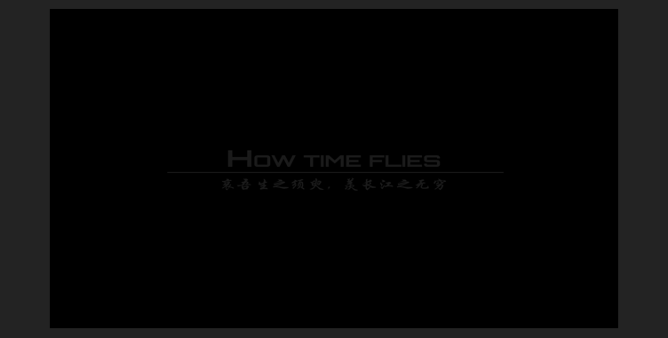 |  |

镜头10黑场淡出，镜头11黑场淡入。镜头关联性不强。

## 11-12 黑背景+黑场淡入

| 11                                                           | 12                                                           |
| ------------------------------------------------------------ | ------------------------------------------------------------ |
| 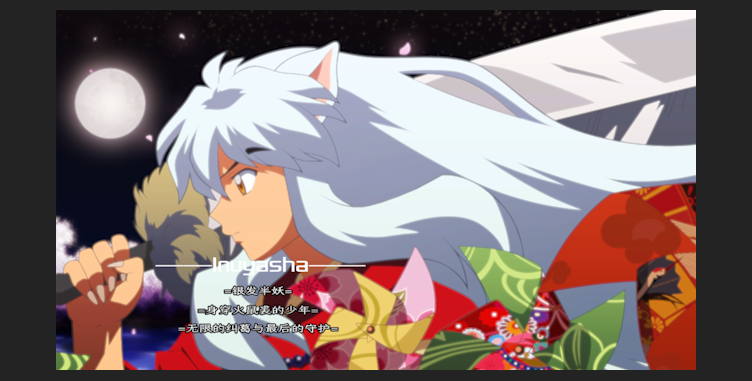 | 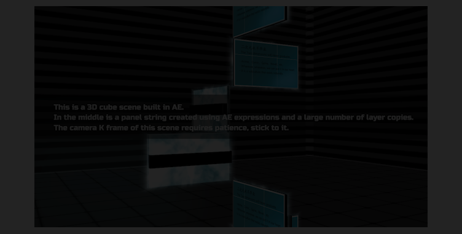 |

镜头11无处理。镜头12黑场淡入。镜头关联性不强。

## 12-13 一致白背景

| 12                                                           | 13                                                           |
| ------------------------------------------------------------ | ------------------------------------------------------------ |
| 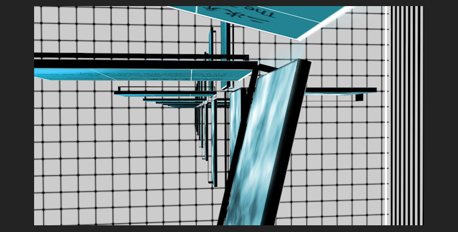 |  |

镜头12和13都没有特殊处理。相似性只有白背景。关联性不强。

## 13-14 白场淡出+白背景

| 13                                                           | 14                                                           |
| ------------------------------------------------------------ | ------------------------------------------------------------ |
|  | 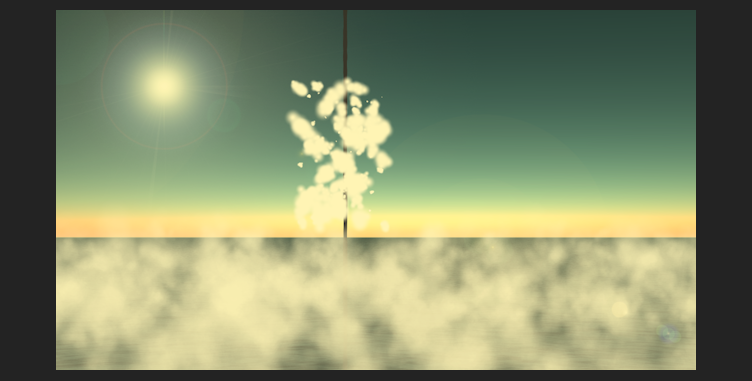 |

镜头13白场淡出，镜头14无处理。相似性为白背景。

## 14-15 叠化

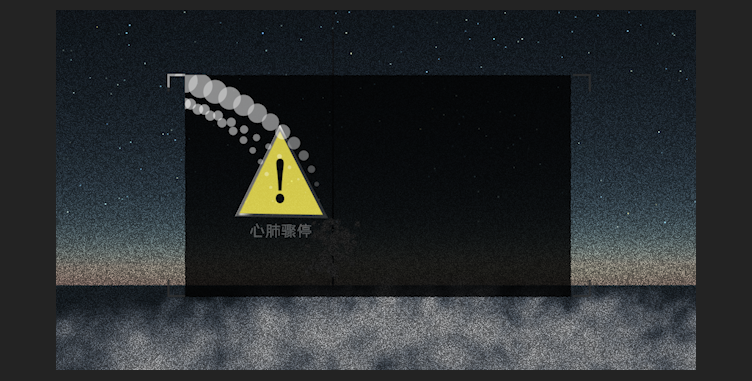

P14和P15均无特殊处理。P15的画面直接叠加在P14背景上面。

## 15-16 白化+白化淡入

| 15                                                           | 16                                                           |
| ------------------------------------------------------------ | ------------------------------------------------------------ |
| 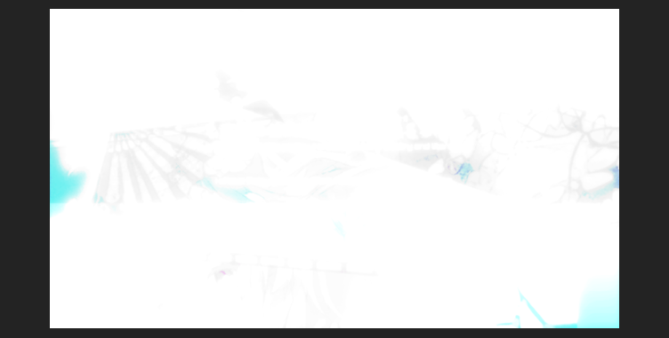 | 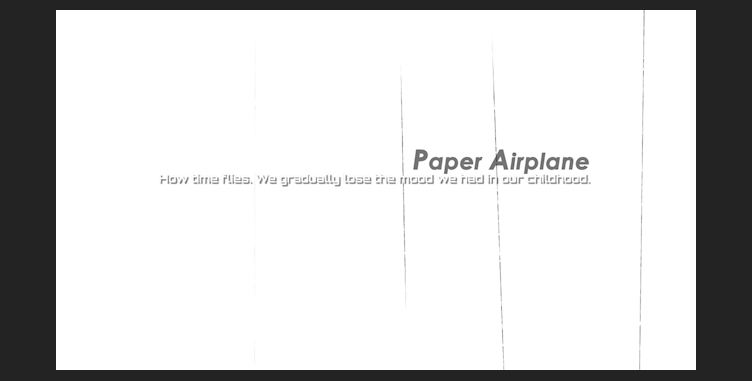 |

镜头15白化，镜头16初始白化，逐渐淡入到正常画面。

## 16-17 黑场淡出+黑场淡入

| 16                                                           | 17                                                           |
| ------------------------------------------------------------ | ------------------------------------------------------------ |
| 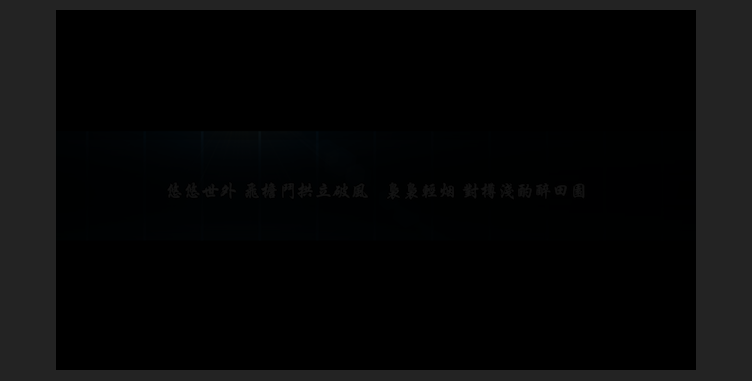 |  |

镜头16黑场淡出，镜头17黑场淡入。

## 17-18 黑场淡出+黑场扩黑边

| 17                                                           | 18                                                           |
| ------------------------------------------------------------ | ------------------------------------------------------------ |
| 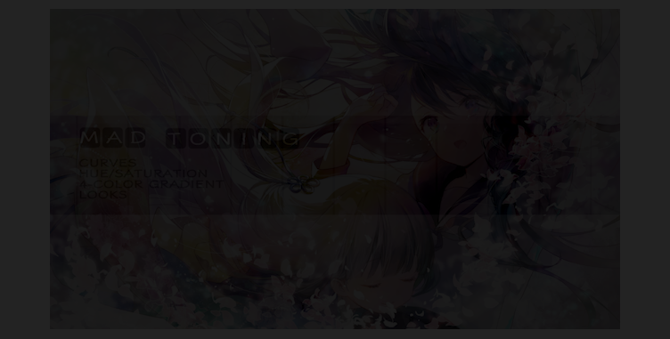 | 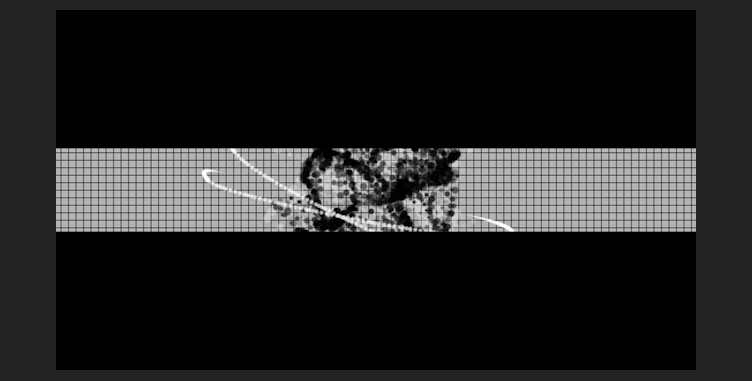 |

镜头17黑场淡出，镜头18黑场扩黑边。

## 18-19 黑场淡出+黑背景

| 18                                                           | 19                                                           |
| ------------------------------------------------------------ | ------------------------------------------------------------ |
| 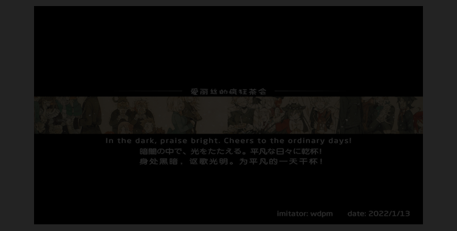 |  |

镜头18黑场淡出，镜头19开始为黑背景。

## 小结

- 黑场淡入淡出，叠化，反复叠化，保持背景一致影调，图形相似性缝合，白化后淡入，扩黑边/压黑边都是可行的过渡方式。

- 黑场淡入淡出在这个作品中使用频率极高。
- 图形相似性缝合本质是蒙太奇理论的应用，观众会对相似的图形变化产生联想，认为这是自然的。
- 叠化指的是上一个镜头还没完全消失，下一个镜头已经开始出现。
- 压黑边/扩黑边让人产生一种看旧电影的感觉。

