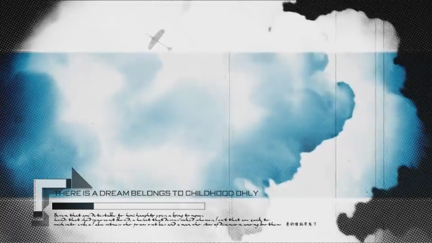
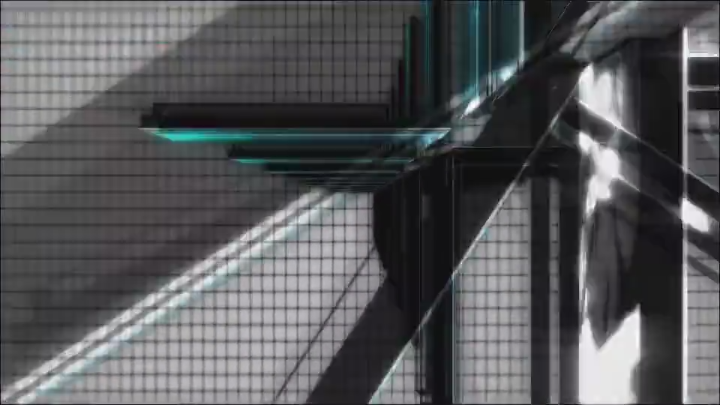
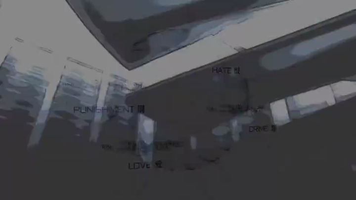
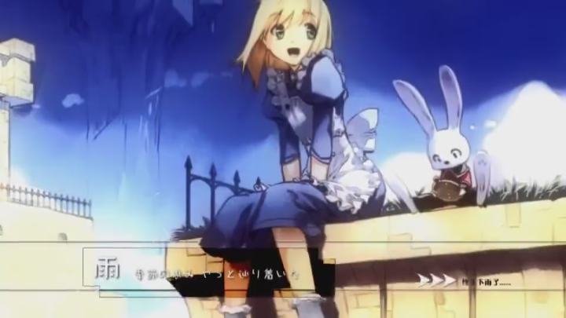

# 2010-autumn-op story board

> - original author：evanlet
>
> - analyzer： wdpm

## 分镜切割——方法论

- [x] ScreenToGif importer and analyze frame by frame

- [x]  AE 

## 分镜表（粗略）

compistion切分方法论：

- 有明显的淡入淡出过渡效果。
- 有明显的硬切效果。
- 内容相关度很低。
- 镜头内容之间衔接不连贯。

time range 不准确，可删除。实际模仿以【时间秒数+帧数】为准。

按15帧/s计算。间隔66ms。

| shot No. | screenshot                                                   | name                  | desc                                                         | time range                          | Composition |
| -------- | ------------------------------------------------------------ | --------------------- | ------------------------------------------------------------ | ----------------------------------- | ----------- |
| 1        |                                         | 开场动画              | 逆时针旋转，外圆圈放大。                                     | 0-1.3                               | P1          |
| 2        |                                         | LOGO进入              | LOGO从左上角进入到画面左侧。同时保持逆时针旋转，有投影。LOGO背面有文字。画面右下角有长文字，画面右侧有很淡的图案作为背景，来保持画面重量平衡。 | 1.2-2.4                             | P2          |
| 3        |                                         | 人物出场叠化          | 背景图片轻微缩小，粒子从右上角往左下角方向随机运动。         | 2.4-3.3                             | P3          |
| 4        |                                         | VOICE SEED            | 两个ICON的运动：类似于形成一个爱心的形状。也可以看成各做一个半圆运动。看板：左上角圆圈黑白交替，三个波形条错落升降，底下有长文字。背景：左右两幅图片，左边彩色，右侧黑白，形成对比。光照：光源在左上角，形成投影。摄像机：稍微旋转角度，使得背景图片可视区域更大。 | 3.3-4.8                             | P3          |
| 5        |                                         | 公交站场景            | 模糊入场，右侧2人先入场。然后向右平移，左侧人物入场。摄像机：稍微拉远。最后，人物逐个消失淡出。 | 4.5-5.5                             | P4          |
| 6        |                                         | 文字波浪              | 文字稍微上移，缩小。文字有彩色重叠投影。                     | 5.6-6.3                             | P4          |
| 7        |         | 老电视故障-飞机与天空 | 第一段动画：中间蓝色矩形展开。飞机从右下角入场，往左上角飞行，同时缩小。左下角箭头闪烁两次，然后保持可见。进度条和文字描述逐步出现。底部文字一直可见。背景云层稍微缩小。第二段动画：飞机往右下角方向飞回。先稍微变大然后变回原大小，最终也很小。开始时，中间矩形加一个白色过曝，然后画面基调变为灰色。整个动画期间，画面加上老电视故障垂直信号线效果。 | 6.3-10.1                            | P5          |
| 8        |         | 抉择二选一            | 蓝色背景先稍微变大，然后变回原大小。两个选择从中间飞出，缩放后摆放于左右位置。左侧选择的边框有顺时针旋转动画。然后，模糊过渡整个画面到左侧第一个选择的倾斜特写。特写的边框依旧保持缓慢的顺时针边框旋转。最后，上下黑边向中间压缩，表示选择这个选项。 | 10.2-12.1                           | P6          |
| 9        |         | 动画人物show          | 左移入场。人物之间位置Z有明显的景深关系，使用广角摄像机。人物居中后，稍微下移，人物逐个虚线化消失。 | 12.2-13.3                           | P7          |
| 10       |  | 蜂巢图案              | 1：蜂巢淡入，文字从上方进入。2：画面翻转到左侧。3：伴随粒子飞散，画面最终定格为空白矩形，给后续图片显示固定参考。 | 13.4-15.0                           | P8          |
| 11       |  | 画廊格子背景          | 1：格子增加。背景出现，缓慢下移。粒子逐步消散。2：格子变白。然后旋转，出现荧光屏（带有明显颗粒的显示屏）。屏幕有一个面附着彩色壁纸。3：摄像机推近，出现一个白色，带有一局对AE摄像机的吐槽。桌子上面有一个小屏幕。摄像机继续推进，伴随顺时针旋转。最后，剧烈旋转，黑场淡出。 | 15.0-16.2-21.3                      | P8          |
| 12       |  | 文字吐槽              | 1:文字逐个缩放进场，伴随旋转。2:第二个图片场景从右下角飞入到居中位置。3：压黑边，左移，背景缩小。最后，背景图片风格化为水墨风格。 | 21.3-24.2                           | P9          |
| 13       |                                       | HORNET                | 中间小矩形中继。画面有一个羽毛飘动。                         | 24.3-26.7                           | P9          |
| 14       |    | 时不我待              | 1：时不我待标语。四个小正方形，逆时针逐个旋转出现。2：正方形顺时针旋转，同时往中心汇聚，然后散开到原来位置，继续加速旋转。3：最后正方形向上方消失。 | 26.7-30.0                           | p10         |
| 15       |         | 型月世界-saber        | 1：人物逐步缩小，背景有视频元素在播放。2：人物根据音乐节奏反复重影分离。然后压黑边，人物完全黑色填充。吐槽线从左侧平移出现。 | 30.1-33.9                           | p11         |
| 16       |         | 未命名场景            | 1: 使用黑矩形遮盖上一个场景进行过渡，揭示下一个场景。2：灰色基调，矩形条随机旋转点缀背景图片。 | 33.9-35.1                           | p11         |
| 17       |         | 闪现对称              | 图片A从左侧进入，图片B从右侧进入。非常快速。                 | 35.2-36.0                           | p11         |
| 18       |      | 空间与旋转轴          | 1：黑场淡入。整体空间逆时针旋转。2：轴体旋转为大致水平横向。3：黑场将轴体改为正向往里延伸。4：一分为二。画面下方图标横向排列，上下环绕文本。 | 35.970-38.676-39.930-40.788         | p12         |
| 18-2     |                | 接上一个镜头          | 5：左右子画面中，轴体逆时针翻转。6：二合为一。继续旋转。     | 40.788-44.088-44.682                | p12         |
| 19       |     | 快速闪现。            | 1：人物左右出场产生交错。2：中间人物从下往上出现。3：人物从上往下出现。4:出现中间合成。圆圈逆时针旋转。然后淡出。 | 44.814-45.342-45.870-46.530-47.454  | p13         |
| 20       |         | 真实场景渲染          | VUE Xstream真实海景渲染。+ AE崩溃页面吐槽。夕阳时分，镜头是顺时针旋转。向夜晚时分演变。一共四次文本记录。 | 47.520-59.136                       | p14         |
| 21       |         | 认真你就输了          | 1:居中文字。2三个图片旋转入场，然后向上平移+黑场淡出。       | 59.202-1.01.248                     | p15         |
| 22       |  | 胶带与诗句            | 1：第一句诗句出场，背景是4个胶带，错开移动。诗句下方有文本修饰。2：第二句诗句在原来诗句位置淡入。出场方式为强曝光。PS：胶带背景颗粒感处理。 | 1.01.512-1.05.802                   | p15         |
| 23       |  | 图片变化1             | 垂直信号线故障。照片从颗粒感变化到正常模式。                 | 1.05868-1.06396                     | p16         |
| 24       |  | 图片变化2             | 图片轻微顺时针旋转，然后白场淡出。故障信号线点缀。           | 1.06.462-1.06.660                   | p16         |
| 25       |  | 图片变化3             | 白场入场，图片保持缓慢上移，白场出场。                       | 1.06.726-1.07.188                   | p16         |
| 26       |  | 图片变化4             | 1：中间有一群类似花瓣的线条。然后图片人物从较大比例缩放到合适大小。文本为感慨青春。2：背景短暂消失，保持中间文本，然后背景重现出现，为黑白色调。3：背景图片变为4个小副本。逐渐消失。黑色羽毛出现。 | 1.07.254-1.07.650-1.08.178-1.08.442 | p16         |
| 27       |  | 文字球体              | 羽毛逐渐淡出，黑色球体出现，伴随文字点缀。                   | 1.08.442-1.08.970                   | p16         |
| 28       |  | 大风车快闪            | 大风车出现，反复亮度闪烁4次。                                | 1.08.970-1.10.026                   | p16         |
| 29       |  | 快闪与粒子飞散        | 伴随音乐节奏，3次快速的闪镜头之后，终于迎来了短暂的慢节奏镜头。粒子运动为从文字下方中间位置，超对角线方向运动，穿过文字后，类似碰撞到球体表面一般，反弹消失。 | 1.10.092-1.11.478                   | p16         |
| 30       |  | 壁纸特写1             | 白色圆圈缓慢逆时针旋转。背景图片缓慢下移。主文本从左侧飞入到右侧合适位置。分割线和底下长文本保持不变。场景有少量细小的白色粒子飘动。 | 1.11.478-1.15.108                   | p17         |
| 31       |  | 壁纸特写2             | 背景图片淡入，保持轻微下移。中间矩形小格子从右往左铺开。最后，黑场淡出。 | 1.14.184-1.17.418                   | p17         |
| 32       |  | ipad                  | ipads从右侧往左侧进入。完成后，稍微压上下黑边。ipad逆时针旋转2圈。ipad屏幕图片随机闪烁后，整体替换成一个大的背景图片。中间一个白场图片入场。背景图片和矩形框下移幅度不一致，制造视差效果。最后，水波纹散开出场。 | 1.17.418-1.22962                    | p18         |
| 33       |  | 未知镜头              | 迷惑的拆解？                                                 | 1.22962-1.23.424                    | p18         |
| 34       |  | 枫叶红                | 摄像机拉远。周围是红色枫叶，镜头有模糊感。人物黑场淡出。     | 1.23754-1.24.612                    | p18         |
| 35       |  | 幽香扫地              | 文本直接出现。黑影顺时针扫过，先出现街道，然后左侧出现人物。【人生的宝物】文字动画为缩放汇聚。2：背景稍微上移，上下压黑边，背景同时过曝消失。 | 1.24.612-1.28.506                   | p18         |
| 36       |  | finale                | 黑场淡入。                                                   | 1.28.506-1.32.400                   | p18         |
| 37       |  |                       | 伸张黑边，出现矩形，淡入背景。文字逐渐出现，发光。然后，整个画面黑场淡出。 | 1.32.466-1.35.238                   | p18         |
| 38       |  | 动画基地              | 发光线条汇聚成【动画基地】，黑场淡出。                       | 1.35.304-1.47                       | p19？       |
